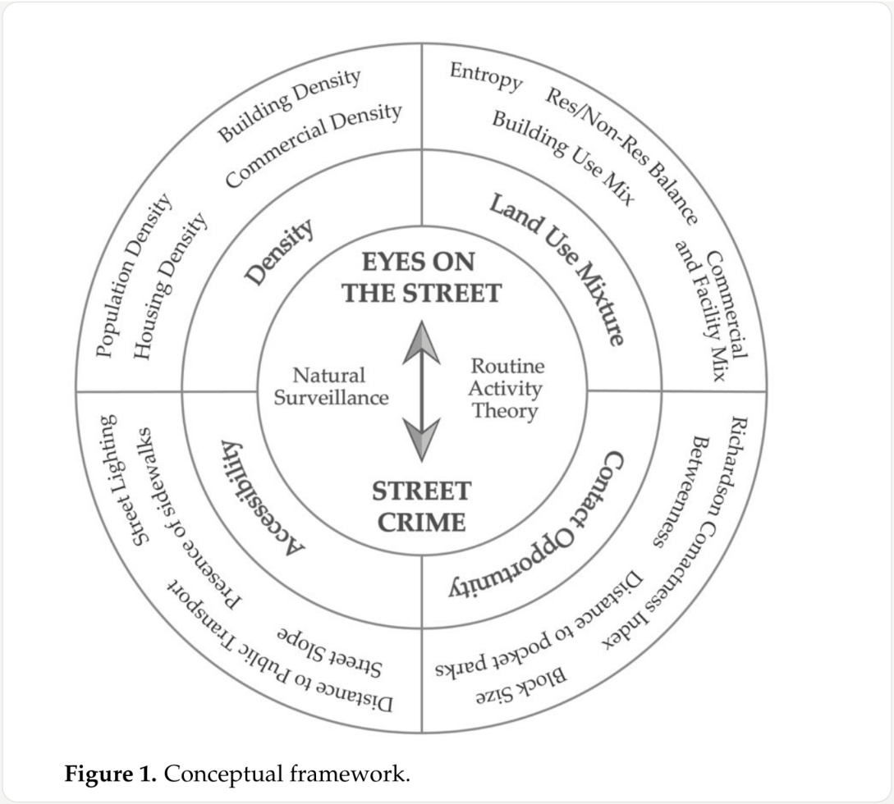
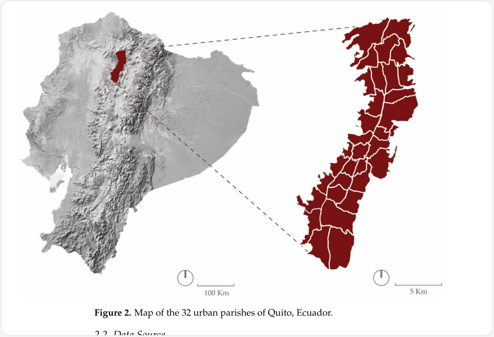
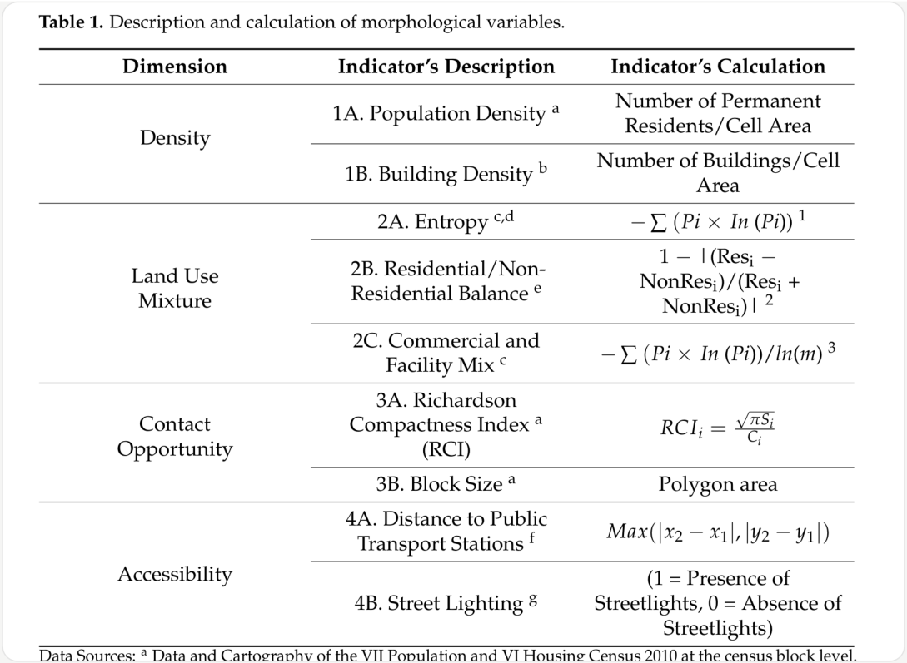
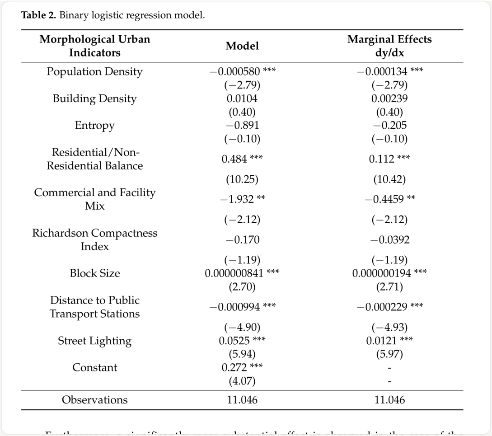

**이진 로지스틱 회귀** 

**사례: 키토(에콰도르)** 

**Buildings 2025 · MDPI 도시형태학 × 범죄학** 

**Open Access (CC BY)** 

# **“Eyes on the Street” as a Conditioning Factor for Street Safety Comprehension: Quito as a Case Study** 

**저자** : Nuria Vidal-Domper (UIC Barcelona), Susana Herrero-Olarte (UDLA), Gioconda Ramos (키토 시 민안전 메트로폴리탄 관측소), Marta Benages-Albert (UIC Barcelona) 

**발표** : Buildings 2025, 15(15), 2590 · 2025-06-17 투고 / 2025-07-17 게재확정 / 2025-07-22 출판 **DOI** : 10.3390/buildings15152590 

**키워드** : eyes on the street · street safety · binary logistic regression model · Quito 

###### **한 줄 요약** 

제인 제이콥스(Jane Jacobs)의 “거리를 향한 눈(eyes on the street)” 가설 — 사람이 많으 면 거리가 안전해진다 — 을 에콰도르 키토의 실제 범죄 신고 데이터로 검증한 탐색적 연 구다. 밀도·토지이용혼합·접촉기회·접근성이라는 4개 도시형태 차원을 9개 지표로 조작화 하고, 50×50 m 격자 단위로 계산한 뒤 이진 로지스틱 회귀에 넣었다. 2022년 키토 32개 도시 교구에서 기록된 노상범죄 22,655건(그중 대인 강도 15,403건)을 사용했고, 모형 관 측치는 11,046개다. 결과는 9개 중 6개가 통계적으로 유의했는데 **방향이 갈렸다** : 인구밀도 − − (한계효과 0.000134)와 상업·시설 혼합( 0.4459)은 대인 강도 확률을 낮췄지만, 주거/비 주거 균형(+0.112), 블록 크기(+0.000000194), 가로등 존재(+0.0121)는 오히려 높였고 대 − 중교통 정류장에서 **멀수록** 확률이 낮아졌다( 0.000229). 즉 “사람의 존재”가 언제나 보호 효과를 내지는 않으며, 통행량·익명성·도주 경로를 함께 늘리는 종류의 활력은 오히려 범죄 를 끌어들일 수 있다는 것이 이 논문의 핵심 메시지다. 다만 종속변수가 “범죄 발생 여부” 가 아니라 “기록된 범죄가 대인 강도인가(1) vs 차량 관련 강도인가(0)”라는 점 — 즉 **범죄 위험이 아니라 범죄 구성비를 설명하는 모형** 이라는 점은 읽는 내내 유의해야 한다. 

**초록** 

Abstract 

“The presence of people has a complex relationship with public safety—while it is often associated with increased natural surveillance, it can also attract specific types of crime under certain urban conditions.” 

사람의 존재는 공공 안전과 복잡한 관계를 맺는다. 흔히 자연적 감시(natural surveillance) 가 늘어나는 것과 연결되지만, 특정한 도시 조건에서는 오히려 특정 유형의 범죄를 끌어들 이기도 한다. 

> **CONTEXT** 논문 전체의 문제의식이 첫 문장에 압축돼 있다. “사람이 많으면 안전하다”는 통념을 부정 하는 것이 아니라, **조건부** 임을 보이겠다는 선언이다. 

“…this research assesses four morphological dimensions—density, land use mixture, contact opportunity, and accessibility through nine specific indicators.” 

이 연구는 네 가지 형태학적 차원 — 밀도(density), 토지이용혼합(land use mixture), 접촉 기회(contact opportunity), 접근성(accessibility) — 을 아홉 개의 구체적 지표를 통해 평가 한다. 

> **TERMINOLOGY 형태학적(morphological) 지표** = 건물·블록·도로·용도처럼 도시의 물리적 형태에서 측정되는 값. 설문으로 묻는 “안전하다고 느끼는가”(지각 지표)와 대비된다. 이 논문 은 지각을 일절 묻지 않고 형태만 쓴다. 

“A binary logistic regression model is used to examine how these features relate to the incidence of street robberies against individuals.” 

이진 로지스틱 회귀 모형을 사용해 이 특성들이 개인 대상 노상강도의 발생과 어떤 관계를 갖는지 검토한다. 

> **MECHANISM** 초록은 “발생(incidence)”이라고 쓰지만, 2.2.3절에서 밝히는 실제 종속변수는 **이미 기 록된 범죄 한 건이 대인 강도인지(1) 차량 관련 강도인지(0)** 이다. 따라서 이 모형이 추 정하는 것은 “여기서 범죄가 일어날 확률”이 아니라 “여기서 일어난 범죄가 대인 강도 일 상대적 확률”이다. 해석의 폭이 크게 달라지는 지점이므로 결과를 읽을 때 계속 기 억해야 한다. 

“…urban form characteristics that foster ‘eyes on the street’—such as higher population density and a mix of commercial and residential uses—show statistically significant associations with lower rates of street robbery.” 

“거리를 향한 눈”을 촉진하는 도시형태 특성 — 예컨대 높은 인구밀도, 그리고 상업 용도와 주거 용도의 혼합 — 은 노상강도 비율이 낮은 것과 통계적으로 유의한 연관을 보인다. 

“However, other indicators…—such as larger block sizes, proximity to public transport stations, greater street lighting, and a higher balance between residential and non-residential land uses— correlate with increased crime rates.” 

그러나 “거리를 향한 눈”을 나타내는 다른 지표들 — 큰 블록 크기, 대중교통 정류장과의 근접성, 더 많은 가로조명, 주거/비주거 용도 간의 높은 균형 — 은 오히려 범죄율 증가와 상관을 보인다. 

> **LOGIC** 제이콥스 이론의 예측과 **반대 방향** 으로 나온 지표가 네 개다. 저자들은 이를 “이론이 틀렸다” 가 아니라 “이론을 맥락화해야 한다”로 해석한다. 4장 논의 전체가 이 네 개를 하나씩 변호·재 해석하는 구조다. 

“Some indicators… show statistically significant relationships, though the practical effect size… is modest.” 

인구밀도, 블록 크기, 대중교통 정류장까지의 거리 같은 일부 지표는 통계적으로 유의한 관계를 보이지만, 주거/비주거 균형·상업 및 시설 혼합·가로조명과 비교하면 실질적인 효과 크기는 작다. 

> **LOGIC 통계적 유의성 ≠ 실질적 중요성** 을 저자 스스로 구분하고 있다. 인구밀도는 p<0.01이지만 한 − − 계효과가 0.000134(= 0.0134%p)로, 인구밀도가 1단위 늘 때 확률이 0.013%p 움직이는 수 준이다. 표를 볼 때 별표(***)와 dy/dx 크기를 반드시 함께 봐야 한다. 

## **1. 서론** 

1. Introduction 

“Ecuador has been identified as the third most violent country in the region… with an increase in the homicide rate from 13.7 per 100,000 inhabitants in 2021 to 43 per 100,000 inhabitants in 2023.” 

에콰도르는 베네수엘라와 온두라스에 이어 이 지역에서 세 번째로 폭력적인 국가로 지목 되었으며, 살인율은 2021년 인구 10만 명당 13.7명에서 2023년 43명으로 증가했다. 수도 키토의 신고 범죄 건수도 2021년 26,477건에서 2022년 38,736건으로 43.6% 늘었다. 

“…Jane Jacobs was one of the pioneers who highlighted that specific morphological dimensions… contributed fundamentally to urban safety through what she termed ‘eyes on the street.’” 

1960년대 미국·캐나다의 도시이론가 제인 제이콥스는, 집중의 필요(밀도 차원)·주요 용도 혼합의 필요(토지이용혼합 차원)·작은 블록의 필요(접촉기회 차원) 같은 특정 형태학적 차 원이 경제적·사회적 상호작용을 촉진할 뿐 아니라, 그가 “거리를 향한 눈”이라 이름 붙인 것 — 주민·소유주·외부인 등 보행자의 존재가 만들어내는 근린 관찰 과정 — 을 통해 도시 안전에 근본적으로 기여한다고 강조한 선구자 중 한 명이다. 

> **TERMINOLOGY eyes on the street** : 감시 카메라나 경찰이 아니라, 거리에 늘 있는 보통 사람들의 시 선이 만들어내는 비공식적 감시. 제이콥스 『미국 대도시의 죽음과 삶』(1961)의 핵심 개념이며, 이 논문은 이 개념을 “측정 가능한 물리적 지표”로 번역할 수 있는가를 묻 는다. 

“Later, these dimensions were updated by adding the accessibility component… and were operationalized through measurable morphological indicators (Figure 1).” 

이후 이 차원들은 접근성 요소를 추가하며 갱신되었는데, 사람의 존재를 늘리는 데 이동성 (mobility)이 점점 더 중요해졌기 때문이며, 이렇게 측정 가능한 형태학적 지표들로 조작화 되었다(그림 1). 

> **MECHANISM** 그림 1은 이 논문의 설계도다. 중앙에 “eyes on the street ↔ street crime”, 이를 매개 하는 두 이론(자연적 감시 / 일상활동이론), 바깥 고리에 4개 차원과 각 차원의 후보 지 표들이 배치돼 있다. 바깥 고리의 지표 중 **실제 모형에 투입된 것은 9개뿐** 이다(예: Housing Density, Betweenness, Street Slope, Distance to pocket parks 등은 개념틀에 는 있으나 회귀에는 없다). 

##### **Figure 1: Conceptual framework.** 

그림 1. 개념틀. 중앙에 “eyes on the street ↔ street crime”, 이를 매개하는 두 이론(자연적 감시 / 일 상활동이론)이 놓이고, 바깥 고리에 밀도·토지이용혼합·접촉기회·접근성 4개 차원과 각 차원의 후보 지 표가 배치돼 있다. 이 중 실제 회귀 모형에 투입된 지표는 9개다. 

“Crime Prevention Through Environmental Design (CPTED)… emphasizing the fear of criminals of being seen, preferring a discreet operation.” 

범죄학자 C. Ray Jeffery가 1971년에 처음 제시한 CPTED(환경설계를 통한 범죄예방)는 자 연적 감시를 공공 안전 강화 전략의 하나로 제시하며, 범죄자가 목격되는 것을 두려워하고 눈에 띄지 않는 실행을 선호한다는 점을 강조한다. 이 관점에서 사람들의 존재와 가시성은 범죄 억제에 핵심 역할을 하며, 활성화된 가로 전면부와 적절히 조명된 거리를 통해 달성 될 수 있다. 

**TERMINOLOGY** 

**CPTED** : 물리적 환경 설계로 범죄 기회를 줄이는 접근. 국내에서도 “셉테드”로 널리 쓰이며 지자체 가이드라인이 존재한다. 이 논문의 가로조명 결과(§3)는 CPTED의 조 명 처방과 정면으로 어긋나 보이는 지점이라 논의에서 길게 다뤄진다. 

“…one of the primary key elements that must exist for a crime to occur in public space is the absence of capable guardians, besides likely offenders and suitable targets.” 

Cohen과 Felson이 1979년에 제시한 일상활동이론(Routine Activity Theory)은, 공공 공간 에서 범죄가 일어나기 위해 필요한 핵심 요소 중 하나가 유능한 감시자(capable guardian) 의 부재라고 본다. 잠재적 범죄자와 적절한 표적에 더해, 범죄자 개인만이 아니라 그를 둘 러싼 공간의 중요성을 강조한다. 

> **TERMINOLOGY 일상활동이론** 의 3요소: 동기화된 범죄자 + 적절한 표적 + 유능한 감시자의 부재. 이 논문에서 “사람의 존재”는 감시자(억제)이면서 동시에 표적(유인)이 될 수 있다 — 이 양면성이 결과의 방향이 갈리는 이론적 근거가 된다. 

“For instance, in Espoo, Finland, higher levels of perceived safety are more common in new monofunctional residential areas… On the contrary, in Auburn, Shiraz, and Kerala, land use diversity is associated with a reduction in the Fear of Crime.” 

예컨대 핀란드 에스포에서는 사람의 존재가 적은 것이 특징인 신규 단일기능 주거지역에 서 오히려 안전 지각이 높게 나타났다. 반대로 미국 오번, 이란 시라즈, 인도 케랄라에서는 토지이용 다양성이 범죄 두려움(FoC) 감소와 연결되었다. 카메룬 야운데에서는 보행 밀도 가 일정 임계치를 넘으면 오히려 범죄 두려움이 커졌고, 서울과 퍼스에서는 유지관리·가시 성·가로조명이 두려움을 완화했다. 

> **LOGIC** 지각 기반 선행연구들이 **서로 반대되는 결론** 을 낸다는 사실 자체가 저자들의 논거다. “지각으 로는 합의가 안 났으니, 실제 신고된 범죄 데이터로 직접 재보자”가 이 논문의 진입 논리다. 

“Women usually feel safer in cases of good lighting, absence of narrow routes, good quality of sidewalks, prioritization of pedestrian mobility…” 

여성은 대체로 조명이 좋고, 좁은 골목이 없으며, 보도 품질이 좋고, 보행 이동이 우선되며, 폐쇄적인 벽이 제거되고, 가시성이 확보되고, 용도가 혼합되고, 가로 패턴을 읽기 쉽고, 둔 각 모서리와 상업 용도가 있는 곳에서 더 안전하다고 느낀다. 

“Research has been less extensive in the direct quantification of relationships between morphological indicators promoting ‘eyes on the street’ and georeferenced crime events.” 

반면 “거리를 향한 눈”을 촉진하는 형태학적 지표와 **좌표가 붙은 실제 범죄 사건** 사이의 관계를 직접 정량화한 연구는 상대적으로 적다. 1970년대 시카고·덴버 연구(Weicher, Schmidt)는 도시형태와 범죄 감소를 잇는 강한 증거를 찾지 못했고, Fowler는 토론토에서 물리적 다양성과 혼합용도가 청소년 범죄 감소와 연관됨을 확인했다. Traunmueller 등과 Bogomolov 등은 엔트로피(제이콥스적 다양성의 재해석)를 사용해 런던에서 도시 엔트로 피가 높을수록 노상범죄가 적음을 발견했고, Summers와 Johnson은 공간구문론으로 가로 연결성이 높을수록 범죄가 줄어듦을 확인했다. 

“Conversely, three analyses… found that specific urban features, such as retail locations, transportation nodes, or proximity to multi-family housing, may increase local crime risks in Seattle, Pittsburgh, and Shanghai.” 

반대로 SooHyun O.·YongJei Lee, Minling Zeng 등, Guopeng Zhang·Guopeng Xiang의 세 분석은 소매 시설 입지, 교통 결절점, 다세대 주택 근접성 같은 특정 도시 요소가 각각 시 애틀·피츠버그·상하이에서 지역 범죄 위험을 **높일 수 있음** 을 발견했다. 또한 관광을 변수로 포함한 공간 모형들은 가로 안전에 긍정·부정 양방향의 영향을 모두 보여주었다. 

“The hypothesis being addressed is that having more ‘eyes on the street’ is correlated with lower crime rates.” 

이 탐색적 연구는 밀도·토지이용혼합·접촉기회·접근성이라는 네 개 도시 차원에 속한 아홉 개 형태학적 지표와 키토의 노상강도 발생 사이의 관계를 평가하는 것을 목표로 한다. 검 증하는 가설은 “거리를 향한 눈이 많을수록 범죄율이 낮다”는 것이다. 

> **MECHANISM** 저자들은 스스로 **exploratory(탐색적)** 연구임을 반복해 명시한다. 가설은 단일 방향이 지만 검정은 양방향으로 이루어지며, 인과가 아니라 상관을 본다는 점을 서론·논의·결 론에서 세 번 못박는다. 결과를 인용할 때 “~때문에”가 아니라 “~와 연관되어”로 써야 한다. 

## **2. 재료와 방법** 

2. Materials and Methods 

### **2.1 연구 대상지** 

2.1 Study Area 

“The city of Quito… with an estimated population of 1.92 million… at an average elevation of 2850 m above sea level… divided into 32 urban parishes (Figure 2).” 

에콰도르 제2의 도시 키토는 추정 인구 192만 명으로, 안데스 산맥의 활화산 피친차 동쪽 사면 해발 평균 2,850 m에 자리한다. 남북으로 길게 뻗은 지형은 산과 계곡에 의해 제약되 며 도시 면적은 197.5 km²다. 도심의 식민지 시대 격자 패턴과 주변부의 불규칙한 성장이 섞여 있고, 행정적으로는 키토 메트로폴리탄 특별구에 속하며 32개 도시 교구(parish)로 나 뉜다(그림 2). 

**Figure 2: Map of the 32 urban parishes of Quito, Ecuador.** 그림 2. 에콰도르 키토의 32개 도시 교구 지도. 왼쪽은 에콰도르 전국에서 키토의 위치, 오른쪽은 남북 으로 길게 뻗은 키토 도시지역과 교구 경계다. 

### **2.2.1 형태 데이터** 

2.2.1 Morphological Data 

“The model’s explanatory variables include nine morphological indicators promoting ‘eyes on the street’ across these four dimensions…” 

모형의 설명변수는 네 차원에 걸친 아홉 개 형태학적 지표다. (1) 밀도: (1A) 인구밀도 — 단위 면적당 거주자 집중도, (1B) 건물밀도 — 전체 면적 대비 건축 면적 비율. (2) 토지이 용혼합: (2A) 엔트로피 — 토지의 기능적 다양성, (2B) 주거/비주거 균형 — 주거와 다른 용 도의 비율. (3) 접촉기회: (3A) 블록 크기 — 블록이 클수록 거리를 향한 눈이 줄어든다는 가정, (3B) 리처드슨 밀집도 지수(RCI) — 원을 이상적 형태로 두고 규칙성과 밀집성의 관 계를 나타냄. (4) 접근성: (4A) 대중교통 정류장까지의 거리, (4B) 가로등 개수. 

> **MECHANISM** 본문이 열거한 지표는 실제로 **8개** 다. 표 1과 회귀 모형에 있는 **2C. 상업·시설 혼합 (Commercial and Facility Mix)이 본문 열거에서 빠졌다.** 하필 이 지표가 결과에서 가 − 장 큰 효과 크기(dy/dx = 0.4459)를 보인 변수다. 원문을 읽을 때 본문이 아니라 표 1 을 기준으로 삼아야 한다. 

> **LOGIC** 번호도 어긋난다. 본문은 3A=블록 크기, 3B=RCI로 쓰지만 표 1은 3A=RCI, 3B=블록 크기다. 또 본문은 (4B)를 “가로등 **개수** ”라 했지만 표 1의 정의는 “가로등 존재 여부(1/0)”인 **이진 변수** 다. 결과 해석(“가로등이 있으면 확률 +1.21%p”)은 표 1 쪽 정의를 따라야 성립한다. 

“The indicators were calculated within raster cells measuring 50 × 50 m using ArcGIS 10.5, applying the WGS84… and the Universal Transverse Mercator (UTM) coordinate projection for Zone 17 South.” 

지표들은 ArcGIS 10.5를 사용해 50 × 50 m 래스터 셀 단위로 계산했으며, WGS84 좌표계 와 UTM 17S 투영을 적용했다(표 1). 

> **MECHANISM** 분석 단위가 **50 m 격자** 라는 점이 이 논문의 방법론적 뼈대다. 행정구역(교구) 단위였 다면 32개 표본밖에 안 나오지만, 격자로 쪼개서 11,046개 관측치를 확보했다. 다만 격 자 크기를 바꾸면 결과가 달라질 수 있는 **MAUP(가변적 공간단위 문제)** 에 노출되며, 논문은 이 민감도 검토를 하지 않았다. 

**Table 1: Description and calculation of morphological variables.** 표 1. 형태 변수의 정의와 계산식. 4개 차원 × 9개 지표가 “차원 / 지표 설명 / 계산식”의 3열로 정리돼 있다. 본문 열거에서 빠진 2C(상업·시설 혼합)가 이 표에는 포함돼 있다. 

“Data Sources: Census 2010 (INEC); Cartography of Buildings, 2019; Metropolitan Licences (LUAEs), 2019; Land Use and Occupancy Plan (PUOS); Bus/Ecovía/Trolleybus Stations, 2019; OpenStreetMap street lighting, 2022.” 

데이터 출처(표 1 각주): 인구밀도·RCI·블록 크기는 2010년 제7차 인구·제6차 주택 총조사 (INEC)의 센서스 블록 단위 자료, 건물밀도는 2019년 키토시 건물 도면, 엔트로피와 상업· 시설 혼합은 2019년 경제활동 영업허가(LUAE) 및 노인복지시설·어린이집·학교 등 시설 도 면, 주거/비주거 균형은 토지이용점용계획(PUOS), 정류장 거리는 2019년 버스·에코비아·트 롤리버스 정류장 도면, 가로조명은 2022년 OpenStreetMap 자료다. 

> **LOGIC 시점 불일치가 크다.** 범죄 데이터는 2022년인데 인구는 2010년 센서스, 건물·용도·정류장은 2019년이다. 12년 사이 인구가 이동한 지역에서는 “인구밀도”가 2022년 현실을 대표하지 못 한다. 논문은 이 한계를 명시적으로 다루지 않는다. 

“Where Pi is the proportion of category i of POIs in a block. The categories are as follows: (1) retail and wholesale… (14) research and education.” 

엔트로피 계산에서 Pi는 블록 내 POI 범주 i의 비율이며, 범주는 (1) 소매·도매, (2) 경관지, (3) 정부·기관, (4) 스포츠·문화, (5) 금융·보험, (6) 섬유·식품, (7) 음식점, (8) 회사·기업, (9) 주 거, (10) 교통, (11) 공공시설, (12) 숙박·여가, (13) 의료·보건, (14) 연구·교육의 14개다. 주거/ 비주거 균형은 50 m × 50 m 셀 안에서 주거 전용 용도 비율과 비주거 용도 비율의 차이 를 1에서 뺀 값(0~1)이다. 

> **MECHANISM** 주거/비주거 균형 = 1 − |(Res − NonRes)/(Res + NonRes)|. 주거와 비주거가 **반반일 때 1** , 한쪽으로 쏠릴수록 0에 가까워진다. 뒤에서 이 지표가 “+11.2%p”로 나오는데, 이는 용도가 균형 잡힌 셀일수록 대인 강도 비중이 높다는 뜻이다. 

> **LOGIC** 표 1 각주는 범주가 **14개** 라고 하는데, 4장 논의에서는 엔트로피를 “nine context-based categories(9개 범주)”로 계산했다고 서술한다. 둘 중 하나는 오기이며, 원문만으로는 어느 쪽 이 실제인지 확인할 수 없다. 재현을 시도한다면 저자 확인이 필요한 지점이다. 

### **2.2.2 범죄 데이터** 

2.2.2 Crime Data 

“It recorded 22,655 street crimes… in 2022, divided into 4 categories: robbery from persons (15,403), robbery from cars (2671), robbery of goods… (3092), and robbery from motorcycles (1489).” 

키토 메트로폴리탄 특별구의 시민안전 메트로폴리탄 관측소(OMSC)가 경찰 신고 기록과 ECU911 신고 전화 데이터를 제공했다. 2022년 32개 도시 교구에서 22,655건의 노상범죄 가 기록되었고, 대인 강도 15,403건, 차량 대상 강도 2,671건, 차량 내 물품·부품 절도 3,092건, 오토바이 대상 강도 1,489건의 네 범주로 나뉜다. 각 사건의 좌표와 일시가 포함 되어 있으며, 보행자 존재의 중요성을 고려해 대인 강도 범주에 초점을 맞췄다. 

> **MECHANISM** 종속변수의 정체가 여기서 드러난다. 분모는 “모든 격자 셀”이 아니라 **“범죄가 기록된 사건”** 이고, 1 = 대인 강도(15,403건), 0 = 차량 관련 강도 3종(합 7,252건)이다. 즉 **범죄 가 없는 곳은 데이터에 아예 없다.** 

> **LOGIC** 따라서 “인구밀도가 높으면 강도가 준다”는 결론은 엄밀히는 **“인구밀도가 높은 곳에서 발생 한 범죄는 대인 강도보다 차량 관련 강도일 가능성이 상대적으로 높다”** 는 의미다. 차량이 많 은 곳에서 차량 범죄가 늘어난 것만으로도 같은 부호가 나올 수 있다 — 이 대안 설명을 논문 은 검토하지 않는다. 

### **2.2.3 분석 절차** 

2.2.3 Analytical Procedure 

“The dependent variable is created as a dichotomous variable that takes the value of 1 if the event is a robbery from person, and 0 if it involves any other type of crime.” 

이 연구는 이진 로지스틱 회귀(로짓) 모형을 사용해, 기록된 범죄 사건이 대인 강도일 가능 성에 영향을 주는 도시 요인을 검토한다. 종속변수는 사건이 대인 강도이면 1, 다른 유형 (차량 강도, 차량 물품·부품 절도, 오토바이 강도)이면 0을 갖는 이분형 변수다. 

> **IMPLICATION** 이 설계는 “범죄 위험 예측”이 아니라 **“범죄 유형 구성비 설명”** 이다. 장점은 신고율 편 향이 부분적으로 상쇄된다는 것(둘 다 신고된 사건이므로), 단점은 절대적 안전도를 말 할 수 없다는 것. 토이프로젝트에서 “무엇을 1로 두고 무엇을 0으로 둘 것인가”를 정하 는 순간 결론의 문장 형태가 정해진다는 사례로 유용하다. 

“Although the data is organized in a georeferenced spatial grid, the model itself (binary logistic regression) does not produce spatially explicit results.” 

데이터가 좌표 기반 공간 격자로 구성되어 있긴 하지만, 모형 자체(이진 로지스틱 회귀)는 공간적으로 명시적인 결과를 산출하지 않는다. 대신 어떤 도시형태 속성이 다른 유형의 강 도 대비 대인 강도일 가능성에 유의하게 영향을 주는지를 통계적으로 식별한다. 

> **LOGIC** 저자들이 스스로 인정하듯 **공간 자기상관을 모형에 넣지 않았다.** 인접 셀의 범죄가 서로 독립 이 아니면 표준오차가 과소 추정되어 별표가 과하게 붙을 수 있다. 4장 한계 ④와 연결된다. 

“The G function refers to a standard normal cumulative distribution… constructed from the standard normal density function φ(z).” 

로짓 모형은 P(x) = G(β₀ + β₁x₁ + … + βₖxₖ)라는 확률 함수를 추정한다. G 함수는 표준정 규 누적분포를 가리키며, 추정값이 0과 1 사이에 머물도록 보장한다. 이 함수는 적분 형태 − − 로 표준정규 밀도함수 φ(z) = (2π)^( 1/2)·exp( z²/2)로부터 구성된다. 

> **MECHANISM 원문의 수식과 모형 이름이 어긋난다.** 링크 함수 G가 표준정규 누적분포(Φ)라면 그것 − 은 **프로빗(probit)** 이고, 로짓이라면 G는 로지스틱 함수 1/(1+e^( z))여야 한다. 논문 전체는 “binary logistic regression / logit”이라 부르므로 수식 쪽이 오기일 가능성이 높지만, 원문만으로는 실제로 무엇을 돌렸는지 단정할 수 없다. 계수 크기 해석에 영향 을 주는 문제다(로짓과 프로빗의 계수 스케일은 약 1.6배 차이). 

> **IMPLICATION** 동시에 이 실수는 **왜 한계효과(dy/dx)를 함께 보고해야 하는지** 를 보여준다. 한계효과 는 확률 단위라 링크 함수 선택과 무관하게 해석이 통한다. 

“…it is essential to calculate the marginal effects of the explanatory variables, following the methodological recommendation made by Wooldridge in 2010.” 

이 유형의 모형이 추정하는 계수는 확률로 직접 해석되지 않는다. 해석은 부호 — 독립변 수와 사건 확률 사이 관계의 방향 — 에 한정된다. 따라서 확률의 크기를 분석하려는 이 연 구의 목적상 Wooldridge(2010)의 방법론적 권고에 따라 설명변수의 한계효과를 계산하는 것이 필수적이다. 

> **TERMINOLOGY 한계효과(marginal effect, dy/dx)** : 다른 변수를 고정한 채 해당 변수가 1단위 변할 때 사건 확률이 얼마나 변하는지. 로짓 계수(로그 오즈)는 직관적 크기 비교가 어렵기 때문에, 정책·설계 함의를 말하려면 한계효과가 필요하다. 

“The estimation… was carried out using the maximum likelihood method, and the standard errors were calculated robustly to correct for possible heteroscedasticity issues.” 

추정은 최대우도법으로 수행했고, 표준오차는 이분산 문제를 보정하기 위해 강건(robust) 방식으로 계산했다. 모형 검증은 개별 계수의 통계적 유의성, 상대적 설명력 척도로서의 R² 값, 그리고 추정치 부호가 가로 안전 문헌과 이론적으로 정합하는지를 기준으로 했다. 아울러 한계효과의 일관성을 통해 결과의 안정성을 평가했다. 또한 범죄 과소신고가 종속 변수에 편향을 만들 수 있으며, 형태 변수 간 잠재적 다중공선성이 개별 계수의 정밀도에 영향을 줄 수 있으나 모형 전체의 타당성을 훼손하지는 않는다고 밝힌다. 

> **LOGIC** 검증 기준으로 R²를 들었지만 **표 2에 R²(pseudo-R²) 값이 실려 있지 않다.** 로그우도, AIC, 분 류 정확도, VIF 같은 진단 지표도 없다. “The model has been internally validated”(3장)라는 문장 하나로 갈음되어 있어, 독자가 모형 적합도를 직접 판단할 근거가 없다. 

## **3. 결과** 

3. Results 

“The marginal effects derived from the logistic probability regression model (Table 2) indicate that higher population density slightly decreases the likelihood of robberies against persons.” 

로지스틱 확률 회귀 모형에서 도출한 한계효과(표 2)는 인구밀도가 높을수록 대인 강도의 가능성이 약간 낮아짐을 보여주며, 그 크기는 0.0134%p 감소다. 이는 인구가 더 조밀한 도 시 지역에서 비공식적 사회통제 또는 공공 공간의 더 많은 사람의 존재가 이 유형의 범죄 를 억제할 수 있음을 시사한다. 

**Table 2: Binary logistic regression model.** 표 2. 이진 로지스틱 회귀 결과. 왼쪽이 모형 계수, 오른쪽이 한계효과(dy/dx)이며 괄호 안은 z값이다. 별표는 유의수준 표기로 보이나 **원문에 범례가 실려 있지 않다** (관례상 *** p<0.01, ** p<0.05). 관측치 “11.046”은 유럽식 천 단위 표기로 11,046개를 뜻한다. 

“…a more balanced proportion of residential and non-residential areas… is linked to an 11.2 percentage point increase in the probability of crimes against persons.” 

반대로 주거와 비주거 지역의 비율이 더 균형 잡힌 경우(주거/비주거 균형)는 대인 범죄 확 률이 11.2%p 증가하는 것과 연결된다. 이는 주거 용도만 지배적인 지역에서 보행자 회전 율이 낮고 역동성이 떨어져, 보행 통행의 억제 효과가 약해지고 범죄 실행이 쉬워진 결과 로 해석할 수 있다. 

> **LOGIC** 해석 문장이 지표 정의와 어긋난다. 균형 지표는 **주거와 비주거가 반반일 때 최대(=1)** 이므로, “주거 용도만 지배적인 지역”은 균형 지표가 **낮은** 곳이다. 즉 저자가 든 설명(주거 일변도 → 

보행 회전율 낮음)은 계수가 **음수** 일 때 맞는 이야기다. 결과 자체(+0.112, z=10.42)와 그에 붙 은 설명이 서로 맞지 않으며, 4장에서도 같은 혼선이 반복된다. 

“These factors are associated with a substantial decrease of 0.4459 points in the likelihood of personal crime, emphasizing the important role played by the functional diversity of the urban environment.” 

한편 상업 혼합과 도시 시설의 존재(상업·시설 혼합)에서는 훨씬 큰 효과가 관찰된다. 이 요소들은 대인 범죄 가능성을 0.4459 포인트 감소시키는 것과 연관되며, 도시 환경의 기능 적 다양성이 하는 중요한 역할을 강조한다. 구체적으로, 상점·서비스·교육 또는 보건 시설 처럼 용도가 섞인 공간은 활동을 늘리고 사람의 지속적 존재를 만들어내며, 이것이 자연적 감시를 강화하고 노상강도가 일어나기 쉬운 조건을 줄인다고 추론할 수 있다. 

> **MECHANISM 단위 표기가 일관되지 않다.** 인구밀도는 dy/dx −0.000134를 “0.0134%p”로, 주거/비주 − 거 균형은 0.112를 “11.2%p”로 환산해 쓰면서, 상업·시설 혼합의 0.4459는 환산 없이 **−** “0.4459 포인트”라고 적었다. 같은 규칙을 적용하면 **44.59%p** 다. 다만 이 지표는 0~1 로 정규화된 값이므로 “1단위 변화”가 지표의 최소→최대 전체 이동을 뜻하며, 현실적 변화 폭은 그보다 훨씬 작다. 

> **IMPLICATION** 스케일이 다른 변수들의 한계효과를 그대로 나란히 놓고 “어느 쪽이 더 중요하다”고 말하면 오해를 낳는다. 표준화 계수를 함께 제시하거나, “실제 데이터에서 관측되는 IQR만큼 변할 때의 효과”로 환산해 보고하는 편이 안전하다. 

“Other urban factors, such as Block Size and the Presence of Streetlights, also have a positive influence on the likelihood of crime… by 0.0000194 and 1.21 percentage points, respectively.” 

블록 크기와 가로등 존재 같은 다른 요인들도 범죄 가능성을 높이는 방향으로 작용하지만 그 정도는 더 작다. 각각 노상강도 확률을 0.0000194%p, 1.21%p 높인다. 블록 크기의 유의 성은 가시성이나 공간 간 연결성을 저해하는 도시 설계 패턴과 관련될 수 있다. 

> **TERMINOLOGY** 블록 크기의 단위는 **㎡** (폴리곤 면적)다. 한계효과가 1.94×10⁻⁷이라는 것은 “1 ㎡ 커질 때”의 값이므로, 1 ha(10,000 ㎡) 차이로 환산하면 약 0.19%p가 된다. 작아 보이는 계 수도 변수의 실제 단위와 분포를 확인해야 크기를 판단할 수 있다. 

“…a greater distance from public transportation… is associated with a slight reduction in the probability of this type of crime, estimated at 0.0229 percentage points.” 

반대로 대중교통에서 더 멀수록 이 유형의 범죄 확률이 약간 낮아지는 것으로 관찰되며, 그 크기는 0.0229%p로 추정된다. 이 관계는 대중교통에서 먼 지역의 보행 통행량이 적기 때문일 수 있으며, 역설적으로 통행이 많지 않은 곳이라면 범죄 기회가 줄어들 수 있다. 

**LOGIC** 

부호를 뒤집어 읽으면 **“정류장에 가까울수록 대인 강도 확률이 높다”** 가 된다. 초록과 결론이 이 지표를 “proximity to public transport stations correlates with increased crime”이라고 적 은 것과 같은 이야기다. 거리 변수는 부호 방향이 직관과 반대로 읽히기 쉬우니, 표를 인용할 때 항상 “거리가 늘 때”로 기준을 고정하는 편이 안전하다. 

“Finally, indicators such as Building Density, Entropy, and the Richardson Compactness Index (RCI) did not show statistically significant effects in the model.” 

마지막으로 건물밀도, 엔트로피, 리처드슨 밀집도 지수(RCI)는 모형에서 통계적으로 유의 한 효과를 보이지 않았다. 이는 확보된 데이터로는 이러한 도시환경 특성과 대인 강도 가 능성 사이의 관계를 확립하기 어려움을 시사한다. 다만 이들의 영향은 회귀에 포착되지 않 은 추가적 맥락 요인의 영향을 받거나, 식별하려면 더 복잡한 모형이 필요할 수 있다. 

> **MECHANISM** 원문은 “it is possible to establish a relationship”이라고 적혀 있는데, 앞뒤 문맥(유의 하지 않음 + 뒤 문장의 “however”)상 **“not possible”의 오기** 로 보인다. 위 번역은 문맥 에 맞춰 옮겼다. 원문을 인용할 때 주의가 필요한 문장이다. 

> **LOGIC** 비유의 결과는 “효과가 없다”가 아니라 **“이 데이터로는 구분할 수 없다”** 는 뜻이다. 4장에서 저자들은 그 이유를 지표 설계 자체에서 찾는데(프록시 부적절, 동일 가중, 분산 부족), 이것이 이 논문에서 가장 실용적인 대목이다. 

## **4. 논의** 

4. Discussion 

“…we identify significant correlations between six out of the nine indicators analyzed… These findings reveal both alignments and contradictions with Jacob’s principles.” 

이진 로지스틱 회귀를 적용해 분석한 아홉 개 지표 중 여섯 개 — (1) 인구밀도, (2) 주거/비 주거 균형, (3) 상업·시설 혼합, (4) 블록 크기, (5) 대중교통 정류장까지의 거리, (6) 가로조 명 — 에서 유의한 상관을 확인했다. 이 결과들은 제이콥스의 원칙과 부합하는 지점과 모 순되는 지점을 동시에 드러내며, 특히 공공 공간 안전에서 자연적 감시가 하는 역할과 관 련해 그렇다. 또한 도시 이론을 실제 범죄 데이터에 적용하는 일의 복잡성을 부각한다. 

“…the Population Density indicator typically does not incorporate parameters of the non-resident population into its calculation.” 

첫째, 밀도 차원에서 인구밀도 지표는 “거리를 향한 눈”이 지속적으로 존재하면 노상강도 가 줄어든다는 핵심 발상을 뒷받침한다. 그러나 인구밀도 지표는 통상 **비거주 인구** 를 계산 

에 포함하지 않는다. 이는 관광객 수가 노상범죄에 직접 영향을 주는 관광 지역에서 상당 한 불일치를 낳을 수 있다. 

> **IMPLICATION 상주인구 ≠ 실제 거리에 있는 사람** . 이 논문이 스스로 지목한 최대 약점이며, 유동인구 (통신 기지국·카드 결제·대중교통 승하차 등)를 쓸 수 있는 프로젝트라면 그대로 개선 포인트가 된다. 실제로 서론에서 인용한 런던 연구들(Traunmueller, Bogomolov)은 휴 대폰 데이터를 썼다. 

“…there is an inconsistency between two of the evaluated indicators: Residential/Non-Residential Balance and Commercial and Facility Mix.” 

둘째, 토지이용혼합 차원에서는 두 지표가 서로 어긋난다. 주거/비주거 균형이 높은 지역 에서 범죄가 늘어난다는 관찰은, 단순한 용도 균형 지표가 도시 활력의 근본 동학을 포착 하지 못할 수 있음을 시사한다. 반면 활성 전면부를 갖춘 다양한 상업·시설 구성은 카페·상 점·서비스처럼 거리 활동 시간을 늘리고 자연적 감시를 유도하는 **특정 용도** 의 중요성을 부 각한다. 이 결과들은 제이콥스의 원칙을 정교화한다 — 모든 “혼합용도” 구성이 보행 밀도 와 공공 안전에 똑같이 기여하지는 않는다. 

> **IMPLICATION** 이 논문에서 가장 이식 가능한 통찰: **“혼합용도”를 하나의 숫자로 뭉개지 말고, 어떤 용도가 섞였는지로 쪼개라.** 같은 엔트로피 값이라도 카페·상점 조합과 창고·주차장 조 합은 완전히 다른 거리를 만든다. 실제로 이 논문에서도 범주 무차별 지표(엔트로피)는 유의하지 않았고, 용도를 특정한 지표(상업·시설 혼합)는 가장 큰 효과를 냈다. 

> **LOGIC** 다만 “주거 일변도라 보행 회전율이 낮아 위험하다”는 설명은 균형 지표의 **부호와 맞지 않는 다** (§3 참조). 이 문단은 결과 해석이라기보다 저자들의 사후적 서사에 가깝게 읽힌다. 

“This finding aligns well with Jane Jacobs’s postulate that urban blocks should be relatively short, fostering a high frequency of intersections and turning opportunities…” 

셋째, 접촉기회 차원에서 블록 크기는 노상강도에 부정적 영향을 미쳐, 블록이 클수록 가 로 안전이 떨어진다. 이 발견은 도시 블록이 비교적 짧아야 하며 그래야 교차로와 방향 전 환 기회가 잦아져 공간 투과성과 보행 연결성이 개선된다는 제이콥스의 명제와 잘 부합한 다. 잦은 가로와 짧은 블록의 가치는 물리적 형태 자체가 아니라, 근린 안에서 복합적인 교 차 이용 패턴을 지탱하는 능력에 있다. 이러한 형태 요소들은 그 자체가 목표가 아니라 사 회적·기능적 다양성의 **가능 조건** 으로 작동한다. 

“…while transit hubs foster activity and movement, they can also attract crime. High pedestrian volumes, increased anonymity, and accessible escape routes make these areas appealing to opportunistic offenders.” 

넷째, 접근성 차원에서 대중교통 정류장까지의 거리와 가로조명은 키토에서 범죄의 촉발 요인처럼 작동한다. 대중교통 근접성은 보행 활동과 자연적 감시를 촉진해 안전을 높인다 고 여겨져 왔다. 그러나 교통 결절점은 활동과 이동을 촉진하는 동시에 범죄를 끌어들일 수도 있다. 높은 보행량, 커진 익명성, 접근하기 쉬운 도주 경로가 기회주의적 범죄자에게 이 지역을 매력적으로 만든다. 이런 맥락에서 교통 허브 근접성은 활력에도 **불구하고** 가 아 니라, 그것이 가능하게 하는 이동적 활동 **때문에** 범죄를 늘릴 수 있다. 

> **LOGIC** “사람이 많다”가 곧 “감시자가 많다”는 아니라는 것 — 서로 모르는 사람들이 스쳐 지나가는 흐름은 감시자가 아니라 **표적과 은폐** 를 동시에 늘린다. 일상활동이론의 3요소로 되돌아가 설 명하는 구조이며, 이 논문의 이론적 기여가 가장 선명한 문단이다. 

“…the positive correlation between street lighting and robbery may not indicate that lighting causes crime, but that lighting tends to be installed in areas with high pedestrian, commercial, or touristic activity.” 

가로조명은 도시 안전 연구에서 오래 논쟁된 요인이다. 적절한 조명은 밝기만이 아니라 어 떻게, 어디에 설치되는가에 달려 있다. 이 연구에서 가로조명과 강도의 양의 상관은 조명 이 범죄를 **유발한다** 는 뜻이 아니라, 조명이 보행·상업·관광 활동이 많은 지역에 설치되는 경향이 있고 그런 곳이 본래 사람과 잠재적 범죄자를 함께 끌어들인다는 뜻일 수 있다. 더 나은 조명은 자연적 감시를 개선할 수 있지만, 붐비는 환경에서는 표적 가용성을 높이고 범죄자의 익명성을 키울 수도 있다. 나아가 조명은 더 높은 인프라 투자와 공간적 명료성 의 신호이며, 이는 흔히 부유한 근린과 연결되어 오히려 강도의 매력적 표적이 될 수 있다. 실제로 영국의 연구들은 조명 강화가 항상 범죄 감소로 이어지지는 않으며 범죄를 시간적· 공간적으로 이동시키는 데 그칠 수 있음을 보였다. 35개 연구를 검토한 리뷰에서는 72%가 조명과 범죄 감소 또는 두려움 감소 사이의 연결을 확인했지만, 그 관계의 성격은 보편적 으로 보호적이라기보다 맥락 의존적이고 복잡하다. 

> **IMPLICATION** 관측 데이터에서 **처치(조명 설치)가 무작위 배정이 아닐 때** 무슨 일이 벌어지는지 보 여주는 교과서적 사례다. 상관계수의 부호를 정책 처방으로 번역하면 “가로등을 끄자” 는 엉뚱한 결론이 나온다. 저자들도 이를 알고 §4 한계 ⑤에서 DID·패널·고정효과 설계 를 제안한다. 

“…the Building Density indicator may require a more accurate proxy… the Entropy indicator has been calculated with nine context-based categories… equally weighted… the Richardson Compactness Index is almost equally distributed throughout the city.” 

다섯째, 모형에서 효과가 없었던 세 지표에 대해 논하고자 한다. 첫째, 건물밀도 지표는 더 정확한 프록시가 필요할 수 있다. 예컨대 8층을 넘는 건물이 있는 고인구 지역은 건물밀도 가 상대적으로 낮게 나오고, 같은 블록에 소형 건물 여러 채가 있어도 비슷하게 낮은 건물 밀도가 나올 수 있다. 둘째, 엔트로피 지표는 맥락 기반 아홉 개 범주로 계산되었으나 모두 

동일 가중을 부여해 결과에 왜곡이 생겼을 수 있다. 셋째, 리처드슨 밀집도 지수는 도시 전 역에서 거의 균일하게 분포해 세밀한 결과를 얻기 어렵다. 

> **MECHANISM** 세 가지 실패 원인이 모두 **피처 설계 문제** 로 진단된다. ① 프록시가 개념을 대표하지 못함(건물 개수는 “사람의 존재”와 단조 관계가 아님), ② 범주 가중이 자의적, ③ **분산 이 없으면 계수도 없다** (RCI). 데이터 프로젝트에서 “유의하지 않음”을 만났을 때 점검할 체크리스트로 그대로 쓸 수 있다. 

> **LOGIC** 여기서 엔트로피 범주가 **9개** 라고 서술되는데, 표 1 각주는 **14개** 다(§2.2.1 참조). 논문 내부에 서 확정되지 않는 수치다. 

“North-European and North-American cities typically exhibit… street life concentrated in the summer… whereas Global South cities close to the Equator present continuous street life… characterized by informal commerce.” 

따라서 맥락에 기반해 지표와 계산식을 신중히 정의하는 것이 중요하다. 북유럽·북미 도시 는 대체로 형식적 도시설계와 관련된 문화적·경제적 동학을 보이며 기후 조건상 거리 생활 이 여름에 집중된다. 반면 적도에 가까운 글로벌 남반구 도시들은 연중 지속적인 거리 생 활을 보이고, 대개 불균등하게 도시화되어 있으며 비공식 상업이 특징적이다. 아울러 제이 콥스의 가설을 보편타당한 진리로 가정해서는 안 된다. 최근의 페미니스트·탈식민주의 도 시 연구들은 “거리를 향한 눈”에 대한 제이콥스의 이상화가 여성의 안전을 보장하기에는 불충분하다고 비판해 왔다. 

> **IMPLICATION** 1960년대 뉴욕에서 만들어진 이론을 2022년 안데스 고원 도시에 적용할 때 무엇이 달 라지는지를 명시하는 문단. 해외 논문의 지표를 국내 데이터에 이식할 때도 같은 질문 이 필요하다 — **“이 지표가 전제하는 거리 생활이 우리 도시에도 있는가?”** 

“Firstly, this is an initial exploratory analysis at the metropolitan level that does not break down results by parish.” 

**한계 ①** 이 연구는 대도시권 수준의 초기 탐색적 분석이며 교구별로 결과를 분해하지 않는 다. 전반적 패턴은 포착하지만 도시 내부의 차이는 반영하지 못한다. 키토의 교구들은 형 태·토지이용·사회경제 조건·관광 수준에서 크게 다르다. 향후 연구는 교구 수준 비교 분석 으로 지역적 경향을 식별하고, 더 작고 구체적인 도시 구역에서 형태 지표가 다르게 작동 하는지 확인할 수 있다. 

“Second, the model focuses exclusively on physical–morphological variables, excluding key sociodemographic and perceptual factors…” 

**한계 ②** 모형은 물리적·형태적 변수에만 집중하며 성별·연령·범죄 두려움·공동체 응집 같은 핵심 사회인구학적·지각적 요인을 배제한다. 이 개념들은 일상활동이론과 2·3세대 CPTED 프레임워크의 중심이며, 사회적 자본·영역성·지각의 역할을 강조한다. 향후 연구는 성별·연 령·사회경제 수준별로 분해된 범죄 데이터를 결합하고 공간 분석과 지각 기반 연구를 함께 써야 한다. 나아가 **사람의 단순한 존재** 와 **장소에 뿌리내린 능동적 감시** 의 차이도 고려해야 한다. 

> **IMPLICATION** “존재 ≠ 감시”라는 이 구분이 논문의 제목(“conditioning factor”)에 담긴 뜻이다. 사람 수를 세는 것만으로는 제이콥스가 말한 눈을 셀 수 없다. 

“Future research should develop more nuanced vitality indicators, distinguishing between residentbased and transient activity, and integrating temporal dimensions (e.g., night vs. day).” 

**한계 ③** 이 연구는 “거리를 향한 눈” 개념 자체를 정교화할 필요를 보여준다. 제이콥스는 보행자의 존재를 안전과 동일시했지만, 우리 결과는 모든 형태의 존재가 보호 효과를 내지 는 않음을 가리킨다. 관광·야간활동·환승으로 활동이 많은 지역은 익명성, 약한 영역 주장, 낮은 사회적 응집 때문에 여전히 높은 범죄를 겪을 수 있다. 향후 연구는 거주자 기반 활동 과 유동적 활동을 구분하고 시간 차원(야간 대 주간)을 통합한, 더 정교한 활력 지표를 개 발해야 한다. 

> **IMPLICATION** 이 논문이 남긴 가장 구체적인 후속 연구 자리다: **시간대별 분석** . 범죄 데이터에 일시 가 포함돼 있다고 §2.2.2에서 밝혔는데도 시간 변수를 전혀 쓰지 않았다 — 이미 가진 데이터로도 할 수 있었던 분석을 하지 않은 셈이다. 

“…the outputs are interpreted primarily through statistical significance rather than spatial distribution… as posited by the ‘Law of Crime Concentration’.” 

**한계 ④** 공간 요소 덕분에 도시 특성과 범죄 데이터를 정렬할 수는 있었지만, 결과는 공간 분포보다 통계적 유의성을 통해 주로 해석된다. 향후 연구는 범죄가 특정 핫스팟에 반복된 다는 “범죄 집중의 법칙”을 전제로, 범죄 상관의 공간적 표현을 통합해야 한다. 

> **TERMINOLOGY 범죄 집중의 법칙(Law of Crime Concentration)** : 도시 범죄의 큰 비중이 극히 일부 가로 구간에 집중된다는 경험적 규칙성. 이 규칙이 성립한다면 “평균적으로 어떤 형 태가 위험한가”보다 “어느 구간이 반복되는가”가 더 중요한 질문이 된다. 

“…our findings are based on a cross-sectional model, which limits the ability to establish a causal direction… future research should explore panel data approaches, fixed-effect models, or quasiexperimental designs like Difference-in-Differences.” 

**한계 ⑤** 이 발견들은 횡단면 모형에 기반하므로 인과 방향을 확립하는 데 한계가 있다. 가 로조명 같은 개입의 진짜 효과를 더 잘 평가하려면, 향후 연구는 패널 데이터 접근, 고정효 과 모형, 이중차분법(DID) 같은 준실험 설계를 탐색해 내생성을 통제하고 인과 추론을 개 선해야 한다. 

> **IMPLICATION** 조명 결과를 자기 스스로 “인과로 읽지 말라”고 봉인하는 문장. 논문이 결과를 과잉 주 장하지 않는 방식의 좋은 예이며, 우리 프로젝트에서도 결론 문장의 강도를 설계(횡단 면/패널)에 맞춰 조절해야 한다. 

“Few have tested Jacobs-derived morphological indicators against georeferenced crime data. By doing so, this research introduces a data-driven approach that complements perception-based studies.” 

탐색적 성격에도 불구하고 이 연구는 도시 안전 연구의 중요한 방법론적 공백을 다룬다. CPTED 프레임워크가 지각적·사회적 차원을 점점 더 포함하는 가운데, 대다수 실증 연구는 질적 또는 설문 기반 접근에 의존한다. 제이콥스에서 도출한 형태 지표를 좌표가 붙은 범 죄 데이터로 검증한 연구는 드물다. 이 연구는 지각 기반 연구를 보완하는 데이터 주도적 접근을 제시하며 도시이론·범죄학·계량경제 분석 사이의 분과적 간극을 잇는다. 

## **5. 결론** 

5. Conclusions 

“…this approach introduces a methodological framework that utilizes binary logistic regression, making it replicable across diverse urban contexts.” 

이 연구는 “거리를 향한 눈” 개념과 연결된 형태학적 도시 지표들이 공공 공간의 범죄 발 생과 유의하게 관련된다는 견해를 강화한다. 도시 형태 변수와 공식 노상강도 데이터를 결 합함으로써, 이진 로지스틱 회귀를 활용하는 — 그래서 다양한 도시 맥락에 재현 가능한 — 방법론적 프레임워크를 제시한다. 

> **CONTEXT** 저자들이 내세우는 기여는 “키토에 대한 발견”보다 **“다른 도시에도 옮겨 붙일 수 있는 절 차”** 다. 우리 입장에서도 이 논문의 값어치는 결과 수치가 아니라 **절차** 에 있다. 

“In Quito’s urban parishes, six out of nine analyzed morphological indicators show statistically significant correlations with the occurrence of street robbery.” 

키토의 도시 교구들에서 분석된 아홉 개 형태 지표 중 여섯 개가 노상강도 발생과 통계적 으로 유의한 상관을 보였다. 특히 높은 인구밀도와 큰 상업·시설 혼합은 낮은 노상강도율 과 연관되었다. 반면 높은 주거/비주거 균형, 큰 블록 크기, 대중교통 정류장 근접성, 높은 가로조명 수준은 높은 강도 발생과 상관을 보였다. 

“These findings underscore the complex and sometimes counterintuitive relationship between ‘eyes on the street’, urban form, and safety.” 

이 발견들은 “거리를 향한 눈”과 도시 형태, 안전 사이의 복잡하고 때로는 직관에 반하는 관계를 부각한다. 형태 지표와 실증 범죄 데이터를 결합함으로써 이 연구는 도시 안전에 대한 더 정보에 근거한 이해에 기여하며, 현대 라틴아메리카 도시에서 제이콥스 이론이 여 전히 유효함을 뒷받침한다. 향후 연구는 사회경제 데이터를 포함하고 범죄의 공간적 표현 과 교구 단위 비교 분석을 함께 제시해, 형태적·사회적으로 유사한 근린이 동일한 수준의 가로 안전을 보이는지 확인해야 한다. 

> **LOGIC** 결론의 강도에 주의. 유의한 6개 중 **4개가 이론과 반대 방향** 인데도 “제이콥스 이론이 여전히 유효함을 뒷받침한다”고 마무리한다. 데이터가 지지하는 범위보다 서술이 한 걸음 앞서 나간 부분으로 읽는 편이 안전하다. 

## **토이프로젝트 매핑** 

이 논문에서 우리 토이프로젝트(주제 미확정)로 옮겨올 수 있는 것들 — 결과 수치가 아니라 **절차와 설계 판단** 중심으로 정리. 

#### **1. 종속변수의 정의가 결론의 문장 형태를 결정한다** 

이 논문의 y는 “범죄 발생 여부”가 아니라 “기록된 범죄가 대인 강도인가”였다. 그 결과 모든 결론이 **“위험이 높다”가 아니라 “범죄 구성비가 다르다”** 로만 말할 수 있게 된다. 우리 프로젝트에서도 y를 정하는 순간 최종 발표에서 쓸 수 있는 문장이 정해진다. 데 이터를 붙이기 전에 “우리가 최종적으로 하고 싶은 말”을 먼저 적고, 그 문장이 성립하 는 y를 역산하는 편이 낫다. 

#### **2. 개념 → 차원 → 지표 → 계산식의 4단 표** 

표 1(그림 1과 짝)은 추상 개념 하나를 측정 가능한 숫자로 내리는 전 과정을 한 장에 담는다. 피처 엔지니어링을 이 형식으로 문서화하면 “왜 이 피처인가”에 매번 답할 수 있고, 발표 슬라이드 한 장으로도 그대로 쓸 수 있다. 여기에 **기준연도와 공간단위 칸을 추가** 하면 이 논문보다 나아진다(이 논문은 2010년 인구와 2022년 범죄를 한 모형에 넣 었다). 

#### **3. 해석 가능한 모형을 베이스라인으로 두기** 

로지스틱 회귀 + 한계효과 보고는 “어떤 변수가 얼마나 확률을 움직이는가”를 사람 말 로 옮길 수 있게 해준다. 부스팅 계열로 성능을 올리더라도, **해석 가능한 베이스라인을 먼저 세우고 SHAP 등으로 비교** 하는 구성이 토이프로젝트 발표에서 설득력이 높다. 단 이 논문처럼 pseudo-R²·분류 성능·다중공선성 진단을 생략하지는 말 것. 

#### **4. 공간 데이터라면 격자 단위와 MAUP을 먼저 정하기** 

50 m 격자 선택이 표본 수(11,046)와 결과를 동시에 규정한다. 우리가 공간 데이터를 쓴다면 격자/행정동/도로구간 중 무엇을 단위로 할지, 다른 단위로도 결과가 유지되는 지(민감도 분석)를 한 절로 넣는 것만으로 이 논문이 비워둔 자리를 메울 수 있다. 

#### **5. “유의하지 않음”을 피처 설계 문제로 진단하는 체크리스트** 

저자들이 비유의 3개를 진단한 방식이 그대로 체크리스트가 된다. ① 프록시가 개념을 대표하는가(건물 수 ≠ 사람의 존재), ② 범주 가중이 자의적이지 않은가(엔트로피 동일 가중), ③ **그 변수에 분산이 있는가** (RCI는 도시 전역에서 거의 같은 값). 모델을 고치기 전에 피처의 분포부터 그려보라는 교훈이다. 

#### **6. 상관을 정책 처방으로 번역할 때의 안전장치** 

“가로등이 있으면 강도 확률 +1.21%p”는 **가로등이 활동 많은 곳에 설치되기 때문** 일 가 능성이 크다. 처치가 무작위 배정이 아닌 관측 데이터에서 부호를 그대로 제안으로 옮 기면 “가로등을 끄자”는 결론이 나온다. 우리 발표에서도 결과 슬라이드마다 “이건 상 관인가 인과인가, 역인과·선택편향 가능성은?”을 한 줄로 붙이는 습관이 필요하다. 

#### **7. 만약 이 논문을 국내 데이터로 재현한다면 (주제 후보)** 

이 논문은 “다양한 도시 맥락에 재현 가능한 프레임워크”를 기여로 내세우므로, **국내 도시 1곳에 이식하는 것** 자체가 토이프로젝트 규모에 맞는 주제 후보가 된다. 필요한 데이터 계열은 인구(격자 인구), 건물(건축물 대장), 용도·상권(상가업소 정보), 대중교통 (정류장 좌표), 조명(가로등 대장), 그리고 종속변수가 될 사건 데이터다. 다만 **국내에서 좌표 단위 범죄 데이터는 공개가 제한적** 이라, y를 무엇으로 대체할지(예: 신고·사고·안 전 관련 다른 사건 데이터)가 최대 관문이다. 착수 전에 데이터 확보 가능성부터 확인 해야 하며, 이 문서의 출처 목록은 **확인 필요** 상태다. 

한국어 해설 문서 · 원문 Buildings 2025, 15, 2590 (DOI: 10.3390/buildings15152590) · KHUDA 26-2 10기 10조 YB 토이프로젝트 선행연구 정리 

