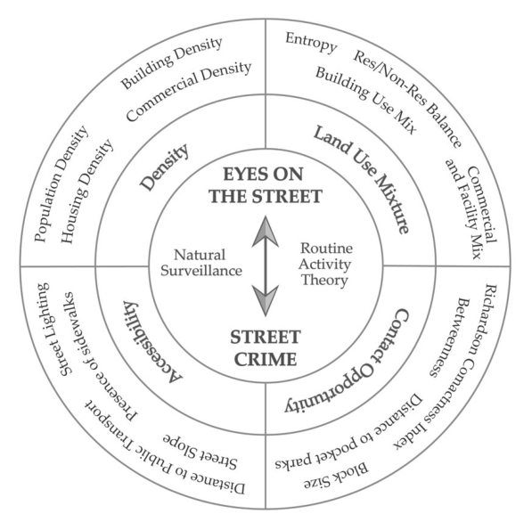
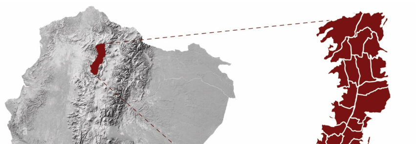
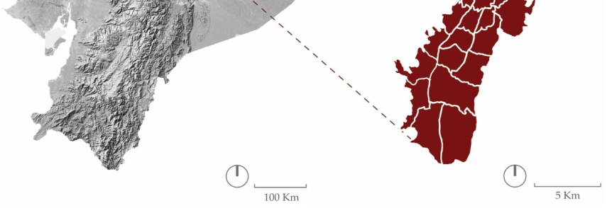
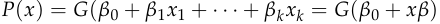
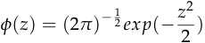

### _Article_ 

# **“Eyes on the Street” as a Conditioning Factor for Street Safety Comprehension: Quito as a Case Study** 

### **Nuria Vidal-Domper****1,** ***, Susana Herrero-Olarte****2** **, Gioconda Ramos****3** **and Marta Benages-Albert****1** 

- 1 School of Architecture, Universitat Internacional de Catalunya (UIC), 08017 Barcelona, Spain; martabenages@uic.es 

- 2 Facultad de Ciencias Económicas y Administrativas, Universidad de las Américas (UDLA), Quito 170513, Ecuador; olartesusana@hotmail.com 

- 3 Observatorio Metropolitano de Seguridad Ciudadana de Quito, Quito 170401, Ecuador; gioconda.ramos@gmail.com 

- Correspondence: nuriavidal@uic.es 

### **Abstract** 

Academic Editor: Fanglei Zhong Received: 17 June 2025 Revised: 16 July 2025 Accepted: 17 July 2025 Published: 22 July 2025 **Citation:** Vidal-Domper, N.; Herrero-Olarte, S.; Ramos, G.; Benages-Albert, M. “Eyes on the Street” as a Conditioning Factor for Street Safety Comprehension: Quito as a Case Study. _Buildings_ **2025** , _15_ , 2590. https://doi.org/10.3390/ buildings15152590 

**Copyright:** © 2025 by the authors. Licensee MDPI, Basel, Switzerland. This article is an open access article distributed under the terms and conditions of the Creative Commons Attribution (CC BY) license (https://creativecommons.org/ licenses/by/4.0/). 

The presence of people has a complex relationship with public safety—while it is often associated with increased natural surveillance, it can also attract specific types of crime under certain urban conditions. This exploratory study examines this dual relationship by integrating Jane Jacobs’s urban theories and the principles derived from them in Quito, Ecuador. Anchored in Jacobs’s concept of “eyes on the street,” this research assesses four morphological dimensions—density, land use mixture, contact opportunity, and accessibility through nine specific indicators. A binary logistic regression model is used to examine how these features relate to the incidence of street robberies against individuals. The findings indicate that urban form characteristics that foster “eyes on the street”—such as higher population density and a mix of commercial and residential uses—show statistically significant associations with lower rates of street robbery. However, other indicators of “eyes on the street”—such as larger block sizes, proximity to public transport stations, greater street lighting, and a higher balance between residential and non-residential land uses—correlate with increased crime rates. Some indicators, such as population density, block size, and distance to public transport stations, show statistically significant relationships, though the practical effect size compared to residential/non-residential balance, commercial and facility mix, and street lighting is modest. These results underscore the importance of contextualizing Jacobs’s frameworks and offer a novel contribution to the literature by empirically testing morphological indicators promoting the presence of people against actual crime data. 

**Keywords:** eyes on the street; street safety; binary logistic regression model; Quito 

## **1. Introduction** 

Urban safety is a crucial topic due to the exponential escalation of violence in a vast part of Latin America [1]. In this regard, Ecuador has been identified as the third most violent country in the region, preceded by Venezuela and Honduras, with an increase in the homicide rate from 13.7 per 100,000 inhabitants in 2021 to 43 per 100,000 inhabitants in 2023 [2]. Moreover, insecurity, crime, and violence are the some of the most pressing public concerns in the country [3]. The city of Quito, as the capital of Ecuador, has experienced a significant rise in violence, with reported incidents escalating from 26,477 crimes in 2021 to 38,736 in 2022, representing an overall growth of 43.6% [4]. Besides the governmental, 

_Buildings_ **2025** , _15_ , 2590 

https://doi.org/10.3390/buildings15152590 

_Buildings_ **2025** , _15_ , 2590 

2 of 14 

economic, and social changes that have likely contributed to this exponential increase in violence across the country [5,6], it is challenging to analyze the possible relationship between “eyes on the street” and street crimes, revisiting Jane Jacobs’s postulates. 

In this sense, in the 1960s, the American Canadian urban theorist Jane Jacobs was one of the pioneers who highlighted that specific morphological dimensions such as the need for concentration (density dimension), the need for primary mixed uses (land use mixture dimension), and the need for small blocks (contact opportunity dimension) not only fostered economic and social interaction but also contributed fundamentally to urban safety through what she termed “eyes on the street,” a neighborhood observation process facilitated by the pedestrian presence of residents, property owners, and outsiders, among others [7]. Later, these dimensions were updated by adding the accessibility component, given the increasing relevance of mobility in enhancing the presence of people, and were operationalized through measurable morphological indicators [8–12] (Figure 1). In urban criminology literature, Jacobs’s “eyes on the street” concept has been foundational for two approaches that incorporate the idea of “natural surveillance”: Crime Prevention Through Environmental Design (CPTED) and Routine Activity Theory. The first one, initially introduced by the American criminologist C. Ray Jeffery in 1971, provides natural surveillance as one possible strategy to enhance public safety, emphasizing the fear of criminals of being seen, preferring a discreet operation [13,14]. In this regard, people’s presence and visibility play a crucial role in deterring criminal activities, which can be accomplished by creating active street fronts and properly illuminated streets [15,16]. The second one, analogous to the previous principle and first announced by Lawrence E. Cohen and Marcus Felson in 1979, advocates that one of the primary key elements that must exist for a crime to occur in public space is the absence of capable guardians, besides likely offenders and suitable targets, not only focusing on the figure of the criminal but also emphasizing the relevance of the surrounding space [17–19]. 

**Figure 1.** Conceptual framework. 

Over the last two decades, empirical studies based on surveys have extensively analyzed the influence of the “eyes on the street” concept on safety perception worldwide, 

_Buildings_ **2025** , _15_ , 2590 

3 of 14 

illustrating both remarkable alignments and contradictions [20]. For instance, in Espoo, Finland, higher levels of perceived safety are more common in new monofunctional residential areas, which are typically characterized by a lower presence of people [21]. On the contrary, in Auburn, Alabama, US, Shiraz, Iran, and Kerala, India, land use diversity is associated with a reduction in the Fear of Crime (FoC) [22–24]. According to the presence of people, it is essential to underline the relationship between street-level pedestrian density and perceived FoC in Yaoundé, Cameroon, accentuating that areas exceeding a pedestrian density threshold generate a higher level of FoC [25]. Moreover, maintenance, visibility, and street lighting contribute to mitigating the FoC in Seoul, Korea, and Perth, Australia [26,27]. In addition, the specific safety perception of women in the urban space has been extensively examined [28,29]. Women usually feel safer in cases of good lighting, absence of narrow routes, good quality of sidewalks, prioritization of pedestrian mobility [30], removal of solid walls [28], promotion of visibility, mixed land use, readable street patterns [31], corners with obtuse angles, and commercial land use [32]. 

Research has been less extensive in the direct quantification of relationships between morphological indicators promoting “eyes on the street” and georeferenced crime events. Early studies in the 1970s by John C. Weicher and Charles G. Schmidt in Chicago and Denver did not find strong evidence connecting urban morphology with crime reduction [33,34]. On the other hand, E. P. Fowler identified that physical diversity and mixed land uses were associated with reduced youth crime in Toronto [35]. Studies led by Martin Traunmueller et al. and Andrey Bogomolov et al., respectively, employed entropy measures—a reinterpretation of Jacobs’s morphological diversity—and found that increased urban entropy corresponded with fewer street crimes in London [36,37]. Similarly, Lucia Summers and Shane D. Johnson employed space syntax analysis to confirm that higher street connectivity, a key Jacobs indicator related to contact opportunities, was significantly linked to crime reduction [38]. Research conducted by Nuria Vidal Domper et al. highlighted the importance of balancing commercial and public facilities, as well as proximity to pocket parks and transportation stations, in reducing crime in Quito [39]. Subham Roy and Indrajit Roy Chowdhury demonstrated that areas with low nighttime light (NTL) in Siliguri City are more vulnerable to crime [16]. Conversely, three analyses led by SooHyun O. and YongJei, Minling Zeng et al., and Guopeng Zhang and Guopeng Xiang found that specific urban features, such as retail locations, transportation nodes, or proximity to multi-family housing, may increase local crime risks in Seattle, Pittsburgh, and Shanghai, respectively [40–42]. In addition, spatial models, which incorporate tourism as a variable, have been applied, illustrating both positive and negative impacts on street safety [43–46]. 

According to the literature review, there is limited evidence of the direct effect of “eyes on the street” on street safety, integrating several morphological dimensions. This exploratory research aims to assess the relationship between nine morphological indicators, which belong to four urban dimensions—density, land use mixture, contact opportunity, and accessibility—and enhance the presence of people and the incidence of street robberies in Quito, Ecuador. The hypothesis being addressed is that having more “eyes on the street” is correlated with lower crime rates. Our study bridges a methodological gap by using four morphological dimensions and nine morphological indicators in conjunction with empirical crime data, employing a binary logit model. Our findings will contribute to understanding which morphological indicators associated with four urban dimensions promoting the presence of people can positively or negatively relate to street-level crime, independently of perceptual or social factors. This article is organized as follows: Section 2 describes the Materials and Methods; Section 3 provides the Results; Section 4 discusses and interprets the findings; and Section 5 presents the conclusions. 

_Buildings_ **2025** , _15_ , 2590 

4 of 14 

## **2. Materials and Methods** 

### _2.1. Study Area_ 

The city of Quito, officially known as San Francisco de Quito, is the second-largest city in Ecuador, with an estimated population of 1.92 million [47]. It is situated on the eastern slopes of the active Pichincha volcano in the Andes Mountains, at an average elevation of 2850 m above sea level. The city’s topography is characterized by its elongated north–south orientation, constrained by the aforementioned mountains and valleys, with an urban area covering 197.5 km2 [48]. Its urban morphology results from its historical development, socio-economic characteristics, and geographical constraints [49]. The city’s layout exhibits a mix of colonial grid patterns in the city center and more irregular growth in the peripheral areas [50]. It administratively belongs to the Metropolitan District of Quito and is divided into 32 urban parishes (Figure 2). 

**Figure 2.** Map of the 32 urban parishes of Quito, Ecuador. 

### _2.2. Data Source_ 

This section describes the data sources used to investigate whether a correlation exists between specific morphological urban indicators associated with the “eyes on the street” concept and the incidence of street robberies in the city of Quito, Ecuador. 

### 2.2.1. Morphological Data 

The database used in this study includes variables based on previous research [39], which respond to Jane Jacobs’s advocacy for the importance of people’s presence in enhancing urban safety and were methodologically adapted for this study. Four morphological dimensions were considered: density, land use mixture, contact opportunity, and accessibility. 

The model’s explanatory variables include nine morphological indicators promoting “eyes on the street” across these four dimensions: (1) Density, comprising (1A) Population Density, which measures the concentration of residents per unit area, and (1B) Building Density, reflecting the proportion of built-up area relative to the total area; (2) Land Use Mixture, including (2A) Entropy, which captures the functional diversity of land, and (2B) 

_Buildings_ **2025** , _15_ , 2590 

5 of 14 

Residential/Non-residential balance, representing the proportion of housing to other land uses; (3) Contact Opportunity, consisting of (3A) Block Size, assuming that larger block sizes would diminish the quantity of eyes on the street and (3B) Richardson Compactness Index (RCI), illustrating the relationship between regularity and compactness, with the circle as the ideal shape; (4) Accessibility, with (4A) Distance to Public Transport Stations and (4B) Number of streetlights (Table 1). The indicators were calculated within raster cells measuring 50 _×_ 50 m using ArcGIS 10.5, applying the WGS84 (World Geodetic System 1984) and the Universal Transverse Mercator (UTM) coordinate projection for Zone 17 South. 

**Table 1.** Description and calculation of morphological variables. 

|**Dimension**|**Indicator’s Description**|**Indicator’s Calculation**|
|---|---|---|
|Density|1A. Population Density a|Number of Permanent Residents/Cell Area|
||1B. Building Density b|Number of Buildings/Cell Area|
||2A. Entropy c,d|_−_∑(_Pi × In_(_Pi_)) 1|
|Land Use Mixture|2B. Residential/Non- Residential Balance e|1_−_|(Resi_−_ NonResi)/(Resi+ NonResi)| 2|
||2C. Commercial and FacilityMix c|_−_∑(_Pi × In_(_Pi_))/_ln_(_m_) 3|
|Contact Opportunity|3A. Richardson Compactness Index a (RCI)|_RCIi_ = _√_ _πSi_ _Ci_|
||3B. Block Size a|Polygon area|
||4A. Distance to Public Transport Stations f|_Max_(_|x_2_−x_1_|_,_|y_2_−y_1_|_)|
|Accessibility|4B. Street Lighting g|(1 = Presence of Streetlights, 0 = Absence of Streetlights)|

Data Sources:<u>a</u> Data and Cartography of the VII Population and VI Housing Census 2010 at the census block level. Source: Instituto Nacional de Estadística y Censos (INEC).b Cartography of Buildings, 2019. Source: Municipio del Distrito Metropolitano de Quito.c Cartography of the Metropolitan Licences for the Economic Activities Exercise—LUAEs, 2019. Source: Municipality of the Metropolitan District of Quito.d Cartography on centres for senior citizens, daycare centres, schools, colleges, etc., 2019. Source: Municipio del Distrito Metropolitano de Quito. e Land Use and Occupancy Plan (PUOS). Source: Metropolitan District of Quito. f Cartography of Bus Stops, Ecovía, and Trolleybus Stations, 2019. Source: Municipio del Distrito Metropolitano de Quito. g Open Street Maps cartography of street lighting and crosswalks, 2022. Additional information: 1 Where Pi is the proportion of category i of POIs in a block. The categories are as follows: (1) retail and wholesale, (2) scenic sites, (3) government, and organization, (4) sports and cultural, (5) financial and insurance, (6) textile and food, (7) restaurants, (8) companies and enterprises, (9) residential, (10) transport, (11) public facilities, (12) hotel and recreation, (13) medical and healthcare, and (14) research and education.2 The indicator evaluates the coexistence of residential and non-residential land uses in a 50 m _×_ 50 m cell. The indicator takes values between 0 and 1. Res is the proportion of exclusively residential uses and Non-Res is the proportion of non-residential uses.3 Where Pi is the proportion of a business category i in a 50 _×_ 50 m cell, and where m is the total number of business categories existing in the study area. 

### 2.2.2. Crime Data 

The Observatorio Metropolitano de Seguridad Ciudadana (OMSC) of the Metropolitan District of Quito, Quito, Ecuador, provided the police report data and ECU911 calls required for this study. It recorded 22,655 street crimes committed across the 32 urban parishes of the city in 2022, divided into 4 categories: robbery from persons (15,403), robbery from cars (2671), robbery of goods, accessories, and auto parts from vehicles (3092), and robbery from motorcycles (1489). Details of each crime, included georeferencing and date, were 

_Buildings_ **2025** , _15_ , 2590 

6 of 14 

provided. Considering the importance of pedestrian presence in street safety, we focused on the robbery from person category. 

### 2.2.3. Analytical Procedure 

This research employs a binary logistic regression model, known as logit, to examine urban factors that influence the likelihood that a recorded crime event is a robbery from persons. The model’s specification enables us to examine how different morphological attributes affect the relative probability of this particular type of crime. The dependent variable is created as a dichotomous variable that takes the value of 1 if the event is a robbery from person, and 0 if it involves any other type of crime (robbery from cars, robbery of goods, accessories, and auto parts from vehicles, and robbery from motorcycles). All these variables are incorporated into a spatial grid of uniform resolution and georeferenced under a system of projected coordinates, allowing for precise overlay with the criminal event records. Although the data is organized in a georeferenced spatial grid, the model itself (binary logistic regression) does not produce spatially explicit results. Instead, it statistically identifies which urban morphological attributes significantly affect the likelihood of a crime being a robbery from persons, relative to other types of robbery, thereby offering a comprehensive empirical approach to understanding the relationship between “eyes on the street”, urban morphology, and street safety. 

The logit model estimates the following probability function: 

The G function refers to a standard normal cumulative distribution, ensuring that the estimated values remain within the range of 0 to 1. This function, in its integral form, is constructed from the standard normal density function _\_ phi( _z_ ), defined as follows: 

It is essential to note that the coefficients estimated by this type of model do not lend themselves to a direct interpretation in terms of probabilities. Their interpretation is limited to the sign, indicating only the direction of the relationship—positive or negative—between the independent variable and the probability of the event. Therefore, and considering that the objective of this study is to analyze the magnitude of these probabilities, it is essential to calculate the marginal effects of the explanatory variables, following the methodological recommendation made by Wooldridge in 2010 [51]. 

In this research, _Yi_ is a binary variable that takes the value of 1 if the crime is robbery to a person, and 0 if it is robbery to a vehicle; _Xi_ represents the vector of urban covariates; and β is the vector of coefficients to be estimated. Given that the coefficients of the logit model are not directly interpretable in terms of probabilities, the marginal effects are calculated as a measure of the change in the probability of a unit variation of each covariate, keeping the other covariates constant. 

The estimation of the logit model was carried out using the maximum likelihood method, and the standard errors were calculated robustly to correct for possible heteroscedasticity issues. The validation of the model was based on several criteria: the statistical significance of the individual coefficients, the R2 value as a measure of the relative explanatory power of the model, and the theoretical consistency of the signs of the estimators with the literature on street safety. Likewise, the stability of the results was evaluated through the consistency of the marginal effects obtained. The inclusion of synthetic indices derived from the weighted combination of multiple urban indicators allowed for an aggregate assessment of the effect of people’s presence on the incidence of street 

_Buildings_ **2025** , _15_ , 2590 

7 of 14 

robberies. This comprehensive approach strengthened the explanatory capacity of the model and provided a multidimensional understanding of the factors that influence crime prevention in urban environments. Also, underreporting of crimes could generate biases in the dependent variable. Finally, potential collinearity between morphological variables could affect the precision of the individual coefficients, although it does not compromise the overall validity of the model. 

To conclude, the methodological strategy adopted allows us to precisely identify which attributes of the urban environment have a differential impact on the occurrence of street robberies. 

## **3. Results** 

The marginal effects derived from the logistic probability regression model (Table 2) indicate that higher population density slightly decreases the likelihood of robberies against persons, reducing it by 0.0134 percentage points. This suggests that in more densely populated urban areas, informal social control or a greater presence of people in public spaces may discourage this type of crime. Conversely, a more balanced proportion of residential and non-residential areas (Residential/Non-Residential Balance) is linked to an 11.2 percentage point increase in the probability of crimes against persons. This can be interpreted as a consequence of reduced pedestrian turnover and lower dynamism in areas dominated solely by residential uses, which may diminish the deterrent effect of pedestrian traffic and facilitate the commission of crimes. 

**Table 2.** Binary logistic regression model. 

|**Morphological Urban** **Indicators**|**Model**|**Marginal Effects** **dy/dx**|
|---|---|---|
|Population Density|_−_0.000580 ***|_−_0.000134 ***|
||(_−_2.79)|(_−_2.79)|
|Building Density|0.0104|0.00239|
||(0.40)|(0.40)|
|Entropy|_−_0.891|_−_0.205|
||(_−_0.10)|(_−_0.10)|
|Residential/Non- Residential Balance|0.484 ***|0.112 ***|
||(10.25)|(10.42)|
|Commercial and Facility Mix|_−_1.932 **|_−_0.4459 **|
||(_−_2.12)|(_−_2.12)|
|Richardson Compactness Index|_−_0.170|_−_0.0392|
||(_−_1.19)|(_−_1.19)|
|Block Size|0.000000841 ***|0.000000194 ***|
||(2.70)|(2.71)|
|Distance to Public Transport Stations|_−_0.000994 ***|_−_0.000229 ***|
||(_−_4.90)|(_−_4.93)|
|Street Lighting|0.0525 ***|0.0121 ***|
||(5.94)|(5.97)|
|Constant|0.272 ***|-|
||(4.07)|-|
|Observations|11.046|11.046|

Furthermore, a significantly more substantial effect is observed in the case of the commercial mix and the presence of urban facilities (Commercial and Facility Mix). These 

_Buildings_ **2025** , _15_ , 2590 

8 of 14 

factors are associated with a substantial decrease of 0.4459 points in the likelihood of personal crime, emphasizing the important role played by the functional diversity of the urban environment. Specifically, it can be inferred that spaces with a mixture of uses—such as shops, services, educational or health facilities—generate increased activity and persistent presence of people, which enhances natural surveillance and diminishes conditions conducive to street robberies. 

Other urban factors, such as Block Size and the Presence of Streetlights, also have a positive influence on the likelihood of crime, albeit to a lesser extent. Specifically, these factors increase the possibility of street robberies by 0.0000194 and 1.21 percentage points, respectively. The significance of block size may relate to urban design patterns that hinder visibility or connectivity between spaces. Conversely, it is observed that a greater distance from public transportation (Distance to Public Transport Stations) is associated with a slight reduction in the probability of this type of crime, estimated at 0.0229 percentage points. This relationship might be due to areas farther from public transportation experiencing lower foot traffic, which, paradoxically, could reduce opportunities for crime if these areas are not heavily trafficked. 

Finally, indicators such as Building Density, Entropy, and the Richardson Compactness Index (RCI) did not show statistically significant effects in the model. This suggests that, based on the available data, it is possible to establish a relationship between these characteristics of the urban environment and the likelihood of robberies against individuals. However, their influence could be affected by additional contextual factors not captured in the regression or may require more complex models to be identified. 

The model has been internally validated through procedures that assess its stability and adequacy. 

## **4. Discussion** 

The present study examines the relationship between specific morphological indicators that promote “eyes on the street” and the incidence of street robberies in Quito, Ecuador. By applying a binary logistic regression model (logit) we identify significant correlations between six out of the nine indicators analyzed: (1) Population Density, (2) Residential/NonResidential Balance, (3) Commercial and Facility Mix, (4) Block size, (5) Distance to Public Transport Stations, and (6) Street Lighting (Table 2). These findings reveal both alignments and contradictions with Jacob’s principles, particularly concerning the role of natural surveillance in public space safety. They also underscore the complexity of applying urban theories to empirical crime data. 

First, according to the Density dimension, the Population Density indicator underlines the core idea that a consistent presence of more “eyes on the street” contributes to a reduction in the number of street robberies. This indicator responds to the relevance of having a consistent presence of people during continuous periods of time in the unit of study [52]. However, the Population Density indicator typically does not incorporate parameters of the non-resident population into its calculation. This may lead to significant mismatches in touristic urban areas where the number of tourists directly impacts the number of street crimes [43,45,46]. 

Second, according to the Land Use Mixture dimension, there is an inconsistency between two of the evaluated indicators: Residential/Non-Residential Balance and Commercial and Facility Mix. The observed rise in crime in areas with a high Residential/NonResidential Balance suggests that a simple metric of land use parity may not capture the fundamental dynamics of urban vitality. Furthermore, increased residential use may result in fewer people on the street, potentially reducing natural surveillance. Conversely, a diverse commercial and facility mix with more active frontages highlights the importance 

_Buildings_ **2025** , _15_ , 2590 

9 of 14 

of specific land uses, especially those that encourage extended hours of street activity and natural surveillance, such as cafes, shops, and services [35–37]. These findings refine Jacobs’s principles, emphasizing that not all “mixed-use” configurations contribute equally to street-level pedestrian density and public safety [39]. 

Third, according to the Contact Opportunity dimension, the Block Size indicator has a negative influence on street robberies, thereby decreasing street safety in larger urban blocks. This finding aligns well with Jane Jacobs’s postulate that urban blocks should be relatively short, fostering a high frequency of intersections and turning opportunities to improve spatial permeability and pedestrian connectivity [7]. The value of frequent streets and short blocks does not lie solely in their physical form, but in their ability to support complex patterns of cross-use within urban neighborhoods [38]. These morphological elements act as enablers of social and functional diversity, rather than as objectives in themselves [7]. 

Fourth, within the Accessibility dimension, the Distance to Public Transport Stations and Street Lighting indicators act as triggers for crime in Quito. Proximity to transit is believed to promote safety by encouraging pedestrian activity and natural surveillance. Transit-oriented environments support Jacobs’s ideal of “eyes on the street” and reflect the focus on visibility of CPTED and Routine Activity Theory [53]. However, while transit hubs foster activity and movement, they can also attract crime. High pedestrian volumes, increased anonymity, and accessible escape routes make these areas appealing to opportunistic offenders [54]. In this context, proximity to transit hubs may increase crime not despite vitality, but because of the transitional activities it enables [40,41]. Street lighting is a widely debated factor in urban safety research. Adequate lighting depends not only on its intensity but also on how and where it is implemented [16]. In this study, the positive correlation between street lighting and robbery may not indicate that lighting causes crime, but that lighting tends to be installed in areas with high pedestrian, commercial, or touristic activity, which inherently attract both people and potential offenders. While better lighting can improve natural surveillance, it can also increase target availability and enable greater offender anonymity in crowded settings [42,55]. Furthermore, lighting may signal higher infrastructure investment and spatial clarity, often associated with wealthier neighborhoods, which can in turn become attractive targets for robbery. Indeed, research from parts of the United Kingdom has shown that increased lighting does not always correlate with reduced crime, and in some cases, it may simply shift criminal activity in time or space [56,57]. While a review of 35 studies found that 72% identified a link between lighting and either reduced crime or fear of crime [58], the nature of that relationship is context-dependent and complex, rather than universally protective. 

Fifth, we would like to argue the relevance of the results of the three indicators, which presented a null effect in the binary logistic regression model. First, the Building Density indicator may require a more accurate proxy to obtain more precise results. For instance, high-populated areas with buildings exceeding eight stories present a relatively low level of building density. In contrast, several small buildings in the same block could yield a similarly low building density. Second, the Entropy indicator has been calculated with nine context-based categories. However, they have been equally weighted, which could lead to possible misadjustments in results. Third, the Richardson Compactness Index is almost equally distributed throughout the city, which does not enable more nuanced results. Accordingly, we would like to emphasize the importance of carefully defining indicators and calculations based on the context. In this sense, North-European and North-American cities typically exhibit cultural and economic dynamics related to formal urban design and street life concentrated in the summer due to their atmospheric conditions, whereas Global South cities close to the Equator present continuous street life and are usually unevenly 

_Buildings_ **2025** , _15_ , 2590 

10 of 14 

urbanized and characterized by informal commerce. In addition, it is mandatory not to assume Jane Jacobs’s hypothesis as a universally valid truth. In this regard, recent feminist and postcolonial urban works have questioned Jacobs’s idealization of “eyes on the street” as insufficient for ensuring women’s safety [59]. 

Despite its empirical contributions, this study has several limitations that open promising avenues for future research: 

Firstly, this is an initial exploratory analysis at the metropolitan level that does not break down results by parish. While this method captures overall patterns, it cannot reflect intra-urban differences. Quito’s parishes vary significantly in terms of morphology, land use, socioeconomic conditions, and tourism levels. Future research could perform comparative analyses at the parish level to identify local trends and determine whether morphological indicators behave differently across smaller and more specific urban areas. 

Second, the model focuses exclusively on physical–morphological variables, excluding key socio-demographic and perceptual factors, such as gender, age, fear of crime, and community cohesion. These concepts are central to Routine Activity Theory and secondand third-generation CPTED frameworks, which emphasize the role of social capital, territoriality, and perception in shaping safety outcomes [28–30,60–62]. Future studies should integrate disaggregated crime data (e.g., by gender, age, or socioeconomic level) and combine spatial analysis with perception-based research to enrich understanding of safety dynamics. Furthermore, they should consider the possible difference between the presence of people and engaged, place-based community surveillance. 

Third, this study points to the need to refine the concept of “eyes on the street.” While Jacobs equated pedestrian presence with safety, our findings indicate that not all forms of presence offer protective effects. Areas with high activity due to tourism, nightlife, or transit may still experience elevated crime, owing to factors such as anonymity, weak territorial claims, or low social cohesion [43–45]. Future research should develop more nuanced vitality indicators, distinguishing between resident-based and transient activity, and integrating temporal dimensions (e.g., night vs. day) to better assess when and how the presence of people contributes to informal control. 

Fourth, although the spatial component facilitates the alignment of urban features with crime data, the outputs are interpreted primarily through statistical significance rather than spatial distribution. Future research should integrate spatial representation of crime correlations, assuming the recurrence of crimes in specific hotspots, as posited by the “Law of Crime Concentration”, a crucial theory in criminology studies [63–65]. 

Fifth, it is essential to note that our findings are based on a cross-sectional model, which limits the ability to establish a causal direction. To better assess the true effect of interventions such as street lighting, future research should explore panel data approaches, fixed-effect models, or quasi-experimental designs like Difference-in-Differences, which can help account for endogeneity and improve causal inference. 

Despite its exploratory nature, this study addresses a significant methodological gap in the field of urban safety research. While CPTED frameworks increasingly incorporate perceptual and social dimensions, most empirical studies rely on qualitative or survey-based approaches. Few have tested Jacobs-derived morphological indicators against georeferenced crime data. By doing so, this research introduces a data-driven approach that complements perception-based studies, bridging the disciplinary division between urban theory, criminology, and econometric analysis. 

## **5. Conclusions** 

This study reinforces the notion that morphological urban indicators associated with the “eyes on the street” concept are significantly related to crime incidence in public space. 

_Buildings_ **2025** , _15_ , 2590 

11 of 14 

By integrating urban morphological variables with official street robbery data, this approach introduces a methodological framework that utilizes binary logistic regression, making it replicable across diverse urban contexts. 

In Quito’s urban parishes, six out of nine analyzed morphological indicators show statistically significant correlations with the occurrence of street robbery. Notably, higher population density and greater commercial and facility mix are associated with lower street robbery rates. In contrast, a higher residential/non-residential balance, larger block sizes, proximity to public transportation stations, and greater street lighting levels are correlated with higher robbery incidence. 

These findings underscore the complex and sometimes counterintuitive relationship between “eyes on the street”, urban form, and safety. By integrating morphological indicators with empirical crime data, this study contributes to a more informed understanding of urban safety and supports the continued relevance of Jacobs’s theories in contemporary Latin American cities. 

Future research should incorporate socioeconomic data and provide spatial representation of crime alongside comparative analyses at the parish scale, aiming to determine if morphologically and socially similar neighborhoods present the same level of street safety. 

**Author Contributions:** Conceptualization, N.V.-D. and M.B.-A.; methodology, N.V.-D.; software, G.R. and S.H.-O.; validation, N.V.-D.; formal analysis, G.R. and S.H.-O.; investigation, N.V.-D.; resources, N.V.-D.; data curation, N.V.-D.; writing—original draft preparation, N.V.-D.; writing—review and editing, M.B.-A.; visualization, N.V.-D.; supervision, N.V.-D. and M.B.-A.; project administration, N.V.-D. All authors have read and agreed to the published version of the manuscript. 

**Funding:** This research received no external funding. 

**Data Availability Statement:** The original contributions presented in this study are included in the article. Further inquiries can be directed to the corresponding author. 

**Acknowledgments:** We are extremely grateful to Esteban Vaca for his technical skills in the generation of the econometric models. 

**Conflicts of Interest:** The authors declare no conflicts of interest. 

## **References** 

1. Observatorio Ecuatoriano para el Crimen Organizado. _Boletín Anual de Homicidios Intencionales Para el Desarrollo en Ecuador_ ; Pan American Development Foundation (PADF): Washington, DC, USA, 2023; p. 36. 

2. Human Rights Watch. _Ecuador: Eventos de 2023_ ; Human Rights Watch: New York, NY, USA, 2023. Available online: https: //www.hrw.org/es/world-report/2024/country-chapters/ecuador (accessed on 21 May 2025). 

3. Statista Principales Problemas de Ecuador Según Opinión Pública en 2024. Available online: https://es.statista.com/estadisticas/ 1405158/los-peores-problemas-de-ecuador-segun-la-opinion-publica/ (accessed on 21 May 2025). 

4. Secretaría General de Seguridad y Gobernabilidad del Municipio del Distrito Metropolitano de Quito. _Diagnóstico Situacional Distrito Metropolitano de Quito año 2022_ ; Alcaldía del Municipio del Distrito Metropolitano de Quito: Quito, Ecuador, 2023. 

5. Pontón Cevallos, D.; Rivera Vélez, F. Cinco Perspectivas Interpretativas Sobre El Incremento de La Violencia En Ecuador. _Sociol. Y Política Hoy_ **2024** , _9_ , 139–167. 

6. Pozo Peralta, J.X. El Aumento de La Violencia En Ecuador: Análisis de Las Variables Socioeconómicas y Su Relación Con La Tasa de Homicidios. _Rev. Cult. Paz._ **2024** , _7_ , 99–122. [CrossRef] 

7. Jacobs, J. _The Death and Life of Great American Cities_ ; Random House: New York, NY, USA, 1961; ISBN 978-0-394-42159-9. 

8. Delclòs-Alió, X.; Miralles-Guasch, C. Looking at Barcelona through Jane Jacobs’s Eyes: Mapping the Basic Conditions for Urban Vitality in a Mediterranean Conurbation. _Land Use Policy_ **2018** , _75_ , 505–517. [CrossRef] 

9. Fuentes, L.; Miralles-Guasch, C.; Truffello, R.; Delclòs-Alió, X.; Flores, M.; Rodríguez, S. Santiago de Chile through the Eyes of Jane Jacobs. Analysis of the Conditions for Urban Vitality in a Latin American Metropolis. _Land_ **2020** , _9_ , 498. [CrossRef] 

10. Gómez-Varo, I.; Delclòs-Alió, X.; Miralles-Guasch, C. Jane Jacobs Reloaded: A Contemporary Operationalization of Urban Vitality in a District in Barcelona. _Cities_ **2022** , _123_ , 103565. [CrossRef] 

_Buildings_ **2025** , _15_ , 2590 

12 of 14 

11. Wang, X.; Zhang, Y.; Yu, D.; Qi, J.; Li, S. Investigating the Spatiotemporal Pattern of Urban Vibrancy and Its Determinants: Spatial Big Data Analyses in Beijing, China. _Land Use Policy_ **2022** , _119_ , 106162. [CrossRef] 

12. Vidal-Domper, N.; Hoyos-Bucheli, G.; Benages-Albert, M. Jane Jacobs’s Criteria for Urban Vitality: A Geospatial Analysis of Morphological Conditions in Quito, Ecuador. _Sustainability_ **2023** , _15_ , 8597. [CrossRef] 

13. Jeffery, C.R. Crime Prevention Through Environmental Design. _Am. Behav. Sci._ **1971** , _14_ , 598. [CrossRef] 

14. Moffatt, R.E. Crime Prevention Through Environmental Design—A Management Perspective. _Can. J. Criminol._ **1983** , _25_ , 19–31. [CrossRef] 

15. Mcmillen, D.; Sarmiento-Barbieri, I.; Singh, R. Do More Eyes on the Street Reduce Crime? Evidence from Chicago’s Safe Passage Program. _J. Urban Econ._ **2019** , _110_ , 1–25. [CrossRef] 

16. Roy, S.; Chowdhury, I.R. Brighter Nights, Safer Cities? Exploring Spatial Link between VIIRS Nightlight and Urban Crime Risk. _Remote Sens. Appl. Soc. Environ._ **2025** , _37_ , 101489. [CrossRef] 

17. Cohen, L.E.; Felson, M. Social Change and Crime Rate Trends: A Routine Activity Approach. _Am. Sociol. Rev._ **1979** , _44_ , 588–608. [CrossRef] 

18. Hollis-Peel, M.E.; Reynald, D.M.; van Bavel, M.; Elffers, H.; Welsh, B.C. Guardianship for Crime Prevention: A Critical Review of the Literature. _Crime Law Soc. Change_ **2011** , _56_ , 53–70. [CrossRef] 

19. Miró, F. Routine Activity Theory. In _The Encyclopedia of Theoretical Criminology_ ; John Wiley & Sons, Ltd.: Hoboken, NJ, USA, 2014; pp. 1–7, ISBN 978-1-118-51739-0. 

20. Yiliu, W.; Hussain, N.; Shukor, S.F.A. Safety Perceptions Related to Park Environments: A Scoping Review. _World Leis. J._ **2025** , 1–40. [CrossRef] 

21. Kyttä, M.; Kuoppa, J.; Hirvonen, J.; Ahmadi, E.; Tzoulas, T. Perceived Safety of the Retrofit Neighborhood: A Location-Based Approach. _Urban Des. Int._ **2013** , _4_ , 311–328. [CrossRef] 

22. Park, Y.; Garcia, M. Pedestrian Safety Perception and Urban Street Settings. _Int. J. Sustain. Transp._ **2020** , _14_ , 860–871. [CrossRef] 

23. Askari, A.; Soltani, S. CPTED Principles and Preventing Crimes: The Cases from Shiraz City, Iran. _J. Des. Built Environ._ **2023** , _23_ , 1–13. [CrossRef] 

24. Mohan, K.; Chani, P.S. Safety-Perception Map: A Participatory Tool to Explore the User’s Perception of Safety in Urban Public Parks. _J. Urban Des._ **2024** , 1–26. [CrossRef] 

25. Tchinda, P.E.; Kim, S.-N. The Paradox of “Eyes on the Street”: Pedestrian Density and Fear of Crime in Yaoundé, Cameroon. _Sustainability_ **2020** , _12_ , 5300. [CrossRef] 

26. Lee, J.S.; Park, S.; Jung, S. Effect of Crime Prevention through Environmental Design (CPTED) Measures on Active Living and Fear of Crime. _Sustainability_ **2016** , _8_ , 872. [CrossRef] 

27. Cozens, P.; Sun, M.Y. Exploring Crime Prevention through Environmental Design (CPTED) and Students’ Fear of Crime at an Australian University Campus Using Prospect and Refuge Theory. _Prop. Manag._ **2019** , _37_ , 287–306. [CrossRef] 

28. Navarrete-Hernandez, P.; Vetro, A.; Concha, P. Building Safer Public Spaces: Exploring Gender Difference in the Perception of Safety in Public Space through Urban Design Interventions. _Landsc. Urban Plan._ **2021** , _214_ , 104180. [CrossRef] 

29. Chen, X.; Hedayati Marzbali, M. How Urban Park Features Impact Perceived Safety by Considering the Role of Time Spent in the Park, Gender, and Parental Status. _Cities_ **2024** , _153_ , 105272. [CrossRef] 

30. Garfias Royo, M.; Parikh, P.; Walker, J.; Belur, J. The Response to Violence against Women and Fear of Violence and the Coping Strategies of Women in Corregidora, Mexico. _Cities_ **2023** , _132_ , 104113. [CrossRef] 

31. Rashid, S.; Wahab, M.; Rani, W. Designing Safe Street for Women. _Int. J. Recent Technol. Eng._ **2019** , _8_ , 118–122. [CrossRef] 

32. Huang, Y.; Hino, K.; Asami, Y.; Usui, H.; Nakajima, M. Fear of Street Crime among Japanese Mothers with Elementary School Children: A Questionnaire Survey Using Street Montage Photographs. _J. Asian Archit. Build. Eng._ **2024** , _23_ , 443–452. [CrossRef] 

33. Weicher, J.C. A Test of Jane Jacobs’ Theory of Successful Neighborhoods. _J. Reg. Sci._ **1973** , _13_ , 29–40. [CrossRef] 

34. Schmidt, C.G. Influence of Land Use Diversity upon Neighborhood Success: An Analysis of Jacobs’ Theory. _Ann. Reg. Sci._ **1977** , _11_ , 53–65. [CrossRef] 

35. Fowler, E.P. Street Management and City Design. _Soc. Forces_ **1987** , _66_ , 365–389. [CrossRef] 

36. Traunmueller, M.; Quattrone, G.; Capra, L. Mining Mobile Phone Data to Investigate Urban Crime Theories at Scale. In _Social Informatics, Proceedings of the 6th International Conference, SocInfo 2014, Barcelona, Spain, 11–13 November 2014_ ; Aiello, L.M., McFarland, D., Eds.; Springer International Publishing: Cham, Switzerland, 2014; pp. 396–411, ISBN 978-3-319-13734-6. 

37. Bogomolov, A.; Lepri, B.; Staiano, J.; Letouzé, E.; Oliver, N.; Pianesi, F.; Pentland, A. Moves on the Street: Classifying Crime Hotspots Using Aggregated Anonymized Data on People Dynamics. _Big Data_ **2015** , _3_ , 148–158. [CrossRef] 

38. Summers, L.; Johnson, S.D. Does the Configuration of the Street Network Influence Where Outdoor Serious Violence Takes Place? Using Space Syntax to Test Crime Pattern Theory. _J. Quant. Criminol._ **2017** , _33_ , 397–420. [CrossRef] 

_Buildings_ **2025** , _15_ , 2590 

13 of 14 

39. Vidal-Domper, N.; Herrero-Olarte, S.; Hoyos-Bucheli, G.; Benages-Albert, M. Do Jane Jacobs’s Conditions Fostering the Presence of People Influence Crimes in Public Space? An Econometric Analysis in La Mariscal Neighborhood in Quito. _Cities_ **2024** , _148_ , 104863. [CrossRef] 

40. O, S.; Lee, Y. Crime and Land Use in Pittsburgh: A Micro-Size Grid-Cell Analysis of the Influence of Land-Uses on Area Crime. _Crime Prev. Community Saf._ **2016** , _18_ , 204–227. [CrossRef] 

41. Zeng, M.; Mao, Y.; Wang, C. The Relationship between Street Environment and Street Crime: A Case Study of Pudong New Area, Shanghai, China. _Cities_ **2021** , _112_ , 103143. [CrossRef] 

42. Lee, S.; Lee, C.; Won Nam, J.; Vernez Moudon, A.; Mendoza, J.A. Street Environments and Crime around Low-Income and Minority Schools: Adopting an Environmental Audit Tool to Assess Crime Prevention through Environmental Design (CPTED). _Landsc. Urban Plan._ **2023** , _232_ , 104676. [CrossRef] 

43. Biagi, B.; Detotto, C. Crime as Tourism Externality. _Reg. Stud._ **2014** , _48_ , 693–709. [CrossRef] 

44. Montolio, D.; Planells-Struse, S. Does Tourism Boost Criminal Activity? Evidence From a Top Touristic Country. _Crime Delinq._ **2016** , _62_ , 1597–1623. [CrossRef] 

45. Recher, V.; Rubil, I. More Tourism, More Crime: Evidence from Croatia. _Soc. Indic. Res._ **2020** , _147_ , 651–675. [CrossRef] 46. Zhang, J.; Xiang, G. Revisiting the Relationship Between Tourism and Crime Based on a Dynamic Spatial Durbin Model. _Crime Delinq._ **2022** , _68_ , 2146–2171. [CrossRef] 

47. Barrera, A.; Cabrera-Barona, P.; Velasco-Oña, P. Derechos, Calidad de Vida y División Social Del Espacio En El Distrito Metropolitano de Quito. _EURE_ **2022** , _48_ , 1–23. [CrossRef] 

48. Ulloa-Espíndola, R.; Cuyo-Cuyo, J.; Lalama-Noboa, E. Towards Rural Resilience: Assessing Future Spatial Urban Expansion and Population Growth in Quito as a Measure of Resilience. _Land_ **2023** , _12_ , 335. [CrossRef] 

49. Bustamante Patiño, B.; Herrero-Olarte, S. La Clase Dominante Como Determinante de La Forma de Quito. _Bitácora Urbano Territ._ **2017** , _27_ , 81–90. [CrossRef] 

50. Hoyos-Bucheli, G. Urban Form Related to Historical Patterns, Morphogenesis, and Transformations. In _The Case of “La Tola” in the City of Quito, Ecuador, Proceedings of the Urban Form and the Sustainable and Prosperous Cities, Glasgow, Scotland, 9 June–3 July 2021_ ; University of Strathclyde Publishing: Glasgow, Scotland, 2022; pp. 1294–1301. 

51. Wooldridge, J.M. _Econometric Analysis of Cross Section and Panel Data_ ; MIT Press: Cambridge, MA, USA, 2010; ISBN 0-262-29679-9. 52. Dogan, O.; Lee, S. Jane Jacobs’s Urban Vitality Focusing on Three-Facet Criteria and Its Confluence with Urban Physical Complexity. _Cities_ **2024** , _155_ , 105446. [CrossRef] 

53. Ba¸saran, G.G.; Ingvardson, J.B.; Nielsen, O.A. Does Transit-Oriented Development (TOD) Influence Perceived Safety and Mode Choice? _JTLU_ **2025** , _18_ , 237–267. [CrossRef] 

54. Devin, D.G. Crime in Transit Oriented Districts: Learning from Dallas, Texas. Master’s Thesis, University of Texas at Arlington, Dallas, TX, USA, 2013. 

55. Weisburd, D.; Groff, E.R.; Yang, S.-M. Understanding and Controlling Hot Spots of Crime: The Importance of Formal and Informal Social Controls. _Prev. Sci._ **2014** , _15_ , 31–43. [CrossRef] [PubMed] 

56. Atkins, S.; Husain, S.; Storey, A. _The Influence of Street Lighting on Crime and Fear of Crime_ ; Crime Prevention Unit Paper; Home Office: London, UK, 1991; ISBN 978-0-86252-668-9. 

57. Tompson, L.; Steinbach, R.; Johnson, S.D.; Teh, C.S.; Perkins, C.; Edwards, P.; Armstrong, B. Absence of Street Lighting May Prevent Vehicle Crime, but Spatial and Temporal Displacement Remains a Concern. _J. Quant. Criminol._ **2023** , _39_ , 603–623. [CrossRef] 

58. Ceccato, V.; Nalla, M. The Architecture of Crime and Fear of Crime. Research Evidence on Lighting, CCTV and CPTED Features. In _Crime and Fear in Public Places: Towards Safe, Inclusive and Sustainable Cities_ ; Taylor & Francis Group: Boca Raton, FL, USA, 2020; ISBN 978-0-429-35277-5. 

59. Roberts, N.; Donovan, C.; Durey, M. Gendered Landscapes of Safety: How Women Construct and Navigate the Urban Landscape to Avoid Sexual Violence. _Criminol. Crim. Justice_ **2022** , _22_ , 287–303. [CrossRef] 

60. Abdullah, A.; Hedayati Marzbali, M.; Maghsoodi Tilaki, M.J. Predicting the Influence of CPTED on Perceived Neighbourhood Cohesion: Considering Differences across Age. _J. Environ. Psychol._ **2013** , _36_ , 54–64. [CrossRef] 

61. Webb Jamme, H.-T.; Bahl, D.; Banerjee, T. Between “Broken Windows” and the “Eyes on the Street:” Walking to School in Inner City San Diego. _J. Environ. Psychol._ **2018** , _55_ , 121–138. [CrossRef] 

62. Kirk, B.; Ha, M.; Lee, S. The Relationship between Children’s Fear of Crime and Pedestrian Volume in School Zones. _J. Asian Archit. Build. Eng._ **2023** , _22_ , 3665–3679. [CrossRef] 

63. Weisburd, D. The Law of Crime Concentration and the Criminology of Place. _Criminology_ **2015** , _53_ , 133–157. [CrossRef] 

_Buildings_ **2025** , _15_ , 2590 

14 of 14 

64. Ridner, H. The Law of Crime Concentration in Midsized Cities: A Spatial Analysis. Master’s Thesis, Western Kentucky University, Bowling Green, KY, USA, 2019. 

65. Amemiya, M.; Ohyama, T. Toward a Test of the “Law of Crime Concentration” in Japanese Cities: A Geographical Crime Analysis in Tokyo and Osaka. _Crime Sci._ **2019** , _8_ , 11. [CrossRef] 

**Disclaimer/Publisher’s Note:** The statements, opinions and data contained in all publications are solely those of the individual author(s) and contributor(s) and not of MDPI and/or the editor(s). MDPI and/or the editor(s) disclaim responsibility for any injury to people or property resulting from any ideas, methods, instructions or products referred to in the content. 

