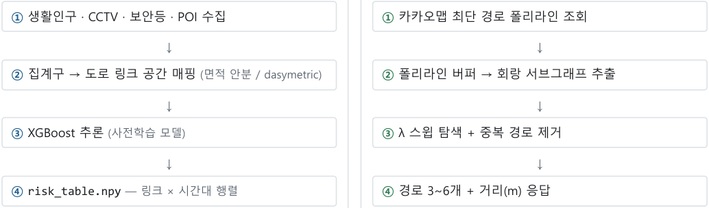

**KHUDA 26-2 · 10기 · 1조 토이프로젝트** 

# **서울 안전 경로 추천 시스템 구현 계획** 

생활인구 기반 위험도 추론 모델과 회랑 제한 경로 탐색을 결합한 실시간 보행 경로 추천 서비스 

**2026-07-29 (수) v0.1 — 설계 초안 보행자 · 서울시 XGBoost + 회랑 A*** 작성일 문서 상태 대상 핵심 기법 

## **1 프로젝트 개요** 

### **1.1 목표** 

서울을 처음 방문하는 사용자가 출발지와 도착지를 입력하면, 최단 경로뿐 아니라 **다소 우회하더라도 더 안전한 보행 경로** 를 함께 제안하는 웹 서비스를 구현한다. 

### **1.2 서비스 시나리오** 

1. 사용자가 웹페이지에서 출발지 · 도착지를 입력한다. 

2. 서버가 해당 구간에 대해 안전도 수준이 다른 **경로 후보 3~6개** 를 한 번에 계산해 응답한다. 

3. 사용자는 **"빠름 ↔ 안전" 슬라이더** 를 조작해 원하는 경로를 즉시 확인한다. 

4. 선택된 경로가 지도 위에 표시되고, **총 거리(km)** 가 함께 제공된다. 

### **1.3 "안전"의 조작적 정의** 

기본 가정은 **단위 시간당 생활인구가 많은 구간일수록 안전하다** 는 것이다. 다만 이 가정은 단독으로 쓰기에 반례 가 존재하므로(§10.1 참조), 생활인구를 주 지표로 두되 CCTV·보안등 밀도 등 보조 지표를 결합한 종합 점수를 사용 한다. 

##### **최우선 합의 사항** 

"안전"의 **정답 라벨** 을 무엇으로 정의할지 팀 내에서 먼저 합의해야 한다. 라벨이 없으면 지도학습이 성립하지 않으며, 비지도 방식(PCA·엔트로피 가중)으로 설계를 전환해야 한다. 프록시 라벨 후보: 경찰청 격자 범죄 통 계, 서울시 안전취약지역, 야간 보행사고 데이터. 

## **2 핵심 설계 원칙** 

### **2.1 머신러닝의 위치 — 사전계산과 실시간 탐색의 분리** 

경로 탐색 자체(최소비용 경로 계산)는 **다익스트라 / A*의 영역이며 최적해를 보장** 한다. 여기에 머신러닝을 적용할 이유는 없다. ML이 필요한 지점은 **엣지(도로 링크)의 비용을 무엇으로 둘 것인가** 이다. 

또한 위험도 모델이 사용하는 피처(도로폭, CCTV 밀도, 보안등 밀도, POI 밀도, 요일×시간대 생활인구)는 **사용자 입력과 무관하게 값이 고정** 이다. 따라서 요청마다 추론할 필요가 없으며, 배치로 전부 계산해 조회 테이블에 저장 한다. 

##### **결론** 

**XGBoost는 요청 처리 경로에 등장하지 않는다.** 지연시간, 배포 복잡도, 메모리 모든 면에서 유리하며, 피처 설계가 아직 확정되지 않은 현 시점에도 서빙 코드를 먼저 개발할 수 있다. 

### **2.2 비용 함수** 

```
cost(e) = length(e) * (1 + lambda * risk(e))       0 <= risk <= 1,  lambda >= 0
```

가중합( `α·거리 + (1−α)·위험도` ) 대신 곱셈 형태를 채택한다. 거리(미터)와 위험도(0~1)의 **스케일 불일치 문제가 사 라지고** , λ의 의미가 직관적이기 때문이다. 

- `λ = 0` → 순수 최단 경로 

- `λ = 1` → 위험도 1인 구간은 체감상 2배 길게 취급 

- λ가 곧 **우회 허용치** 로 해석되어 슬라이더 값과 직접 대응된다 

## **3 시스템 아키텍처** 

#### **배치 레이어 — 오프라인 (1회 또는 일 1회)** 

#### **서빙 레이어 — 실시간 (요청당)** 





<!-- Start of picture text -->
①  생활인구 · CCTV · 보안등 · POI 수집 ①  카카오맵 최단 경로 폴리라인 조회<br>↓ ↓<br>②  집계구 → 도로 링크 공간 매핑 (면적 안분 / dasymetric) ②  폴리라인 버퍼 → 회랑 서브그래프 추출<br>↓ ↓<br>③  XGBoost 추론 (사전학습 모델) ③  λ 스윕 탐색 + 중복 경로 제거<br>↓ ↓<br>④ risk_table.npy  — 링크 × 시간대 행렬 ④  경로 3~6개 + 거리(m) 응답<br><!-- End of picture text -->

- 두 레이어는 `risk_table.npy` 파일 하나로만 연결된다. 피처를 수정해도 서빙 코드는 변경되지 않는다. 

## **4 위험도 모델 (배치 레이어)** 

### **4.1 공간 다운스케일링** 

서울 생활인구 데이터는 **집계구 × 1시간** 단위인 반면, 경로 탐색은 **도로 링크** 단위로 이루어진다. 이 불일치 해소 가 전처리의 첫 관문이다. 

|**방식**|**내용**|
|---|---|
|**면적 안분**|공간 조인 후 링크가 점유하는 면적 비율로 인구를 분배. 가장 단순하며 1차 구현에 적합|
|**Dasymetric**|건물 밀도 · POI 분포로 가중해 분배. 정확도가 높고 추가 데이터가 필요|
|**회귀 예측**|링크 주변 피처로 링크별 인구밀도를 직접 예측|


### **4.2 피처 후보** 

##### **미확정** 

피처 구성은 **현재 팀 논의 중** 이다. 아래는 후보이며 확정 시 이 절을 갱신한다. 서빙 구조가 피처와 분리되어 있어, 피처 변경은 배치 스크립트 재실행만으로 반영된다. 

|**범주**|**피처**|**출처**|
|---|---|---|
|생활인구|요일×시간대 체류인구 밀도|서울 열린데이터광장|
|감시 인프라|CCTV 밀도, 보안등(가로등) 밀도|서울시 공공데이터|
|도로 물리속성|도로폭, 보도 유무, 교차로 근접성|OSM|
|토지이용 · POI|편의점 · 상가 밀도, 지하철역 거리, 유흥업소 밀도|OSM / 상권 데이터|
|사건 이력|격자 단위 범죄 발생, 야간 보행사고|경찰청 · TAAS|


### **4.3 모델 및 산출물** 

모델은 **사전학습된 XGBoost를 그대로 사용** 하며, 배치 단계에서 추론만 수행한다. SHAP을 적용하면 "이 구간이 왜 위험한가"에 대한 설명을 확보할 수 있어 발표 자료로 활용 가치가 높다. 

```
# batch/build_risk_table.py
import numpy as np, pandas as pd, xgboost as xgb
```

```
df = link_features.merge(link_pop_by_slot, on="link_id")   # slot = 요일×시간 (48 or 168)
booster = xgb.Booster(); booster.load_model("risk_model.json")
df["risk"] = booster.predict(xgb.DMatrix(df[FEATURES]))
```

```
R = df.pivot(index="link_id", columns="slot", values="risk").to_numpy(np.float32)
np.save("risk_table.npy", R)        # 70만링크 × 48 슬롯 × 4B ≈ 134MB → 메모리상주가능
```

## **5 경로 탐색 (서빙 레이어)** 

### **5.1 회랑(corridor) 제한 탐색** 

평면 그래프에서 다익스트라의 비용은 탐색 면적에 비례한다. 서울 전역(약 70만 엣지)을 제한 없이 탐색하면 장거 리 요청에서 실시간성이 무너진다. 

해결책은 **카카오맵이 제시한 최단 경로 주변으로 탐색 공간을 한정** 하는 것이다. 폴리라인에 버퍼를 씌워 그 안의 엣지만 남기면 탐색 대상이 **수천~수만 엣지** 로 줄어든다. 

- **성능** — 탐색 공간이 1~2 자릿수 감소하여 응답이 수 ms 단위로 수렴 

- **UX** — 안전 경로가 최단 경로와 알아볼 수 있게 닮아 있어, 사용자가 "엉뚱한 곳으로 안내한다"고 느끼지 않음 

- **버퍼 폭** — 적응형. `경로길이 × 0.1` , 200m~1000m로 clamp 

### **5.2 카카오맵과 자체 그래프의 역할 분담** 

|**구성요소**|**역할**|
|---|---|
|**카카오맵**|지도 표출, 주소 검색 · 지오코딩,**회랑 생성용 기준 폴리라인**, 화면상 회색 참조선|
|**자체 그래프 (OSM)**|실제 추천 경로 계산 전체. 슬라이더의 모든 구간을 담당|


슬라이더 좌측 끝(λ=0)까지 자체 그래프로 계산하는 이유는, 카카오 폴리라인과 자체 경로를 혼용하면 슬라이더를 조금만 움직여도 **선의 기하와 거리 값이 불연속적으로 튀기 때문** 이다. 전 구간을 동일 네트워크로 유지해야 슬라 이더가 매끄럽게 이어진다. 

### **5.3 λ 스윕과 중복 제거** 

λ 값이 달라도 동일한 경로가 산출되는 경우가 많다. 스윕 후 중복을 제거하면 통상 **서로 다른 경로 3~6개** 가 남으 며, 이것이 사실상 Pareto frontier에 해당한다. 

```
LAMBDAS = [0.0, 0.3, 0.6, 1.0, 2.0, 4.0, 8.0]
@app.get("/routes")
def routes(o, d, slot: int):
    poly = kakao_walk_route(o, d)                          # ① 카카오폴리라인
    line = LineString(to_xy(poly))
    width = float(np.clip(line.length * 0.1, 200, 1000))   # ② 회랑서브그래프
    keep  = EDGE_TREE.query(line.buffer(width))            #    STRtree 공간인덱스
    SG    = G.subgraph_edges(keep, delete_vertices=False)
    src, dst = snap(poly[0]), snap(poly[-1])               #    양끝을그래프에스냅
    out, seen = [], set()                                  # ③ λ 스윕 + 중복제거
    for lam in LAMBDAS:
        w = LEN[keep] * (1.0 + lam * R[keep, slot])
        p = SG.get_shortest_paths(src, dst, weights=w, output="epath")[0]
        k = hash(tuple(p))
        if k in seen:
            continue
        seen.add(k)
        out.append({
            "lambda":  lam,
            "geojson": to_geojson(p),
            "dist_m":  float(LEN[p].sum()),                # 화면에표시할값
        })
    return {"kakao_ref": poly, "routes": out}              # ④ 경로 3~6개
```

## **6 슬라이더 UX** 

슬라이더 조작마다 서버를 호출하면 지연과 부하가 발생한다. 대신 **요청 1회에 모든 λ의 경로를 계산해 한꺼번에 내려주고** , 슬라이더는 이미 수신한 폴리라인 사이를 클라이언트에서 전환하기만 한다. 

|`사용자 O/D입력  `|`──▶  `|`서버 호출 1회`|
|---|---|---|
|||`├ ①카카오 최단 경로 폴리라인`|
|<br>|<br>|`├ ②회랑 버퍼 →서브그래프 (2k~30k엣지)`<br>`├ ③ λ스윕 →중복 제거`|
|||`└ ④경로 3~6개 +각 거리(m)`|
|||`▼`|
|`슬라이더 드래그  `|`──▶  `|`클라이언트에서 폴리라인 전환만  (지연 0ms,서버 호출 0회)`|


### **화면 표시 항목** 

|**표시함**|선택된 경로의**총 거리(km)**, 지도 위 경로 폴리라인, 카카오 최단 경로(회색 참조선)|
|---|---|
|**표시 안 함**|우회율, 안전개선율 — 런타임에서 계산하지 않음|
|**선택 제안**|보행속도 4km/h 가정 시<br>`"2.3km ·약 34분"`형태로 소요시간 병기 (도보 서비스 관례)|


우회율 · 안전개선율은 **평가 및 발표 자료용으로 노트북에서 오프라인 계산** 한다. 예: "평균 12% 더 걸으면 위험도 34% 감소". 런타임 코드와 분리해 유지한다. 

## **7 API 명세 (초안)** 

|**항목**|**내용**|
|---|---|
|`GET /routes`|경로 후보 일괄 조회|
|요청 파라미터|`o_lat, o_lon, d_lat, d_lon, slot`|
|응답|`{ kakao_ref: [...], routes: [{ lambda, geojson, dist_m }, ...] }`|
|응답 경로 수|3~6개 (λ 스윕 후 중복 제거 결과)|
|목표 응답 시간|500ms 이내 (카카오 API 왕복 포함)|


## **8 성능 예산** 

|**구간**|**회랑 내 엣지**|**igraph 탐색 (λ 7회 전체)**|
|---|---|---|
|한 동네 (1~2km)|약 2천|수 ms|
|구 하나 (5km)|약 1만|10~30 ms|
|서울 횡단 (20km)|약 5만|50~150 ms|


여기에 카카오 API 왕복 100~300ms가 더해져도 전체 500ms 이내로 실시간 범위에 들어온다. 

### **그래프 라이브러리 선택** 

|**라이브러리**|**서울 전역 1회 탐색**|**비고**|
|---|---|---|
|NetworkX|수 초 ~ 수십 초|순수 Python.**실시간 불가 — 사용하지 않음**|
|**python-igraph**|수십 ~ 수백 ms|C 백엔드.**채택**|
|scipy.sparse.csgraph|매우 빠름|커스텀 A* 적용이 어려움|
|pandana|매우 빠름|contraction hierarchies. 가중치 갱신이 번거로움|


## **9 기술 스택 및 구현 로드맵** 

### **9.1 스택** 

|**전처리 · 배치**|Python, OSMnx, GeoPandas, Shapely(STRtree), XGBoost, NumPy|
|---|---|
|**백엔드**|FastAPI + uvicorn — 그래프 · 위험도 테이블을 프로세스 시작 시 1회 로드|
|**프론트엔드**|Leaflet 또는 카카오맵 JS SDK + 슬라이더 UI|
|**빠른 프로토타입**|Streamlit + folium (프론트 개발 여력이 부족할 경우 대안)|
|**배포**|Railway / Render / Fly.io — 메모리 티어 확인 필요|


### **9.2 구현 순서** 

|**단계**|**작업**|**산출물 · 비고**|
|---|---|---|
|**1**|OSMnx 대상 구역 보행망 추출 +<br>STRtree 인덱스 구축|`seoul_walk.pkl`, 공간 인덱스.<br>`network_type='walk'`|
|**2**|더미 위험도 테이블 생성|피처 확정 전 자리채움. 예: 도로폭 좁을수록 위험.**파이프라인을 먼저**<br>**굴리기 위한 단계**|
|**3**|FastAPI`/routes`엔드포인트 구현|회랑 추출 + λ 스윕 + 중복 제거|
|**4**|Leaflet + 슬라이더 프론트엔드|클라이언트 측 폴리라인 전환|
|**5**|피처 확정 후 실제 위험도 테이블 교체|배치 스크립트 재실행 → 파일 교체 → 서버 재시작.**서빙 코드 변경 없**<br>**음**|
|**6**|오프라인 평가 및 발표 자료 작성|우회율, 안전개선율, λ별 Pareto curve, SHAP 해석|


##### **스코프 권고** 

1차 구현은 서울 전역이 아니라 **1~2개 구** 로 한정한다(제안: **종로구** — 상업지 · 주거지 · 골목이 혼재해 위험 도 편차가 뚜렷하고 데모 효과가 좋음). 그래프 규모가 크게 줄어 개발 속도가 빨라지고, 데이터 검증 부담도 함께 감소한다. 전역 확장은 향후 과제로 남긴다. 

**10 리스크 및 확인 사항** 

### **10.1 생활인구 단독 지표의 반례 설계 리스크** 

"사람이 많으면 안전하다"는 가정에는 명확한 반례가 있다. **유흥가는 심야 생활인구가 매우 높지만 범죄 발생률도 함께 높다.** 생활인구를 단독 지표로 사용하면 술집 골목으로 안내하는 경로가 생성될 수 있다. 

따라서 다지표 결합은 부가 기능이 아니라 **프로젝트의 타당성을 지키는 핵심 요소** 이다. 생활인구는 "체류인구 밀 − 도"로 사용하고, 유흥업소 밀도를 음( )의 가중으로 반영하는 등의 보정을 설계 초기부터 포함한다. 

### **10.2 카카오맵 보행자 경로 API 제공 여부 즉시 확인** 

카카오 모빌리티 REST API는 자동차 길찾기 중심이며, **도보 경로가 API로 제공되는지 확인이 필요** 하다(앱 기능과 API 제공 범위는 별개). 미제공 시 대안은 다음과 같다. 

   - **T맵 API** — 보행자 경로안내를 공식 제공. 무료 쿼터 있음 

   - **자체 그래프 λ=0** — 외부 경로 API 없이 회랑 기준선을 직접 계산 

- 이 항목에 설계가 걸려 있으므로 **구현 착수 전에 우선 확인** 한다. 

### **10.3 기타 확인 사항** 

|**항목**|**내용**|
|---|---|
|API 레이트 리밋|호출 실패 시 자체 λ=0 전역 탐색으로 폴백. 폴백 코드는 어차피 필요|
|엔드포인트 스냅|카카오 폴리라인 양 끝을 자체 그래프 노드에 스냅 (cKDTree)|
|OSM 보행망 품질|λ=0 경로가 카카오 경로와 크게 다르면 해당 구간 OSM 데이터 품질 문제 신호. 디버깅 지<br>표로 활용|
|클래스 불균형|범죄 라벨 사용 시 희소성 문제. 이진 분류보다 포아송(count) 회귀 검토|
|배포 메모리|위험도 테이블 규모에 따라 512MB 티어로 부족할 수 있음|


## **11 다음 액션** 

|**#**|**할 일**|**상태**|
|---|---|---|
|1|"안전"의 정답 라벨 정의 합의|**팀 논의**|
|2|보행자 경로 API 제공 여부 확인 (카카오 / T맵)|**즉시 확인**|
|3|대상 구역 확정 (제안: 종로구)|**결정 대기**|
|4|위험도 피처 목록 확정|**논의 중**|
|5|OSMnx 보행망 추출 + STRtree 인덱스 (단계 1)|**착수 대기**|


서울 안전 경로 추천 시스템 · 구현 계획 v0.1 · 2026년 7월 29일 (수요일) · KHUDA 26-2 10기 1조 

