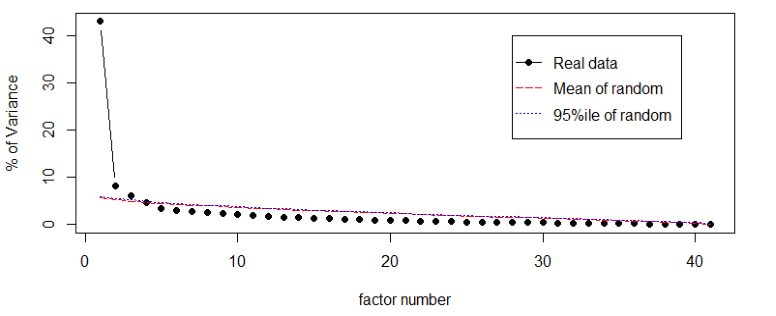
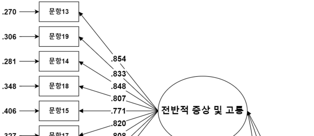
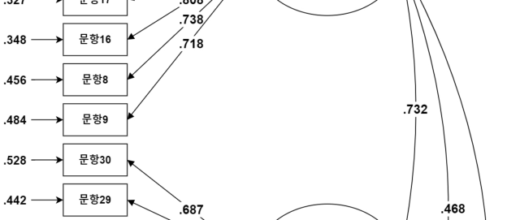
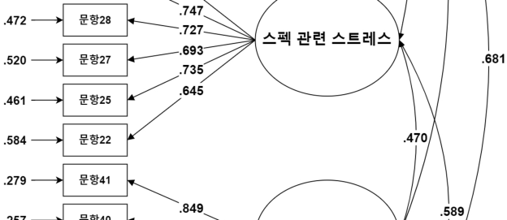
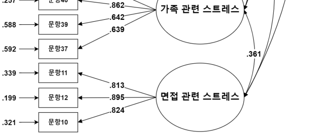

OPEN ACCESS 

한국심리학회지 : 상담 및 심리치료 

_The Korean Journal of Counseling and Psychotherapy_ 2023, Vol. 35, No. 2, 441-469 http://dx.doi.org/10.23844/kjcp.2023.05.35.2.441 

# 한국 대학생 취업 스트레스 척도 개발 및 타당화***** 

한림대학교 / 학생                     한림대학교 / 교수 

취업 스트레스는 취업을 준비하는 개인에게 심리적, 신체적으로 부정적인 영향을 미칠 수 있 고, 그러한 영향에 대하여 많은 연구들이 이루어져 왔으나, 기존에 개발된 취업 스트레스 척 도들은 현재 사용하기에 여러 제한점들이 있다. 본 연구의 목적은 취업 스트레스 척도를 개 발하고 타당화하는 것이다. 예비조사에서, 대학생 202명의 자료로 예비문항에 대하여 탐색적 요인분석을 실시하여 (1) 전반적 증상 및 고통, (2) 스펙 관련 스트레스, (3) 가족 관련 스트레 스, 그리고 (4) 면접 관련 스트레스의 하위요인들을 발견하였다. 본 조사에서 대학생 438명의 자료로 본 척도에 대한 확인적 요인분석 및 다집단 확인적 요인분석을 실시하여 적합도 수준 이 양호함을 확인하였다. 그리고 우울, 불안, 진로 스트레스, 정신적 웰빙, 진로성숙도와의 상 관분석을 통하여 수렴, 변별, 공존 타당도를 확보하였다. 마지막으로, 이상의 연구 결과를 바 탕으로 취업 스트레스 척도의 활용과 의의, 제한점에 대하여 논의하였다. 

주요어 : 취업 스트레스, 한국 취업문화, 대학생, 요인분석, 측정동일성 

- 본 논문은 2022년도 한림대학교 교비연구비(HRF-202204-010)의 지원으로 연구되었음. 

> †제 1저자 : 김고운, 한림대학교 심리학과 학부졸업생 

- ††공동저자 : 심재창, 한림대학교 심리학과 박사과정생 

- ††† 교신저자 : 임선영, 한림대학교 심리학과/한림응용심리연구소 부교수, (24252) 강원도 춘천시 한림대학길 1, 한림대학교 사회경영 1관, Tel: 033-248-1729, E-mail: imsy@hallym.ac.kr 

Copyright ⓒ2023, The Korean Counseling Psychological Association 

This is an Open Access article distributed under the terms of the Creative Commons Attribution Non-Commercial License (http://creativecommons.org/licenses/by-nc/4.0/) which permits unrestricted non- commercial use, distribution, and reproduction in any medium, provided the original work is properly cited. 

- 441 - 

#### 한국심리학회지: 상담 및 심리치료 

오늘날 장기 불황과 경기 침체 등의 사회적 불안정으로 인하여 청년 고용의 감소와 청년 실업의 증가가 매년 지속되고 있다(강슬아 등, 2016). 통계청은 고용동향 분석 결과를 통하여 15세 이상 29세 미만 청년층의 취업률을 2021 년 7월에는 45.2%(통계청, 2021), 2022년 8월에 는 47.6%로 발표하였다(통계청, 2022). 2021년 7월 통계청 조사에서 청년 실업률은 5.8%였으 나, 생계 목적으로 임시적으로 근무하거나 취 업이 가능하지만 경제활동을 하지 않는 인구 를 포함하는 확장실업률은 21.7%로 상대적으 로 높은 수치를 보이며(통계청, 2021), 5명 중 1명이 실업일 수 있음을 나타냈다. 

게다가 청년층 인구변화, 점포 무인화의 확 산, 정년 연장에 따른 퇴직 감소 등의 사회적 흐름을 고려하면 청년 취업 문제는 더 큰 문 제가 될 수 있다. 장기화되는 청년 취업 문제 는 큰 사회문제가 될 수 있다. 청년 실업은 다른 연령층의 실업과 달리 노동시장의 활력 둔화를 야기하여 국가 경제에 부정적 영향을 미칠 수 있고(강성호, 김태완, 2013), 취업하지 못한 청년들은 직장에서의 학습기회를 박탈당 하고 개인의 자존감 상실 및 좌절 등과 같은 문제를 경험할 수 있다(채구묵, 2004). 

특히 청년 실업은 청년들의 정신건강에 부 정적 영향을 미친다는 점에 주목할 필요가 있 는데, 장재윤, 신희천과 장은영(2006)은 실업이 장기화될수록 우울과 불안 정도가 높아지는 반면, 취업 성공 후 검사결과에서는 우울 및 불안이 급격히 감소한다는 것을 보여주었다. 국외 연구에서도 실업자 집단이 취업자 집 단보다 더 높은 우울 정도를 보였고(Dooley, Catalano, & Wilson, 1994; McGee & Thompson, 2015), 면역력 저하와 같은 신체적 건강에도 부정적 영향을 미친다는 점(Bartley, 1994) 등이 

밝혀져 왔다. 게다가 Taris(2002)는 청년층 1700 명을 대상으로 실업자와 관련한 종단연구를 진행하였는데, 실업 여부, 실업 기간이 참가자 들의 정신건강 주로 우울과 관련이 있는 것으 로 보고되었다. 

국내 대학생들이 받는 스트레스 중에는 학 업과 미래, 진로 문제의 비중이 높은 편이다 (이은희, 2004). 김범준(2011)이 대학생들을 대 상으로 삶의 가장 큰 영향을 준 행복 및 불행 사건을 조사한 결과, 불행 사건 중 1위는 취 업에 대한 걱정으로 밝혀졌다. 대학생들은 취 업난에서 살아남기 위해 고등학생 시절부터 기업과 대학에서 요구하는 학력, 자격증을 취 득하기 위해 경쟁하며(김인구, 김완석, 2013), 대학 진학 후에도 학업 외 소위 ‘스펙(SPEC; 학력, 학점, 외국어 등 직장을 구하는 데 필요 한 능력이나 자격)’을 쌓기 위하여 노력한다 (허창구, 2020). 일부 대학생들은 학점 관리에 더하여 가중되는 스펙 관리에 대한 부담으로 극심한 스트레스를 경험할 수 있고(이가영 등, 2015), 취업 준비에만 몰두하면서 정작 진로탐 색을 적절히 행하지 못하고 심리적 여유를 느 끼지 못하고 높은 ‘취업 스트레스’를 경험할 수 있다(황매향 등, 2013). 

취업 스트레스(job search stress; employment stress)는 취업 준비 과정에서 구직 실패로 인 한 좌절감으로 인하여 비롯되는 스트레스이다 (윤성원, 김기승, 2012). 이외에도 다양한 방식 으로 취업 스트레스라는 용어가 정의되고 있 다. 황성원(1998)은 취업 스트레스를 졸업 후 의 취업과 관련된 문제로 인하여 대학생활 중 신체적, 심리적 평형상태가 파괴되고 위기, 긴 장감 또는 불안을 느끼는 상태로 정의하였고, 강경훈(2010)은 대학에 재학 중이거나 졸업 예 정인 사람이 최초의 취업 준비 과정에서 주관 

- 442 - 

․ ․ 김고운 심재창 임선영 / 한국 대학생 취업 스트레스 척도 개발 및 타당화 

적으로 경험하는 스트레스라 정의하였다. 이 미숙(2011)은 취업 스트레스를 취업과 관련하 여 개인의 능력을 능가하는 내외적 요구에 대 한 개인적 인지 및 그에 따른 적응 차이로 인 하여 발생하는 개인의 정서적, 행동적, 신체적 반응이라 정의하기도 하였다. 취업 스트레스 의 의미를 종합하자면 대학 재학 혹은 졸업 예정에 놓인 대학생들이 취업을 준비하는 과 정 중 경험하는 우울, 불안, 걱정 등 신체적이 고 심리적인 스트레스라 할 수 있다. 취업 스 트레스는 취업을 준비하는 개인에게 심리적, 신체적으로 부정적인 영향을 미칠 수 있다. 국내의 구인 구직 사이트에서 조사한 결과(잡 코리아, 2019, 10, 18)에 따르면 취업 준비생 중 93.8%가 취업 스트레스를 경험한다고 응답 하였고, 취업 스트레스 증상들에는 우울증과 두통, 만성피로, 소화불량, 대인기피증 등 심 리적, 신체적 증상들이 주를 이루었다. 

이러한 취업 스트레스의 부정적 영향에 대 하여 많은 연구들이 이루어져 왔으나, 아쉽게 도 정작 취업 스트레스의 정확한 측정에 대해 서는 큰 관심이 기울여지지 않았다. 기존에 사용되던 측정 도구들은 개발된 지 오랜 시간 이 지나 현재 우리나라의 취업문화와 취업준 비생들의 경험을 적절히 반영하기 어려울 뿐 만 아니라, 측정하는 내용과 타당도 측면에서 일부 제한점이 있다. 이에 본 연구에서는 새 로운 취업 스트레스 척도를 개발하고 타당화 하고자 한다. 

취업 스트레스의 하위요인은 여러 연구들을 통하여 다양하게 제안되어 왔다. 황성원(1998) 의 취업 스트레스 척도는 학업스트레스, 성격 스트레스, 학교환경 스트레스, 가족환경 스트 레스의 4가지 하위요인을 포함하고 있고, 김 혜정과 강유리(2008)는 황성원(1998)의 척도를 

수정하여 4가지 하위요인에 더하여 취업불안 스트레스라는 ‘취업’ 자체와 관련된 하위요인 을 추가로 제안하였다. 정의석과 노안영(2001) 은 미취업에 대한 불안, 취업에 대한 자신감 상실, 일상생활에서의 부정적 정서의 3 하위요인을, 이미숙(2011)은 취업 스트레스의 내용을 인지, 정서, 행동, 신체화의 4가지 측 면으로 구분하였다. 연구마다 취업 스트레스 의 하위영역이 다소 상이해 보이지만, 스트레스는 넓은 관점에서 보면 스트레스의 일종이기 때문에 스트레스로 증상이나 그로 인한 문제행동의 측면을 구분한다는 점에서 공통적이다. 

취업 스트레스의 영향에 대하여 많은 연구 들이 이루어져 왔으나, 정작 취업 스트레스의 정확한 측정에 대한 관심은 부족하였다. 기존 에 사용되던 선행연구들은 취업 스트레스를 측정하기 위하여 황성원(1998), 정의석과 노안 영(2001), 이미숙(2011) 등이 개발한 척도들을 사용하여 왔지만, 이 척도들에는 몇 가지 한 계점들이 있다. 황성원(1998)은 대학생들에게 취업문제로 대학생활 중 받고 있는 스트레스 를 기술하게 하여 얻은 자료를 기초로 코넬대 학의 스트레스 측정법(Cornell Medical Index: CMI; Shepherd, Cooper, Brown, & Kalton, 1966) 을 참고하여 문항을 개발하였다. 이후 전문가 의 자문을 얻어 내용타당도를 평가하고 문항 을 수정하는 작업을 거쳐 확정된 72문항 척도 는 학업 스트레스, 성격 스트레스, 학교환경 스트레스, 가족환경 스트레스의 4가지 하위요 인으로 구성된다. 하지만, 황성원(1998)의 취업 스트레스 척도는 요인분석과 같은 통계적 절 차가 생략되어 내적구조에 대한 근거가 충분 하지 않고, 문항들이 3점 리커트 척도로 평정 되어 참가자의 반응이 단순화될 수 있다는 제 

- 443 - 

#### 한국심리학회지: 상담 및 심리치료 

한점이 있다. 또 척도의 문항 수가 많아 비효 율적이고, 척도가 개발된지 20년 이상 지나 현재의 사회적 특성을 반영하기에 다소 오래 되었다는 점에서 제한적이다. 이후 김혜정과 강유리(2008)는 황성원이 개발한 척도를 5점 척도로 수정하고, 탐색적 요인분석을 실시하 여 성격, 가족환경, 학업, 학교환경, 취업불안 의 5가지 측면의 취업 스트레스 하위요인을 찾아냄으로써 척도를 단축 및 타당화하는 노력을 기울였지만, 문항들이 개발된 지 20년 이상 오래되었다는 점에서 여전히 제한점이 있다. 

구직자들의 취업 준비 과정, 진로에 대한 가치의식과 행동규범, 채용과 관련된 제도적 특징 등은 ‘취업문화’로서 나타난다(이종구, 김 홍유, 2009). 이종구와 김홍유(2009)는 한국의 취업문화가 시대별로 변화하여 왔음을 설명하 였다. 1980년대에 본격적으로 등장한 취업문화 는 1990년대 국내 산업 환경의 급변을 거치면 서 2000년대에는 진로에 대한 가치, 직업 혹 은 일자리에 대한 가치가 취업 준비에 영향을 미치고 취업을 준비하는 과정에서 중요시되었 다. 또한 채용제도, 필기시험, 면접방식 등 채 용과 직결되는 제도적 특징들은 그 시대의 산 업환경과 취업환경의 메커니즘 및 속성을 동 시에 반영하고 있으므로(이종구, 김홍유, 2009), 취업과 관련된 현상들을 이해하기 위해서는 시대적 흐름에 따른 취업문화 변화를 고려하 는 것이 중요하며, 연구에 사용되는 취업 스 트레스 척도는 현 시대의 특징을 잘 반영하도 록 수정되어야 할 것이다. 이러한 점에서 개 발 시기가 오래된 취업 스트레스 척도를 사용 하는 것은 현재 취업문화와 취업준비생들의 경험을 적절히 반영하지 못할 수 있다는 점에 서 제한적일 수밖에 없다. 

가령 기존 취업 스트레스 척도(김혜정, 강유 리, 2008)에 있는 가족환경 스트레스 요인에는 가정의 경제적인 문제로 인한 스트레스를 반 영하는 문항들만이 포함되어 있다(‘가족부양의 ’ ‘ 책임이 있어 취업을 해야 할 실정이다 , 대학공부 때문에 부모님께서 경제적으로 어려 워 내가 취업하여 해결해야 한다’ 등). 문항들 중 특히 가족부양에 대한 내용은 변화 한 현대사회의 모습과는 다소 동떨어져 있을 수 있다. 과거 우리사회는 전통적인 가족주의 적 관념에 따라 가족을 부양해야 한다는 논리 가 지배적이었지만(김송애, 조병은, 1991), 현 대사회에서 핵가족화, 여성의 사회진출 등으 로 부모에 대한 부양의식이 변하여 가족이나 사회에서 피부양자 개인의 역할이 상대적으로 약해졌다(김유경, 2016). 또한, 현재 정보기술 의 발전으로 인하여 많은 온라인 구인구직 사 이트(예: 잡코리아, 워크넷, 사람인, 잡플래닛) 들이 생겨났고, 과거 신문이나 잡지 등 인쇄 물이 취업정보를 얻기 위하여 대부분 이용되 었다면, 현재는 온라인 사이트가 가장 많이 이용되는 추세이다(박기호, 김연정, 2005). 이 러한 점에서 ‘취직자리를 놓칠까봐 많은 시간 을 취업정보센터나 신문과 잡지의 구직난을 본다’(김혜정, 강유리, 2008), ‘나는 취업분야의 신문이나 잡지의 기사를 읽는다’(이미숙, 2011) 와 같은 문항들은 현재 취업문화를 적절히 반 영한다고 보기에는 아쉬움이 있다. 

정의석과 노안영(2001)은 개방형 질문지를 통하여 얻은 자료를 분석하여, 미취업에 대한 불안, 취업에 대한 자신감 상실, 일상생활에서 부정적 정서의 3요인으로 구성된 취업 스트레 스 척도(Employment Stress Scale)를 개발하였으 나, 내적구조 등 타당도에 대한 근거가 부족 하고, 마찬가지로 개발된 지 오랜 시간이 지 

- 444 - 

․ ․ 김고운 심재창 임선영 / 한국 대학생 취업 스트레스 척도 개발 및 타당화 

났다는 제한점이 있다. 이미숙(2011)은 탐색적 요인분석과 관련된 다른 척도들과의 상관분석 을 통하여 취업 스트레스 척도를 개발 및 타 당화하였고, 취업 스트레스 척도의 하위요인 으로 인지, 정서, 행동, 신체화를 제시하였다. 예비문항 개발 단계에서는 가족환경적 요인, 학교환경적 요인과 같은 환경적 요인들이 고 려되었으나 최종 선정된 문항을 보면 기존에 사용되던 취업 스트레스 척도(김혜정, 강유리, 2008)와 달리 개인적인 스트레스 증상의 차원 을 구분하는 데 초점이 맞추어져 있고, 학교 와 가족과 같은 환경적 요인이 포함되지 않았 다. 선행연구들에서 가족의 압박이나 부담이 심해 취업 스트레스로 인한 고통이 커지거나 반대로 가족의 지지가 있는 경우 스트레스가 경감되는 등 가족 관련 변인이 취업 스트레스 와 중요하게 관련된다는 점(김주혜, 2022; 문 은미, 이주희, 2016; 박미진 등, 2009; 최미혜, 2017; 황성원, 1998) 등을 고려하면, 개인의 스 트레스 증상의 내용에만 초점을 맞춘 취업 스 트레스 척도는 다소 제한적일 수 있고, 해당 척도의 하위요인들 중 ‘행동’ 요인의 문항들 (예: ‘나는 취업과 관련된 강의를 찾아서 듣는 다’, ‘나는 도서관에 가서 취업관련 책을 찾아 본다’)은 취업과 관련된 스트레스보다는 단순 히 취업을 위한 일반적인 행동들에 불과하다. 

실제로 취업스트레스 관련 선행연구들을 살 펴보면 가족이나 학교와 같은 환경적 요인에 대한 내용이 자주 언급된다. 최미혜(2017)는 취업을 준비하는 대학생들이 취업부모, 형제, 자매 등 가족에게 의지하고 지지받았음을 발 견하였고, 김주혜(2022)의 연구에서도 장기 취 업준비 청년이 가족에게 취업 준비 과정을 이 야기하며 정서적으로 의지하는 경험이 보고되 었다. 이 연구 결과들로 미루어볼 때 가족 관 

련 요인이 취업 스트레스를 완화할 것으로 보 이지만, 최미혜(2017)는 대학생 참가자에게 가 족이 취업 과정에서의 지지체계가 되는 동시 에, 가족들의 기대로 인하여 취업 과정에서 큰 부담을 느끼게 되기도 한다는 점을 기술하 였다. 박미진 등(2009), 문은미와 이주희(2016) 의 연구들에서도 취업준비생들이 가족, 친척 들의 기대에 부응해야 한다는 부담으로 스트 레스를 받고, 주변의 시선이 계속 신경 쓰이 거나 부모님으로부터 취업에 대하여 압박받는 다는 내용들이 보고되었다. 또한 취업준비생 들은 취업을 준비하면서 학교환경과 관련된 출신 학교, 학점, 인턴 경험 등을 현실적으로 고려하지 않을 수 없다. 채용 면접관들은 출 신 학교를 언급하며 더 좋은 학교 출신의 지 원자들을 원하는 경향이 있다(김주혜, 2022). 기업 인사담당자와 취업준비생의 구직요건에 대한 인식 차이를 조사한 연구(조성인, 김은애, 2014)에서는 취업준비생들이 출신 학교에 대 하여 기업 인사담당자보다 더 중요하게 여기 며 스트레스 요인으로 작용한다는 점이 나타 났다. 이러한 점에서 취업 스트레스의 하위요 인으로 환경적 요인을 고려하지 않을 수 없다. 

취업 스트레스 척도의 타당화를 위하여 선 행연구들로부터 취업 스트레스와 관련되는 변 인들을 살펴보았다. 선행연구들에 따르면 취 업 스트레스는 취업을 준비하는 사람들에게 부정적인 심리적 영향을 미칠 수 있다. 김민 정과 조긍호(2009)는 취업과 관련하여 높은 학 비 부담과 반복적인 구직 실패, 구직 기간의 장기화로 인하여 경제적 스트레스를 받는 이 들이 미래에 대하여 부정적 기대와 불안을 가지고 있음을 보여주었고, 한규철과 이현심 (2019)은 취업 스트레스가 구직에 대한 효능감 을 감소시킬 수 있음을 확인하였다. 이뿐만 

- 445 - 

#### 한국심리학회지: 상담 및 심리치료 

아니라, 박미진 등(2009)의 질적연구에서는 취 업 스트레스를 경험하는 대학생들이 불안과 우울, 적대감 등의 부정 정서를 느낀다는 것 이 나타났다. 게다가 최승혜와 이해영(2013)의 연구에서는 취업 스트레스가 우울, 불안과 같 은 심리적 증상뿐만 아니라 심혈관 증상, 두 통 등 신체적 증상과도 정적 상관관계가 있음 이 나타나기도 하였다. 특히 우울의 경우 취 업 스트레스와 관련된다는 점이 다른 여러 연 구들에서도 반복적으로 보고되고 있고(서인균, 이연실, 2015; 엄나연, 김은하, 2016; 지연옥, 김종운, 2019), 취업 스트레스가 무망감(김민정, 조긍호, 2009)과 자살 사고(김향수, 채규만, 2014; 한동헌, 조영아, 2015)에도 영향을 미친 다는 연구 결과도 있다. 

또한 여러 연구에서 취업 스트레스를 경험 하는 실업자들이 취업한 사람들보다 정신적 웰빙이 낮음이 보고되기도 하고(McKee-Ryan, Song, Wanberg, & Kinicki, 2005; Pultz, & Teasdale, 2017), 대학생들의 취업 스트레스가 개인이 잠재력을 충분히 발휘하여 자신의 삶 속에서 잘 기능하는 것을 의미하는 심리적 안 녕감(Ryff, 1989)과 부적으로 관계된다는 연구 결과들도 있었다(김영태, 2014; 엄나연, 김은하, 2016; 오중언, 2017). 이러한 연구 결과들은 취 업 스트레스가 전반적인 삶의 질을 떨어뜨릴 수 있다는 점을 시사한다. 

취업 스트레스는 개인이 진로를 결정하고 준비하는 과정에서 경험하는 스트레스, 즉 진 로 스트레스와 관련이 있다. 진로 스트레스는 ․ 개인이 진로 준비 과정에서 내 외적으로 부 족함을 느끼고 이에 심리적 안녕감이 위협받 는다고 평가되는 상황에서 발생하는 개인의 반응들이다(박희락, 2009). 연구자들은 진로 스 트레스에 대하여 진학이나 취업을 준비하는 

과정에서 결정하지 못하거나 과도한 경쟁을 하게 되는 등 어려움을 겪으며 느끼는 스트레 스라 설명하며, 취업 준비 중에 느끼는 스트 레스와의 관련성을 강조하였다(김경욱, 조윤희, 2011; 문학선, 김양균, 2020; 전찬열, 2013). 박 희락(2009)은 여러 선행 연구들을 바탕으로 진 로 스트레스 척도를 개발하며 ‘취업 압박’이라 는 내용을 진로 스트레스의 하위요인에 포함 하기도 하였다. 일부 연구자는 진로 스트레스 와 취업 스트레스를 같은 개념으로 혼용하여 사용할 만큼(고경필, 심미영, 2014), 두 개념은 밀접한 관련이 있는 것으로 보인다. 

한편 취업 스트레스와 진로성숙도와의 관계 에 대한 다수 연구들이 수행되었었다. 박미진 등(2009)의 질적연구에서는 취업 스트레스가 신체적, 심리적 건강에 부정적 영향을 미칠 뿐만 아니라, 진로를 준비하는 태도와 관련된 진로성숙도에도 부정적 영향을 미칠 수 있을 것으로 보고했다. 다만 취업 스트레스와 진로 성숙도와의 관계에 대한 양적 연구 결과들은 비일관적인 양상을 보인다. 취업 스트레스가 진로성숙도와 정적 관계를 갖는다는 연구 결 과가 있으며(김혜정, 강유리, 2008; 김명옥, 박 영숙, 2012), 이에 대하여 취업 스트레스가 진 로 선택이나 취업에 대한 부담감을 가지게 하 고 사회생활을 위한 준비를 촉진하여 진로성 숙도를 강화한다는 해석이 있다(고경필, 심미 영, 2014). 그러나, 이와 달리 취업 스트레스가 진로성숙도와 부적으로 관련한다는 여러 연구 결과가 존재하기 때문에(김은주, 최경원, 2012; 소용준, 박준성, 2016; 최윤미, 이문희, 2011), 명확한 해석을 위해서는 더 많은 연구가 필요 해 보인다. 

종합하면, 취업 스트레스가 정신건강에 미 치는 부정적 영향에 대하여 많은 연구가 이루 

- 446 - 

․ ․ 김고운 심재창 임선영 / 한국 대학생 취업 스트레스 척도 개발 및 타당화 

어져 왔지만, 기존에 사용되던 취업 스트레스 척도들은 개발된 지 오래되어 현재 한국의 취 업문화를 반영하는 데 아쉬움이 있거나 하위 요인에 환경적 요인이 포함되지 않는 등 한계 점이 있었다. 이에 본 연구에서는 이러한 한 계점들을 보완한 취업 스트레스 척도를 개발 및 타당화하고자 한다. 본 연구는 크게 두 단 계의 절차로 진행된다. 예비조사 단계에서는 취업 스트레스를 경험하는 대학생들을 대상으 로 인터뷰하여 제작한 문항들의 요인구조를 살펴본다. 그리고 본 조사 단계에서는 취업 스트레스 척도의 모형 적합도를 확인하고, 선 행연구를 토대로 선정된 우울, 불안, 진로 스 트레스, 정신적 웰빙, 진로성숙도와의 관련성 을 살펴볼 것이다. 이상의 내용을 토대로 본 연구에서 살펴볼 내용은 다음과 같다. 

용되었다. 이상치에는 예비문항 총점에 대하 여 Mahalanobis 거리( _D_2 ) 검증 시 _p_ <.001인 자 료가 해당되었다. 참가자 202명 중 남자 47명 (23.27%), 여자 155명(76.73%)이었고, 1학년 43 명(21.29%), 2학년 36명(17.82%), 3학년 54명 (26.73%), 4학년 64명(31.68%)이었다. 전공계열 에 따라서는 인문계열 47명(23.27%), 사회계열 69명(34.16%), 교육계열 6명(2.97%), 공학계열 30명(14.85%), 자연계열 17명(8.42%), 의약계열 21명(10.40%), 예체능계열 10명(4.95%), 기타 2 명(0.99%)이었고, 거주지역에 따라서는 서울 34 명(16.83%), 부산 1명(0.50%), 인천 3명(1.49%), 경기도 60명(29.70%), 강원도 71명(35.15%), 충 청도 11명(5.45%), 전라도 3명(1.49%), 경상도 19명(9.41%)이었다. 

### 본 조사 참가자 

연구문제 **1** . 취업 스트레스 척도의 내적구 조는 어떠한가? 

연구문제 **2** . 취업 스트레스 척도의 신뢰도, 공존 및 변별 타당도(우울, 불안, 진로 스트레 스, 정신적 웰빙, 진로성숙도와의 관련성)는 어떠한가? 

## 방  법 

### 참가자 

### 예비조사 참가자 

예비조사 참가자는 총 220명으로, 대학생들 이 주로 이용하는 온라인 커뮤니티들을 통하 여 모집하였다. 참가자들은 모두 대학에 재학 중인 대학생으로, 자료분석에는 이상치와 중 복 참가자 18명을 제외한 202명의 자료가 사 

본 조사에 총 440명의 4년제 대학교 학생이 참가하였다. 이 중 해외 대학에 재학 중인 2 명의 자료를 제외하고 총 438명의 자료를 분 석에 사용하였다. 438명 참가자 중 남자 219 명(50.00%), 여자 219명(50.00%)이었고, 재학생 358명(81.36%), 휴학생 80명(18.18%), 저학년 218명(49.77%; 1학년 90명, 2학년 128명), 고학 년 220명(50.23%; 3학년 95명, 4학년 125명)이 었다. 참가자들의 연령(만 나이) 평균은 22.08 세(표준편차 2.39)였고, 최소 17세, 최대 29세 였다. 전공계열에 따른 참가자 수는 인문계열 81명(18.49%), 사회계열 92명(21.00%), 교육계열 20명(4.57%), 공학계열 128명(29.22%), 자연계열 33명(7.53%), 의약계열 30명(6.85%), 예체능계열 49명(11.19%), 기타 5명(1.14%)이었고, 거주지 역에 따른 참가자 수는 서울 133명(30.37%), 부산 29명(6.62%), 인천 21명(4.79%), 경기도 107명(24.43%), 강원도 11명(2.51%), 충청도 

- 447 - 

#### 한국심리학회지: 상담 및 심리치료 

표 1. 참가자 정보 

|구분|예비조사 참가자|본 조사 참가자|
|---|---|---|
|전체|202명(100.00%)|438명(100.00%)|
|성별|||
|남자|47명(23.27%)|219명(50.00%)|
|여자|155명(76.73%)|219명(50.00%)|
|재학 상태|||
|재학|202명(100.00%)|358명(81.36%)|
|휴학|0명(0.00%)|80명(18.18%)|
|학년|||
|1학년|43명(21.29%)|90명(20.55%)|
|2학년|36명(17.82%)|128명(29.22%)|
|3학년|54명(26.73%)|95명(21.67%)|
|4학년|64명(31.68%)|125명(28.54%)|
|전공계열|||
|인문계열|47명(23.27%)|81명(18.49%)|
|사회계열(경상,법학,사회과학)|69명(34.16%)|92명(21.00%)|
|교육계열|6명(2.97%)|20명(4.57%)|
|공학계열|30명(14.85%)|128명(29.22%)|
|자연계열|17명(8.42%)|33명(7.53%)|
|의약계열(의학)|21명(10.40%)|30명(6.85%)|
|예체능계열|10명(4.95%)|49명(11.19%)|
|기타|2명(0.99%)|5명(1.14%)|
|거주지역|||
|서울|34명(16.83%)|133명(30.37%)|
|부산|1명(0.50%)|29명(6.62%)|
|인천|3명(1.49%)|21명(4.79%)|
|경기도|60명(29.70%)|107명(24.43%)|
|강원도|71명(35.15%)|11명(2.51%)|
|충청도|11명(5.45%)|36명(8.22%)|
|전라도|3명(1.49%)|31명(7.08%)|
|경상도|19명(9.41%)|64명(14.61%)|
|제주도|0명(0.00%)|6명(1.37%)|

- 448 - 

․ ․ 김고운 심재창 임선영 / 한국 대학생 취업 스트레스 척도 개발 및 타당화 

36명(8.22%), 전라도 31명(7.08%), 경상도 64명 (14.61%), 제주도 6명(1.37%)이었다. 

### 연구절차 

예비조사의 목적은 개발된 예비문항들 중에 서 적절한 문항을 선정하고 척도의 요인구조 를 탐색하는 것이며, 이를 위하여 문항분석과 탐색적 요인분석을 실시하였다. 예비문항들은 취업 스트레스를 경험한 대학생들을 대상으로 진행된 인터뷰를 통하여 제작되었다. 예비문 항 제작을 위한 인터뷰에는 대학에 재학 중인 대학생 27명이 참가하였다. 참가자 중 남자는 13명(48.15%), 여자는 14명(51.85%)이었고, 1학 년은 9명(33.33%), 2학년은 9명(33.33%), 3학년 은 5명(18.52%), 그리고 4학년은 4명(14.81%)이 었다. 모든 인터뷰 참가자들은 비확률 표집방 법인 눈덩이 표집방법을 통하여 전화나 문자 로 연구에 대하여 설명을 받고 연구에 참가하 

는 것에 사전 동의하였다. 예비문항의 개발을 위한 인터뷰에서 취업 스트레스와 관련된 다 양한 특징들을 잘 반영하고 있다고 판단되는 이미숙(2011)의 개방형 인터뷰 질문지를 본 연 구에 맞게 수정 및 보완하여 사용하였다. 주 요 질문은 7가지이며, 그 내용은 표 2에 제시 되어 있다. 질문지의 내용은 크게 성격(예: 내 향성), 가정배경(예: 부모와의 관계), 학업(예: 성적), 학교환경(예: 교우 관계), 능력(예: 자격 증 소지 여부), 가치(예: 가치관)의 측면과 관 련하여 취업을 준비하면서 경험하는 스트레스 를 묻는 것이다. 인터뷰에서 나타난 취업 스 트레스 관련 문장들을 모두 검토하여 개념화 하였고 이를 토대로 50개의 예비문항을 제작 하였다. 예비문항들은 어떤 인터뷰 질문으로 부터 도출된 것인지에 따라 성격, 가족(가정배 경), 학업, 학교환경, 능력, 가치, 기타 7개 잠 정적 요인으로 분류되었다. 다음으로 예비문 항 50개에 대하여 상담심리학 전공의 박사학 

#### 표 2. 인터뷰 질문지 

|번호|내용|
|---|---|
|1|자신의 성격적인 면(예.내향성,외향성,심한 불안 등)과 관련하여 취업 스트레스를 가장 많이 받는 부분을 상세히 서술하세요.|
|2|자신의 가정배경(예.경제적 여건,부모와의 관계,가족 모임 등)과 관련하여 취업 스트레스를 가장 많이 받는 부분을 서술하세요.|
|3|학업적 측면(예.성적,선공만족 등)과 관련하여 취업 스트레스를 가장 많이 받는 부분을 상세 히 서술하세요.|
|4|학교 환경적인 면(예.교우 관계,교수와의 관계,지역 등)과 관련하여 취업 스트레스를 가장 많이 받는 부분을 상세히 서술하세요.|
|5|자신의 능력(예.자격증 소지,외국어 등)과 관련하여 취업 스트레스를 가장 많이 받는 부분을 상세히 서술하세요.|
|6|가치적인 면(예.자신의 가치,사회 가치,가치 간의 갈등 등)과 관련하여 취업 스트레스를 가 장 많이 받는 부분을 상세히 서술하세요.|
|7|기타 취업 스트레스를 가장 많이 받는 부분을 상세히 서술하세요.|

- 449 - 

#### 한국심리학회지: 상담 및 심리치료 

위를 소지한 교수 1명 및 상담심리학 전공 대 학원생 3명에게 내용타당도를 평정받았다. 그 과정에서 취업 스트레스 개념을 적절히 반영 하지 못하거나 중복되는 내용의 문항 7개를 제외하였고, 남은 문항들에 대하여 문법적, 의 미적 수정을 거친 후 최종적으로 예비문항을 선정하였다. 

다음으로 본 조사를 진행하였고, 본조사의 목적은 취업 스트레스 척도의 모형 적합도를 평가하고 다른 변인들과의 관련성을 확인하는 것이다. 이를 위하여 확인적 요인분석과 취업 스트레스 관련 변인들과의 상관분석을 실시하 였다. 

### 측정도구 

### 취업 스트레스 척도 

본 연구에서 취업 스트레스에 대한 인터뷰 결과를 토대로 제작된 50개의 문항을 사용하 였다. 이는 (1) 성격, (2) 가정배경, (3) 학업, (4) 학교환경, (5) 능력, (6) 가치, 그리고 (7) 그 외 주제(기타)와 관련한 취업 스트레스의 내용을 반영하는 문항들로 구성되어 있다. 인터뷰에 서 참가자들이 보고한 핵심 문장들은, (1) 성 격 측면에서는 “내향적인 성격으로 인해 면접 ” “ 시 답변을 제대로 할 수 없을 것 같다 , 주변 타인의 눈치를 지나치게 봐서 취업을 준비하 는 과정에서 주어지는 조언에 힘이 든다” 등, (2) 가정배경 측면에서는 “가정환경이 넉넉하 지 않아 취업 준비 시 금전적인 면에서 어려 움을 느낀다”, “친척, 사촌들이 부모님보다 더 나의 취업을 걱정한답시고 조언을 하는데 이 게 엄청난 스트레스로 다가온다” 등, (3) 학업 측면에서는 “지식 추구 목적보다 취업이나 학 점을 목적으로 해서인지 성적을 잘 받아야만 

” “ 할 것 같은데 마음대로 되지 않는다 , 대외활 동이나 동아리 활동도 경험을 쌓는 게 중요한 데, 학점을 관리하기도 시간이 빠듯하다” 등을 포함하였다. (4) 학교환경 측면에는 “학교의 명성이 좋지 않아 능력이 좋아도 취업이 잘 ” “ 되지 않을 것 같아 고민이다 , 교수님과의 관 계가 나의 취업에 영향일 미치지는 않을까 고 민된다”와 같은 내용이, (5) 능력 측면에는 “전 공과 관련된 자격증은 취득이 어렵지만, 취업 을 위해서는 필요하고 이를 공부해야 한다는 ” “ 것 자체가 부담된다 , 스펙은 쌓아야 할 것 같아 자격증을 취득해야하거나 외국어 성적을 따놓아야 할 것 같은데 무엇을 먼저 공부해야 할지, 어떤 자격증을 취득해야할지 정보가 부 족해 잘 모르겠다”와 같은 내용이, (6) 가치 “ 측면에는 내가 좋아하고, 즐기는 일을 하고 싶은데 현실적으로 취업이 잘 되는 직종을 선 ” “ 택해야하는 점이 스트레스이다 , 경력직을 우대하는 것 같아 졸업 후 취직을 할 수 있을 까 걱정된다” 등이 포함되었다. 그리고 (7) 기 타 측면에는 “졸업 후 당장 무엇이라도 해야 ” “ 만 할 것 같아 부담된다 , 취업을 생각하면, ” “ 우울하고 암담하다 , 취업 이야기를 하는 것 ” “ 자체가 짜증나고 기분이 나빠진다 , 취업만 생각하면 막막하고 머리 아프다”와 같이 짜증 처럼 상대적으로 가벼운 기분변화부터 우울, 신체화 등 스트레스 관련 심리적, 신체적 증 상들까지 다양한 주제가 포함되었다. 

본 척도는 리커트(Likert) 5점 척도(0 = 전혀 그렇지 않다 ~ 4 = 매우 그렇다)로 평정되며, 예비조사에서는 50개 문항을 모두 사용하였고, 본 조사에서는 예비조사를 통하여 선정된 22 문항을 사용하였다. 최종 선정된 하위요인은 전반적 증상 및 고통, 스펙 관련 스트레스, 가 족 관련 스트레스, 면접 관련 스트레스에 대 

- 450 - 

․ ․ 김고운 심재창 임선영 / 한국 대학생 취업 스트레스 척도 개발 및 타당화 

한 두려움으로 4가지이다. 척도는 5점 리커트 척도(0 = 전혀 그렇지 않다 ~ 4 = 매우 그 렇다)로 평정된다. 본 조사에서 본 척도의 내 적일관성(Cronbach’s α)은 전체 문항 .94, 하위 요인별로는 전반적 증상 및 고통 .94, 스펙 관 련 스트레스 .85, 가족 관련 스트레스 .84, 면 접 관련 스트레스 .88였다. 

### 기존 취업 스트레스 척도 

취업 스트레스 척도의 수렴타당도를 확인하 기 위하여 Cornell 대학의 ‘스트레스 측정법 (Cornell Medical Index, CMI; Shepherd et al., 1966)’에 기초하여 한국에 맞게 황성원(1998)이 개발한 ‘취업 스트레스 설문지’를 김혜정과 강 유리(2008)가 수정 보완한 취업 스트레스 검사 를 사용하였다. 총 22개 문항이 5점 척도로 평정되는 자기보고식 질문지이고, 성격 스트 레스(6문항), 가족환경 스트레스(5문항), 학업 스트레스(4문항), 학교환경 스트레스(4문항), 취 업불안 스트레스(3문항)의 5가지 하위척도로 ’ 구성되어 있다. 척도의 내적일관성(Cronbach s α)은 본 연구에서 .95였다. 

### 우울 척도 

Radloff(1977)가 개발한 CES-D(The Center for Epidemiologic Studies Depression Scale)를 전겸 구 등(2001)이 번안 및 개발한 통합적 한국판 CES-D를 사용하여 우울을 측정하였고, 공존타 당도를 확인하는 데 사용되었다. 척도는 4개 의 요인(신체적 상태, 긍정 정서 부족, 대인관 계 문제, 우울 정서)으로 구성되어 있으며, 총 20문항이다. 응답자들은 최근 2주 동안의 상 태에 대하여 4점 척도(0 = 극히 드물게 ~ 3 점 = 거의 대부분)로 평정하며, 척도 총점이 높을수록 우울 수준이 높음을 의미한다. 통합 

적 CES-D의 내적일관성(Cronbach’s α)은 전겸 구 등(2001)의 연구에서 .91, 본 연구에서 .97 이었다. 

### 불안 척도 

Spitzer, Kroenke, Williams와 Löwe(2006)에 의 해 개발된 GAD-7(Generalized Anxiety Disorder-7) 을 사용하여 불안을 측정하였고, 공존타당도 를 확인하는 데 사용되었다. 국내에서 서종근 (2015)이 타당화 연구를 진행하였으며, 본 연 구에서는 the Patient Health Questionnaire website (www.phqscreeners.com)에 제공된 GAD-7 질문지 를 사용하였다. 척도는 총 7개의 문항이며, 4 점 리커트 척도로 평정된다(0점 = 전혀 방해 받지 않았다, 3점 = 거의 매일 방해 받았다). 척도의 내적일관성(Cronbach’s α)은 Spitzer 등 (2006)의 연구에서 .92, 본 연구에서 .92였다. 

### 진로 스트레스 척도 

공존타당도를 확인하기 위하여 박희락(2009) 이 개발한 진로 스트레스 척도를 사용하여 진 로 스트레스를 측정하였다. 척도는 진로 모호 성(예: 나는 미래에 무슨 일을 하고 싶은지 잘 몰라서 답답하다), 취업압력(예: 취업 경쟁률이 너무 높다는 것이 걱정이다), 정보 부족(예: 원 하는 직업을 갖는 데 어떠한 자격이 필요한지 잘 몰라서 답답하다), 외부갈등(예: 부모님과 내가 원하는 직업이 달라서 갈등을 겪는다), 내부갈등(예: 하고 싶은 일이 너무 많아서 진 로를 결정하기 힘들어서 스트레스다)의 5개의 요인으로 구성되어 있으며, 총 25문항이다. 5 점 리커트 척도로 평정되며(1점 = 매우 그렇 지 않다, 5점 = 매우 그렇다), 척도 총점이 높을수록 진로 스트레스가 높은 것으로 해 ’ 석된다. 전체 문항의 내적일관성(Cronbach s 

- 451 - 

한국심리학회지: 상담 및 심리치료 

α)은 박희락(2009)의 연구에서 .91, 본 연구에 서 .96이었다. 

### 정신적 웰빙 척도 

변별타당도를 확인하기 위하여 Keyes와 동 료들(2008)이 개발한 정신적 웰빙 척도를 임영 진 등(2012)가 번안, 단축 및 타당화한 것을 사용하여 정신적 웰빙을 측정하였다. 총 14문 항이며, 척도는 정신적 웰빙, 심리적 웰빙, 사 회적 웰빙 등 총 3개의 요인으로 구성된다. 6 점 리커트 척도(0점 = 전혀 없음 ~ 5점 = 매일)로 평정되며, 척도 총점이 높을수록 정신 적 웰빙 수준이 높은 것으로 해석된다. 전체 문항의 내적일관성(Cronbach’s α)은 임영진 등 (2012)의 연구에서 .93, 본 연구에서 .95였다. 

### 진로성숙도 척도 

공존타당도를 확인하기 위하여 진로성숙도 (career maturity)를 측정하기 위하여 이기학과 한종철(1997)이 개발 및 타당화한 진로태도성 숙도 척도를 사용하였다. 진로태도성숙도 척 도는 총 47문항이고, 리커트 5점 척도(1점: 전 혀 아니다 ~ 5점: 매우 그렇다)를 이용하여 평정된다. 하위요인은 결정성, 목적성, 확신성, 준비성, 독립성이다. 전체 문항의 내적일관성 (Cronbach’s α)은 이기학과 한종철(1997)의 연구 에서 .88, 본 연구에서 .95였다. 

### 분석방법 

자료분석에는 R 4.1.2 버전이 사용되었고, 탐색적 요인분석에서 요인수효 추정을 위하여 MRFA 방식 평행분석을 실시할 때는 FACTOR 11 프로그램을 사용하였다. 

### 탐색적 요인분석 

먼저 예비문항들에 대하여 문항분석을 실시 하여 문항 삭제 시 척도의 신뢰도(내적일관성; Cronbach’s α)가 증가하거나 변별도가 .30 미만 인 문항을 제외하였다. 문항의 변별도는 해당 문항의 점수와 그 문항을 제외한 나머지 문항 - 들의 총점 간 상관을 의미하는 수정된 문항 총점 상관계수로 산출되었다. 자료가 요인분 석에 적절한지 판단하고자 KMO 측도를 확인 하고 및 Bartlett 구형성 검증을 실시하였다. 자 료의 표본크기가 상대적으로 작고 다변량 정 규성이 충족되지 않았으므로, 요인분석의 모 수 추정방법으로 주축요인 추출법(principal axis factoring)을 사용하였다. 요인분석에 사용되는 분석자료로는 연속형 척도에 사용하는 Pearson 적률상관 행렬이 아닌, 서열 척도에 적합한 다분상관행렬(polychoric correlation matrix)을 사 용하였다. 적절한 요인의 수를 확인하기 위해 Kaiser 규칙과 스크리 도표(scree plot) 및 평행 분석(parallel analysis) 결과를 활용하였다. 평행 분석 시 요인분석에서 고유 값이 음수로 추정 될 때 요인수효가 과잉 추정되는 현상을 방지 하기 위하여 MRFA(minium rank factor analysis) 방법을 사용했으며(Timmerman & Lorenzo-Seva, 2011), FACTOR 11 프로그램을 사용하였다. 

### 확인적 요인분석 

예비조사에서 개발된 취업 스트레스 척도 의 적합도를 확인하기 위하여 확인적 요인분 석을 실시하였다. 본 연구에서 타당화하는 취 업 스트레스 척도의 개별 문항들의 왜도와 첨 도, 응답 분포를 산출하고 Mardia 다변량 정규 성 검증(Mardia, 1970)을 실시하여 다변량 정규 성 기준에 부합하는지를 검토하였다. 정규성 과 거리가 있다고 판단하여 확인적 요인분석 

- 452 - 

․ ․ 김고운 심재창 임선영 / 한국 대학생 취업 스트레스 척도 개발 및 타당화 

시 변인들(문항)이 비정규성을 지닐 때 강건 한 모수 추정방법인 ‘강건 최대우도법(robust maximum likelihood: MLR)’을 사용하였다(Muthén & Muthén, 2012). MLR 방식의 추정을 실시 할 경우 χ² 검증 통계량은 보정(scaled)되어 산출된다(Yuan-Bentler 통계량; Yuan & Bentler, 2000). 또한 취업 스트레스 척도가 여러 집단 에 일반적으로 적용될 수 있는지 판단하기 위 하여 다집단 확인적 요인분석을 실시하였다. 즉 일반적인 인구통계학적 변인인 성별(남, 여), 학년(저, 고)에 따라 측정동일성이 성립되 는지 검증하였다. 다집단 확인적 요인분석은 많은 연구자들이 공통적으로 강조하는 4단계 절차, 즉 형태(측정틀) 동일성, 측정단위(요인 부하) 동일성, 측정원점(절편) 동일성, 요인분 산 및 공분산 동일성 제약을 순차적으로 가한 모형의 적합도 지수들을 이전 단계의 제약 모 형과 비교하는 방식으로 실시되었다(김수영, 2016). 모형 적합도의 비교에는 근사 적합도인 RMSEA와 CFI의 차이값인 ΔRMSEA와 ΔCFI를 이용하였다. 

### 상관분석 

취업 스트레스 척도의 수렴, 변별, 공존 타 당도를 확인하기 위하여 취업 스트레스 척도 와 다른 척도들의 상관계수를 산출하였다. 기 존에 사용되던 취업 스트레스 척도(김혜정, 강 유리, 2008)는 본 연구에서 개발하는 취업 스 트레스 척도의 수렴타당도를 위하여 사용되었 고, 정신적 웰빙 척도(Keyes et al., 2008; 임영 진 등, 2012)는 변별타당도를 위하여 사용되었 다. 그리고 공존타당도를 확인하기 위하여 우 울(Radloff, 1977; 전겸구 등, 2001), 불안(Spitzer, 2006), 진로 스트레스(박희락, 2009), 진로성숙 도(이기학, 한종철, 1997) 척도를 사용하였다. 

## 결  과 

### 탐색적 요인분석 결과 

사전에 문항분석을 실시하여 신뢰도를 저해 하고 변별도가 낮은 문항을 삭제하는 과정을 ’ 거쳤다. 전체 43문항의 내적일관성(Cronbach s α)는 .957로 높았다. 문항 삭제 시 신뢰도가 - 증가하지는 않았지만 변별도(수정된 문항 총점 상관)가 .266으로 낮게 나타난 1개 문항(취업 시 경력을 중요하게 본다고 생각한다)이 제외 되었다. 남은 42개 문항의 변별도(수정된 문항 -총점 상관)는 최소 .38, 최대 .73, 평균 .58(표 준편차 .09)이고, 심각도(난이도; P)는 최소 .26, 최대 .79, 평균 .59(표준편차 .13)이었다. 

다음으로, 자료가 요인분석에 적합한지 확 인하기 위하여 Bartlett 구형성 검증을 실시하 고 KMO 측도를 확인하였다. Bartlett 구형성 검증 결과 χ2 (861)=8297.196, _p_ <.001로 구형성 가정이 기각되었고, KMO 측도는 .76으로 양 호하여 데이터가 요인분석에 적합하였다. 적 합한 요인 수를 추정하기 위하여 Kaiser 규칙, 스크리 도표와 평행분석을 활용하였다. 그 결 과, 고유값 1 이상으로 Kaiser 규칙에 부합하는 요인 수는 4개였고, 스크리 도표에서는 2개, 평행분석에서는 7개 요인수효가 지지되었으나, 변인들의 고유값이 음수로 추정된 것이 발견 되었기 때문에 평행분석에서 추정된 요인 수 효가 과잉추정된 것이라 판단하였다. 일반적 으로 사용되고 있는 주축요인 방식(principal axis factor analysis)의 평행분석은 음수인 고유 치가 있으면 요인수효를 과대추정하는 문제 점을 가질 수 있다(이순묵 등, 2016). 이에 경 험자료의 고유치 산출 시 양수로 제약되어 요 인수효의 과대추정 문제를 보완할 수 있는 최 

- 453 - 

한국심리학회지: 상담 및 심리치료 

그림 1. 스크리 도표 및 평행분석(MRFA 방식) 결과 

소계수 요인분석(minimum rank factor analysis: MRFA; Timmerman & Lorenzo-Seva, 2011) 방식 의 평행분석을 실시하였고, 그 결과 3개 요인 이 적합하다는 것이 지지 되었다(그림 1). 이 에 따라 2개부터 4개까지의 요인 수를 설정하 고 여러 회전방식(예: geomin, oblimin)을 적용 하여 탐색적 요인분석을 실시한 뒤 그 결과들 을 비교하였다. 

탐색적 요인분석을 실시하여 한 요인에 .40 이상으로 부하 되고 다른 요인에는 .30 미만 으로 부하되는 조건에 부합하지 않는 문항들 을 제외하는 절차를 반복하여 요인구조를 도 출하였다. 요인구조의 해석 가능성과 각 요인 별 문항 수 등의 조건을 고려할 때, 여러 요 인 수와 회전방식을 적용한 결과들 중 4요인 및 oblimin 회전방식의 요인구조가 가장 적합 하였고, 취업 스트레스 척도의 최종 모형으로 결정하였다. 최종 결정된 문항 수는 22개이다. 최종 결정된 취업 스트레스 척도의 요인구조 는 표 3에 제시되어 있다. 문항들은 최소 .520 에서 최대 .902의 요인부하량을 나타냈으며, 모든 문항이 한 요인에만 .40 이상으로 부하 되고 다른 요인에 .30 미만으로 부하되었다. 

각 요인의 고유값은 최소 2.593에서 5.672이고, 요인 간 상관은 최소 .288에서 .575로 모두 유의하였다( _p_ <.001). 전체 척도의 내적일관성 (Cronbach’s α)은 .92, 하위요인별 내적일관성은 최소 .84에서 최대 .92였다. 

하위요인들의 이름은 설명 변량이 큰 순서 대로 ‘전반적 증상 및 고통(25.78%; 9문항)’, ‘스펙 관련 스트레스(15.25%; 6문항)’, ‘가족 관 련 스트레스(12.31%; 4문항)’, ‘면접 관련 스트 ’ 레스(11.79%; 3문항) 으로 명명되었다. 첫 번째 요인에는 우울(예: ‘취업을 생각하면 갑자기 우울해진다’), 불안(예: ‘취업을 생각하면 갑자 기 불안해진다’), 답답함(예: ‘취업을 생각하면 가슴이 답답해진다’), 두통(예: ‘취업을 생각하 면 머리가 아파온다’) 등 취업과 관련한 심리 적, 신체적 스트레스 증상과 고통을 나타내는 문항들이 포함되어 있어 ‘전반적 증상 및 고 통’으로 명명하였고, 두 번째 요인에는 학점 (예: ‘학점이 좋지 않으면, 취업하는 데 불리할 것 같아 걱정이다’), 외국어(예: ‘최소 한 가지 외국어는 구사해야 취업할 것 같아 스트레스 를 받는다’), 자격증(예: ‘혼자서 취업에 필요 한 자격증을 준비하는 게 벅차다’), 대외활동 

- 454 - 

․ ․ 김고운 심재창 임선영 / 한국 대학생 취업 스트레스 척도 개발 및 타당화 

#### 표 3. 취업 스트레스 척도에 대한 탐색적 요인분석 결과 

|문항||요인|부하||_h_ 2|_u_|
|---|---|---|---|---|---|---|
||요인1|요인3|요인2|요인4|||
|요인**1:**전반적 증상 및 고통|||||||
|취업을 생각하면 갑자기 우울해진다.|.892||||.732|.268|
|취업을 생각하면 나도 모르게 한숨이 나온다.|.855||||.736|.264|
|취업을 생각하면 갑자기 불안해진다.|.826||||.724|.276|
|취업을 생각하면 가슴이 답답해진다.|.809||||.705|.295|
|취업을 생각하면 걱정이 앞선다.|.754||||.677|.323|
|취업을 생각하면 머리가 아파온다.|.684||||.596|.404|
|취업을 생각하면 무기력해진다.|.667||||.682|.318|
|채용 경쟁률이 높으면 갑자기 우울해진다.|.618||||.520|.480|
|채용 경쟁률이 높으면 갑자기 불안해진다.|.570||||.558|.442|
|요인**2:**스펙 관련 스트레스|||||||
|학점이 좋지 않으면,취업하는 데 불리할 것 같아 걱정이다.||.902|||.804|.196|
|취업을 위해서 높은 학점이 유리할 것 같아 부담스럽다.||.815|||.656|.344|
|최소 한 가지 외국어는 구사해야 취업할 것 같아 스트레스를 받는다.||.612|||.452|.548|
|취업을 위해 외국어 공부를 하는데,실력이 늘지 않아 답답하다.||.587|||.504|.496|
|혼자서 취업에 필요한 자격증을 준비하는 게 벅차다.||.561|||.550|.450|
|취업하기 위해 대외활동을 해야 할 것만 같은 압박감이 든다.||.520|||.397|.603|
|요인**3:**가족 관련 스트레스|||||||
|취업에 대한 생각이 부모님과 달라 이야기를 꺼내기가 어렵다.|||.867||.778|.222|
|부모님이 바라는 취업 자리는 내가 원하는 취업 자리가 아니라 답답하다.|||.838||.748|.252|
|가족 모임 시 나의 취업에 대해 조언하는 어른들에게 화가 난다.|||.708||.626|.374|
|가족들은 취업을 준비하는 과정이 힘든지 모를 것이다.|||.566||.451|.549|
|요인**4:**면접 관련 스트레스|||||||
|채용 과정에 면접이 있으면,지원을 포기하고 싶다.||||.872|.853|.147|
|채용 과정에 면접이 있으면,떨어질 것 같다는 생각이 든다.||||.854|.807|.193|
|채용 과정에 면접이 있으면,갑자기 불안해진다.||||.831|.774|.226|
|고유값(Eigenvalue; SS loadings)|5.672|3.354|2.709|2.593|||
|설명변량 비율(Proportion Variance; %)|25.78|15.25|12.31|11.79|||
|내적합치도(Cronbach’sα)|.92|.85|.84|.89|||
|요인1|1||||||
|요인 간 상관(Interfactor Correlation) 요인2|.501 ***|1|||||
| 요인3|.349 ***|.288 ***|1||||
|요인4|.575*** |.324*** |.302***|1|||

주. *** _p_ <.001; _h_ 2 = 공통분, _u_ = 고유요인. 요인부하 절댓값 .30 미만은 생략됨. 

- 455 - 

#### 한국심리학회지: 상담 및 심리치료 

(예: ‘취업하기 위해 대외활동을 해야 할 것만 같은 압박감이 든다’) 등 취업에 필요한 능력 이나 자격을 의미하는 ‘스펙’과 관련한 스트레 ‘ 스가 반영된 문항들로 구성되어 있어, 스펙 ’ 관련 스트레스 로 요인 명을 정했다. 세 번째 요인에는 취업 방향에 대한 부모와의 의견 불 일치(예: ‘취업에 대한 생각이 부모님과 달라 이야기를 꺼내기가 어렵다’), 가족들의 과도한 취업 간섭(예: ‘가족 모임 시 나의 취업에 대 해 조언하는 어른들에게 화가 난다’), 가족들 의 정서적 지지 부족(예: ‘가족들은 취업을 준 비하는 과정이 힘든지 모를 것이다’)과 같은 가족과 관련된 스트레스가 반영되어 있어 ‘가 ’ 족 관련 스트레스 라 명명하였다. 네 번째 요 인에는 모두 ‘면접’이라는 단어가 포함되어 있 고, 면접으로 인한 불안(예: ‘채용 과정에 면접 ’ 이 있으면, 갑자기 불안해진다 ), 자신감 하락 (예: ‘채용 과정에 면접이 있으면, 떨어질 것 같다는 생각이 든다’), 지원 포기(예: ‘채용 과 정에 면접이 있으면, 지원을 포기하고 싶다’) 와 같이 ‘면접’이라는 특수한 주제를 내포하는 내용이므로 ‘면접 관련 스트레스’로 요인 명을 정했다. 

### 확인적 요인분석 결과 

본 조사에서 사용한 취업 스트레스 척도 22 문항들의 왜도는 최소 -.92에서 최대 .25, 첨도 는 최소 -1.03에서 최대 .55로 나타나 Curran 등(1996)이 다변량 정규분포의 기준으로 제시 한 왜도 절댓값 2 미만, 첨도 절댓값 7 미만 의 기준에 부합하였다. 하지만 각 문항의 응 답분포가 0점에서 4점 응답(5점 리커트 척도; 0 = 전혀 그렇지 않다 ~ 4 = 매우 그렇다) 중 1점이나 3점에 몰려 있고, Mardia 다변 

량 정규성 검증(Mardia, 1970)을 실시한 결과, Mardia 왜도 통계치는 4230.918( _p_ <.001), Mardia 첨도 통계치는 34.608( _p_ <.001)로 다변량 정규성 은 충족되지 않는 것으로 나타났다. 이에 따 라 확인적 요인분석 시 자료가 비정규성을 지 닐 때 강건한 모수 추정방법인 강건 최대우도 법을 사용하였다(Muthén & Muthén, 2012). 

확인적 요인분석 결과(그림 2), 취업 스트레 스 척도 4요인 모형의 적합도는 전반적으로 양호하였다(χ² (203)=846.601, _p_ <.001, CFI=.882, TLI=.866, RMSEA=.093(90% C.I.: .087, .100), SRMR=.061). CFI와 TLI는 .80 이상일 때 양 호한 수준(Bagozzi & Yi, 1988), RMSEA는 .08 미만, SRMR는 .10 미만일 때 양호한 수준 (Vandenberg & Lance, 2000)으로 적합도를 평가 할 수 있다. RMSEA의 90% 신뢰구간이 하한 값 .087, 상한값 .100으로, 신뢰구간 하한값이 양호한 RMSEA의 기준값인 .08과 근사하였고, SRMR이 양호한 수준이고 CFI와 TLI가 .80보다 높았기에 전반적으로 양호한 것으로 판단하였 다. 요인부하, 측정오차분산, 요인 간 상관 등 추정된 모든 계수들은 통계적으로 유의하였다 ( _p_ <.001). 요인부하의 크기는 최소 .639에서 최 대 .895였고, 요인 간 상관계수(표 5)는 최소 .361에서 최대 .732였다. 일부(30, 27, 22, 39, 37번)를 제외한 모든 문항의 요인부하가 Kline (2011)이 수렴타당도가 확보되는 기준으로 제 안한 표준화된 요인부하 추정치 .70 이상에 부합하였고, 기준에 부합하지 않는 일부 문항 들의 요인부하 또한 .70에 근사하였다. 

### 다집단 확인적 요인분석 결과 

성별(남, 여)과 학년(고학년, 저학년)에 따라 취업 스트레스 척도의 측정동일성이 성립되는 

- 456 - 

․ ․ 김고운 심재창 임선영 / 한국 대학생 취업 스트레스 척도 개발 및 타당화 

주. 제시된 모든 계수는 표준화된 것이며, 추정된 모든 계수들은 통계적으로 유의하였음( _p_ <.001). 그림 2. 확인적 요인분석 결과 

- 457 - 

한국심리학회지: 상담 및 심리치료 

지를 검증하기 위하여 다집단 확인적 요인 분석을 실시하였다(표 4). Chen(2007)은 측정동 일성 검증 시 RMSEA가 .015 이상 증가하거나 (ΔRMSEA≥.015), CFI가 .01 이상 감소하면(ΔCFI ≤-.01) 측정동일성이 성립하지 않는 것으로 판 단하는 기준을 제시하였다. 성별에 따른 분석 결과, 취업 스트레스 척도의 형태 동일성 제약 모형의 적합도는 양호하였다(χ²(398)=1101.476, _p_ <.001, RMSEA=.098, CFI=.872). 측정단위 동 일성 제약 단계에서 ΔCFI는 -.002, ΔRMSEA는 -.002였기 때문에 Chen(2007)의 기준에 부합하 여 측정동일성이 성립되는 것으로 판단 되었 고, 측정원점 동일성 제약 단계(ΔRMSEA=.001, ΔCFI=-.007)와 요인 분산 및 공분산 동일성 제약 단계(ΔRMSEA=-.001, ΔCFI=-.001)에서도 기준에 부합하여 측정동일성이 성립되었다. 다음으로, 학년에 따른 분석 결과, 취업 스 트레스 척도의 형태 동일성 제약 모형의 적 합도는 양호하였다(χ2(398)=1072.406, _p_ <.001, RMSEA=.096, CFI=.878). 성별 집단 비교 시 와 마찬가지로 측정단위 동일성 제약 단계 

(ΔRMSEA=-.002, ΔCFI=-.002), 측정원점 동일성 제약 단계(ΔRMSEA=-.002, ΔCFI=.000), 요인 분산 및 공분산 동일성 제약 단계(ΔRMSEA= -.001, ΔCFI=-.001)에서 기준에 부합하여 측정 동일성이 성립되었다. 

### 상관분석 결과 

수렴, 공존, 변별 타당도를 확인하기 위하여 취업 스트레스 척도와 관련 척도들과의 상관 분석을 실시하였다. 상관분석에 사용된 척도 들의 기술통계치와 상관분석 결과는 표 5에 제시되어 있다. 먼저, 취업 스트레스 척도는 기존에 사용되던 김혜정과 강유리(2008)의 취 업 스트레스 척도와 .68( _p_ <.001)의 강한 정적상 관을 보였다. 즉 두 척도가 유사한 개념을 측 정하면서도 일부 다른 측면을 반영하고 있음 을 시사하였다. 취업 스트레스 척도는 우울 ( _r_ =.49, _p_ <.001), 불안( _r_ =.57, _p_ <.001), 진로 스 트레스( _r_ =.71, _p_ <.001)와 강한 정도의 정적상 관을 보였고, 정신적 웰빙( _r_ =-.35, _p_ <.001)과는 

표 4. 다집단 확인적 요인분석 결과: 적합도 비교 

|동일성 제약|χ²|_df_|_p_|RMSEA|CFI|ΔRMSEA|ΔCFI|
|---|---|---|---|---|---|---|---|
|집단구분:성별(남,여)||||||||
|형태(측정틀)|1101.476|398|< .001|.098|.872|||
|요인부하(측정단위)|1140.893|420|< .001|.096|.870|-.002|-.002|
|절편(측정원점)|1204.826|438|< .001|.096|.863|.001|-.007|
|요인분산 및 공분산|1231.506|452|< .001|.095|.862|-.001|-.001|
|집단구분:학년(고학년,저|학년)|||||||
|형태(측정틀)|1072.406|398|< .001|.096|.878|||
|요인부하(측정단위)|1113.895|420|< .001|.094|.876|-.002|-.002|
|절편(측정원점)|1138.890|438|< .001|.092|.876|-.002|.000|
|요인분산 및 공분산|1166.745|452|< .001|.091|.874|-.001|-.001|

- 458 - 

․ ․ 김고운 심재창 임선영 / 한국 대학생 취업 스트레스 척도 개발 및 타당화 

표 5. 기술통계 및 상관분석 결과 

||JSS|JSS-K|CES-D|GAD-7|CSS|MHC-SF|CMI|
|---|---|---|---|---|---|---|---|
|JSS|1|||||||
|JSS-K|.68 ***|1||||||
|CES-D|.49 ***|.64 ***|1|||||
|GAD-7|.57 ***|.61 ***|.80 ***|1||||
|CSS|.71 ***|.60 ***|.49 ***|.53 ***|1|||
|MHC-SF|-.35 ***|-.18 ***|-.06|-.21 ***|-.25 ***|1||
|CMI|.41 ***|.39 ***|.42 ***|.38 ***|.54 ***|.18 ***|1|
|평균|52.14|33.10|18.93|6.27|49.96|29.94|102.99|
|표준편차|16.83|19.00|10.58|5.22|22.08|14.52|18.29|
|왜도|-.54|.20|.84|.81|-.39|.28|.07|
|첨도|.21|-.70|.32|.06|-.44|-.34|2.24|

*** 주. _p_ <.001; JSS = 본 연구에서 개발된 취업 스트레스 척도, JSS-K = 취업 스트레스 척도(김혜정, 강유 리, 2008), CES-D = 우울 척도, GAD-7 = 불안 척도, CSS = 진로 스트레스 척도, MHC-SF = 정신적 웰빙 척도, CMI = 진로성숙도 척도. 

보통 정도의 부적상관을 나타냈다. 그리고 진 로성숙도( _r_ =.41, _p_ <.001)와는 정적상관을 나타 냈다. 

## 논  의 

지금까지 취업 스트레스에 영향을 미칠 수 있는 요인과 취업 스트레스로 인한 부정적 결 과에 초점은 둔 연구들이 있었지만, 정작 타 당한 측정 도구의 사용에는 관심이 덜 기울여 졌다. 이에 본 연구에서는 대학생들을 대상으 로 한 취업 스트레스 척도를 새롭게 개발하고 타당화하였다. 

예비조사에서는 대학생들의 취업과 관련한 스트레스 경험을 바탕으로 만든 예비문항들에 

대하여 탐색적 요인분석을 실시해 요인구조를 도출하였다. 총 22개 문항이 선택되었으며, 하 위요인은 전반적 증상 및 고통, 스펙 관련 스 트레스, 가족 관련 스트레스, 그리고 면접 관 련 스트레스로 4개였다. 

첫 번째 요인인 전반적 증상 및 고통에는 ‘ ’ ‘ 취업을 생각하면 갑자기 우울해진다 , 취업 을 생각하면 가슴이 답답해진다’ 등 취업 스 트레스와 관련한 다양한 개인적 반응을 반영 하는 문항들이 포함된다. 우울과 불안과 같은 심리적 증상, 나아가 신체적 증상이 취업 스 트레스와 관련된다는 선행연구 결과와 일치하 며(김민정, 조긍호, 2009; 김향수, 채규만, 2014; 서인균, 이연실, 2015; 엄나연, 김은하, 2016; 지연옥, 김종운, 2019; 최승혜, 이해영, 2013; 한동헌, 조영아, 2015), 전반적 증상 및 고통 

- 459 - 

#### 한국심리학회지: 상담 및 심리치료 

요인의 문항들은 김혜정과 강유리(2008)가 사 용한 척도의 ‘성격 스트레스’ 요인, 이미숙 (2011)이 개발한 척도의 ‘인지’, ‘정서’, ‘신체 화’ 요인과 유사한 내용들을 담고 있다고 할 수 있다. 

첫 번째 요인과 달리, 나머지 세 요인은 반 응이 아닌 다른 측면의 스트레스를 나타내는 것으로 보인다. 스트레스는 관점에 따라 다른 방식으로 정의되어 왔다. 즉 반응으로서, 그리 고 자극으로서 모두 정의될 수 있는 것이다. Selye(1976)가 스트레스를 새로운 자극이 나타 났을 때 이에 대응하기 위한 신체의 반응이라 정의한 것과 같이, 첫 번째 요인은 반응으로 서의 취업 스트레스 개념을 반영하는 요인인 것이다. 한편, 스트레스를 자극으로 바라보는 관점에서 스트레스는 개인의 신체적, 심리적 적응에 영향을 미치는 유해하고 위협적인 사 건과 같은 자극들이다(Lazarus & Cohen, 1977). 나아가 스트레스가 사건에 대한 개인의 지각 이나 평가로 결정된다는 상호작용적 관점에서 는 스트레스를 개인과 환경의 복잡한 상호작 용으로 바라본다.(Lazarus & Folkman, 1984). 스 트레스가 한 가지 관점에서만 정의될 수 없는 복잡한 개념이라는 점을 고려하면, 취업 스트 레스도 단순히 반응으로만 취급되기보다 복잡 한 의미를 함께 지닌 개념으로 여겨지는 것이 더 적절할 것이다. 즉 취업 스트레스에는 취 업과 관련된 여러 자극 요소들(예: 스펙, 가족, 면접)이 내포되어 있다. 김혜정과 강유리(2008) 의 취업 스트레스 척도에도 가족환경 스트레 스, 학교환경 스트레스와 같이 환경적 자극과 관련된 문항들이 있고, 이미숙(2011)의 척도에 도 일부 사람들이 스트레스 자극으로 경험할 수 있는 취업 행동들이 포함되어 있다. 

두 번째 요인인 스펙 관련 스트레스에는 

‘학점이 좋지 않으면 취업하는 데 불리할 것 ’ ‘ 같아 걱정이다 , 취업하기 위해 대외활동을 해야 할 것만 같은 압박감이 든다’ 등 문항들 이 포함되며, 취업을 준비하는 이들이 학교 성적, 외국어 능력, 자격증 취득, 대외활동 등 취업 요건을 충족시키며 느끼는 스트레스를 반영한다. 이는 국내 취업 현장에서 학력, 학 점, 외국어 등 직장을 구하는 데 필요한 능력 이나 자격을 의미하는 소위 ‘스펙’을 쌓기 위 해 노력하며 스트레스를 느끼는 취업준비생들 (김인구, 김완석, 2013; 이가영 등, 2015; 허창 구, 2020; 황매향 등, 2013)의 모습과 일치하며, 최근 취업문화와 취업준비생들의 경험을 적절 히 반영하는 것으로 보인다. 특히 오늘날 취 업준비생에게 있어 취업 성공 여부를 결정짓 는 가장 중요한 잣대로 인식되는 ‘스펙(SPEC)’ 을 확보하는 것과 관련된 내용을 반영하고 있 다. 취업에 필요한 스펙 요소는 시간이 흐르면 서 점차 늘어나고 있다(조성인, 김은애, 2014). 예를 들어 기존에는 학력, 학점, 토익, 어학연 수, 자격증의 ‘5대 스펙’이었으나 최근에는 봉 사, 인턴, 공모전 입상 경력이 더해져 ‘8대 스 ’ 펙 으로 확대되었다. 기존 취업 스트레스 척도 (김혜정, 강유리, 2008)에는 ‘학점’을 제외하고 는 현재 취업에 필요한 여러 가지 스펙에 해 당하는 구체적인 요소를 반영하는 문항이 없 ‘ ’ 다. 스펙 관련 스트레스 요인은 스펙 이라는 특수한 요소를 다루는 새로운 요인이라 할 수 있으며, 현재 취업문화에서 중시되는 여러 스 펙(학점, 외국어, 자격증, 대외활동) 관련 스트 레스를 측정한다는 점은 본 연구에서 개발된 척도가 가지는 강점 중 하나이다. 

세 번째 가족 관련 스트레스 요인은 국내 취업준비생들의 취업 스트레스가 가족 관련 변인과 관련한다는 점에서 의미가 있다. 가족 

- 460 - 

․ ․ 김고운 심재창 임선영 / 한국 대학생 취업 스트레스 척도 개발 및 타당화 

은 취업 스트레스에 대한 훌륭한 지지체계가 될 수 있지만 반대로 압박과 부담으로 작용하 면 더 큰 스트레스 요인이 될 수 있는 만큼 (김주혜, 2022; 박미진 등, 2009; 최미혜, 2017) 취업 스트레스의 하위요인으로 고려할 필요가 있다. 본 취업 스트레스 척도에는 가족이 취 업 준비에 방해가 된다거나 취업에 대한 의견 이 불일치하거나 정서적 지지를 제공하지 못 하는 것과 같이 가족이 심리적으로 부정적으 로 작용하는지를 묻는 문항들이 있다. 다만 취업 스트레스와 관련한 가족의 긍정적 역할 을 묻는 문항은 없어 수검자의 취업 과정에서 가족이 긍정적인 심리적 지지자원이 되는지 직접적으로 평가할 수 없다는 점은 척도 활용 에 한계가 될 수 있으며, 이는 예비문항 개발 을 위한 인터뷰 문항에 긍정적 자원 여부가 직접적으로 고려되지 않았기 때문이다. 기존 취업 스트레스 척도(김혜정, 강유리, 2008)의 가족 환경 스트레스 요인에는 가정의 경제적 인 문제로 인한 스트레스를 반영하는 문항들 이 포함되어 있던 반면, 가정의 경제적 문제 로 인한 스트레스보다는 취업에 대한 부모와 의 의견 불일치, 가족의 정서적 지지 부족, 가 족들의 과도한 간섭 등 가족들에게 느낄 수 있는 심리적 어려움들을 더 많이 반영하고 있 다는 점도 이 척도의 특징이다. 가족과 관련 된 요인은 상담자들이 본 취업 스트레스 척도 를 활용한 평가를 통하여 상담개입에 적용할 수 있는 부분이라는 점에서 의미가 있다. 가 령 취업 스트레스를 경험하고 있는 내담자에 게 가족들이 심리적으로 압박과 부담을 제공 하는 부정적 요소로 여겨지는지를 평가하고, 취업 스트레스를 완화하기 위하여 부정적인 가족관계를 개선하는 등의 방식으로 개입을 실시할 수 있을 것이다. 

네 번째 면접 관련 스트레스 요인은 기존에 사용되던 취업 스트레스 척도들(김혜정, 강유 리, 2008; 정의석, 노안영, 2001; 이미숙, 2011; 황성원, 1998)에는 없던 새로운 하위요인이며, 한국 사회의 취업 특성을 잘 반영하고 있다. 실제로 면접은 한국 사회의 취업문화에서 중 요한 요소로 여겨지고 있다. 한 구인구직 매 칭플랫폼에서 기업 인사담당자 600명을 대상 으로 채용 시 면접 평가 비중을 조사한 결과 (사람인, 2018), 전체 채용평가에서 면접이 차 지하는 비중이 평균 71%인 것으로 집계되었 다. 또한 기업들은 채용과정에서 지원자 평가 를 위하여 2차, 3차 등 여러 번에 걸쳐서 심 층면접을 하거나 합숙을 하면서 면접을 하기 도 하는데, 해당 조사에 따르면 기업들이 평 균 2단계의 면접을 실시하는 것으로 드러났고, ‘ ’ ‘ 면접의 유형도 질의응답면접 , 실무수행면 접’, ‘외국어면접’, ‘PT면접’, ‘토론면접’ 등 다 양한 형태가 있었다. 그만큼 한국 사회의 채 용과정에서 면접의 비중은 매우 높으며, 취업 을 준비하면서 면접과 관련한 스트레스를 경 험하고 있을 가능성이 높다. 구직자 채용에 있어 인적성 검사와 외국어 시험과 같은 필기 시험뿐만 아니라 면접시험이 중요한 요소로 여겨지기 때문에, 취업준비생들은 외국어 공 부, 프레젠테이션 연습, 기업 정보 수집뿐만 아니라, 채용 면접에 대한 스터디를 개별적으 로 진행하기도 하며(박미진 등, 2009), 동시에 면접에서 불합격할까봐 두려움을 느끼거나 면 접을 볼 때 다른 사람들이 자신을 규정하는 듯한 느낌을 받기도 한다(김주혜, 2022; 문은 미, 이주희, 2016). 김주혜(2022)는 질적연구를 통하여 장기 취업 준비를 하는 청년들이 면접 을 낯설어하고 두려워하고 있다는 점을 찾아 냈다. 현대사회에서 의사소통 능력은 사적 상 

- 461 - 

#### 한국심리학회지: 상담 및 심리치료 

호작용 외에도 공식적 장면에서 자신의 생각 이나 의견을 발표해야하기에 점점 더 중요시 되고 있지만, 다수의 사람들은 자신의 의사를 효과적으로 전달하는 데 어려움을 경험하고 있으며 특히 심한 사람들은 여러 사람 앞에서 말하는 상황의 직면하면, 극도의 불안에 압도 되어 전혀 말을 하지 못하기도 한다(김진미, 손정락, 2013). 면접을 볼 때 부정적인 평가를 받을까봐 두려워한다는 점 등(Clark & Wells, 1995)은 사회불안, 발표불안의 특징들과 유사 하며, 넓게 보면 사회불안에 대한 개입의 일 종으로서 상담장면에서 면접 관련 스트레스를 다룰 수 있고, 개입을 위한 평가 과정에서 본 척도를 활용할 수 있을 것이다. 

예비조사에서 취업 스트레스 척도 하위요인 들의 설명변량 비율은 전반적 증상 및 고통, 스펙 관련 스트레스, 가족 관련 스트레스, 면 접 관련 스트레스 순으로 높았으며, 전반적 증상 및 고통이 25.78%로 가장 많은 변량 비 율을 설명하였다. 요인 간 상관이 적절하여 하위요인들이 하나의 잠재변인과 관련된다는 점이 지지 되었고, 가장 적은 수의 문항을 가 지고 있는 면접에 대한 두려움 요인에 해당하 는 문항들이 모두 높은 부하량을 가지고 있기 에(장승민, 2015), 요인구조가 안정적일 것이라 예상된다. 

본 조사에서는 확인적 요인분석, 관련 변인 과의 상관분석을 통해 취업 스트레스 척도의 내적구조에 대한 타당도와 수렴, 공존, 변별 타당도를 확보하였으며, 기존 척도 개발 연구 에서 수행하지 않았던 다집단 분석을 수행함 으로써 성별과 학년 집단 구성원들에게 동일 하게 취업 스트레스를 측정할 수 있는 도구임 이 추가로 지지되었다. 이는 기존 취업 스트 레스 척도에서는 보이지 않은 본 척도만의 타 

당도 증거이다. 구체적으로, 취업 스트레스 척 도의 수렴타당도, 변별타당도, 공존타당도가 양호한 것으로 확인되었다. 본 취업 스트레스 척도는 기존에 사용되던 다른 취업 스트레스 척도(김혜정, 강유리, 2008)와 강한 정적상관을 나타내어 두 척도가 서로 유사한 구성개념을 측정하고 있음을 지지하였다. 다만 두 척도 간 상관의 크기로 볼 때 서로 일치하지 않는 부분도 일부 있어 보이는데, 본 연구에서 사 용한 기존 취업 스트레스 척도의 원판(황성원, 1998)과 본 연구에서 개발한 취업 스트레스 척도의 개발 시기에 20년 이상의 차이가 있기 에 취업 스트레스와 관련한 측정 내용에 차이 가 있을 수 있다. 

본 취업 스트레스 척도는 우울, 불안, 진로 스트레스와는 중등도 이상의 정적상관을 나 타냈고, 정신적 웰빙과는 부적상관을 보였다. 이것은 취업 스트레스가 우울, 불안과 같은 부정적인 심리적 증상, 그리고 낮은 정신적 웰빙과 관련된다는 선행연구의 결과와 일치한 다(김민정, 조긍호, 2009; 박미진 등, 2009; 서 인균, 이연실, 2015; 엄나연, 김은하, 2016; 지 연옥, 김종운, 2019; McKee-Ryan et al., 2005; Pultz, & Teasdale, 2017). 특히 진로 스트레스는 취업 스트레스와 강한 상관을 나타낸 것은 취 업 스트레스와 진로 스트레스가 밀접한 관련 이 있음을 의미한다. 선행연구들에서 진로 스 트레스가 진학이나 취업을 준비하는 과정에서 경험하는 스트레스라 정의된 점을 고려하면 (김경욱, 조윤희, 2011; 문학선, 김양균, 2020; 전찬열, 2013), 이 같은 결과가 새로운 발견은 아니며, 취업 스트레스가 진로 스트레스에 매 우 큰 비중으로 포함된다는 점을 시사한다. 한편, 본 취업 스트레스 척도는 진로성숙도 와 정적상관을 나타냈다. 선행연구들은 취업 

- 462 - 

․ ․ 김고운 심재창 임선영 / 한국 대학생 취업 스트레스 척도 개발 및 타당화 

스트레스가 진로성숙도와 비일관적으로 관련 된다는 점을 보여 왔기 때문에(박미진 등, 2009; 김혜정, 강유리, 2008; 김명옥, 박영숙, 2012; 고경필, 심미영, 2014, 김은주, 최경원, 2012; 소용준, 박준성, 2016; 최윤미, 이문희, 2011), 본 연구 결과를 명확히 해석하는 것은 쉽지 않다. 두 개념의 비일관적인 관계는 표 본의 이질성, 측정시기, 척도의 타당도와 같은 연구설계의 차이 때문일 수 있지만, 취업 스 트레스와 진로성숙도 간 관계에 기여하는 중 재변인의 가능성을 고려할 필요가 있다. 또한 부정적 사건의 경험이 역설적으로 그 사람을 성장시키는 현상을 의미하는 외상 후 성장 (Tedeschi & Calhoun, 1996, 2004)처럼, 취업 스 트레스가 진로를 준비하는 것과 관련된 태도 를 성숙하게 할 가능성을 염두에 두어야 한다. 예를 들어, 김효정과 김봉환(2011)은 청년 구 직자들이 반복되는 취업노력의 실패와 구직과 정의 여러 어려움을 경험하며 혼란과 스트레 스를 경험하는 단계를 넘어서, 이전까지 유지 해 왔던 취업전략과 직종 등을 변경하는 등 여러 잠재적 진로에 대한 새로운 시도와 도전 을 하고 자신과 직업세계 전반에 대한 인식의 전환을 경험했다는 점을 발견하였다. 또 김주 혜(2022)의 질적연구에서는 취업준비생인 청년 들이 취업 준비를 하면서 힘든 시간을 경험하 였지만, 점점 시간이 지나며 첫 서류심사에 통과한 것, 면접비를 받은 것 등 예상하지 못 한 “소소하고 가까이에 있는 것들”에 기쁨과 행복을 느끼기도 했다는 점이 나타났다. 다만, 아직까지 이 같은 해석에 대한 선행연구가 부 족하기에 추후연구에서 취업 스트레스의 긍정 적인 영향에 대하여 더 다루어질 필요가 있다. 이상의 결과들이 본 취업 스트레스 척도의 타당도를 지지하고 있지만, 본 연구가 안고 

있는 몇 가지 제한점이 있다. 첫 번째는 탐색 적 요인분석에 포함된 자료의 성비 불균형 문 제이다. 예비조사의 참가자는 남자 47명, 152명으로 여자의 수가 남자의 수보다 2배 이 상 많다. 다행히도 성별 간 측정불일치 문제 가 크지 않다는 것이 다집단 CFA를 통하여 일부 지지되었지만, 남자와 여자 집단에서 보 이는 문화적 차이 등으로 인하여 취업과 관련 하여 경험하는 스트레스의 내용이 다소 편향 적으로 보고되었을 가능성을 완전히 배제할 수는 없다. 또한 탐색적 요인분석을 실시할 때 안정적인 결과를 산출하기 위해서는 일반 적으로 300 이상(장승민, 2015), 혹은 문항수의 5 ~ 10배 표본 크기가 필요한데 반해 본 연 구에서는 탐색적 요인분석에 사용된 표본 크 기는 202명으로 다소 작은 크기의 표본이 사 용되었다. 다행히도 탐색적 요인분석 결과에 서 문항들의 공통분과 요인계수 크기가 양호 하였지만 더 큰 표본크기를 사용했다면 결과 가 더 안정적으로 지지되었을 것이다. 

다음은 본 조사에서 사용한 진로성숙도 척 도의 타당도 관련 제한점이다. 선행연구들에 서 진로성숙도가 취업 스트레스 척도와 비일 관적인 관련성을 보였다(박미진 등, 2009; 김 혜정, 강유리, 2008; 김명옥, 박영숙, 2012; 고 경필, 심미영, 2014, 김은주, 최경원, 2012; 소 용준, 박준성, 2016; 최윤미, 이문희, 2011). 때문에 본 연구에서 나타난 진로성숙도와의 상관을 해석하기가 어려운데, 본 연구에서 사 용된 진로성숙도 척도는 1997년 개발되어 20 년 이상 시간이 지났음에도 특별한 수정이 이 루어지지 않아 현재의 문화적 특징을 적절히 반영하지 못할 수 있다. 또한 문항 중 일부는 내용적으로 진로성숙도로 판단되기 불명확한 “ 것이었다. 예를 들어, 나는 어떤 직업을 갖든 

- 463 - 

#### 한국심리학회지: 상담 및 심리치료 

지 간에 잘 할 자신이 있다”라는 문항은 현실 적 판단이나 자기 적성의 이해 없이 단순히 자신감을 가지고 있어도 진로성숙도 점수를 상승시킬 수 있을 것이다. 추후연구에서는 보 다 타당한 진로성숙도 척도를 사용하고, 취업 스트레스와 진로성숙도 간 관계를 명확히 밝 혀낼 필요가 있다. 

몇 가지 제한점이 있지만, 본 연구는 기존 에 사용되던 제한적인 취업 스트레스 척도들 을 보완하는 새로운 취업 스트레스 척도를 개 발함으로써, 취업 스트레스에 대한 보다 다양 하고 폭넓은 연구가 가능하게 했다는 의의를 가진다. 새로운 취업 스트레스 척도는 앞으로 의 연구들에서 한국 대학생들의 취업 스트레 스의 평가를 용이하게 할 것으로 기대된다. 

## 참고문헌 

강경훈 (2010). 대학생의 자아분화, 자아존중감 과 취업스트레스간의 관계. 인제대학교 대 학원 석사학위논문. 

강성호, 김태완 (2013). 청년실업 경험과 연금 수급권. 대한경영학회지, 26(6), 1597-1615. 강슬아, 김효원, 박부진 (2016). 대학생의 취업 스트레스, 사회적으로 부과된 완벽주의, 우울의 관계에서 회복탄력성의 조절효과. 청소년학연구, 23(1), 77-98. 

- 고경필, 심미영 (2014). 대학생의 자기효능감, 취업 스트레스, 진로성숙 및 진로준비행 동의 구조관계 분석. 한국진로교육학회, 27(1), 19-38. 

김경욱, 조윤희 (2011). 대학신입생의 진로스트 레스와 대학생활적응과의 관계에서 자기 효능감의 매개 및 조절효과. 청소년학연 

구, 18(4), 197-218. 

- 김명옥, 박영숙 (2012). 대학생의 진로준비행동 과 취업 스트레스의 관계에서 진로결정 자기효능감의 조절효과. 청소년학연구, 19 (11), 69-90. 

- 김민정, 조긍호 (2009). 취업준비생의 경제적 스트레스와 진로태도 성숙도가 무망감과 정신건강에 미치는 영향. 한국심리학회지: 사회 및 성격, 23(4), 47-62. 

- 김범준 (2011). 대학생의 행복에 영향을 미치는 행복/불행 관련 사건들에 관한 연구. 한국 심리학회지: 사회 및 성격, 25(1), 115-135. 

- 김송애, 조병은 (1991). 가족주의 가치관과 노 - 

- 부모 부양에 관한 연구 기혼여성의 시가 와 친가에 대한 비교. 한국가정관리학회지, 9(2), 303-322. 

- 김수영 (2016). 구조방정식 모형의 기본과 확장: MPLUS 예제와 함께. 서울: 학지사. 

- 김영태 (2014). 스트레스 사건, 인지적 정서조 절전략과 심리적 안녕감 간의 관계. 학교 생활상담, 26, 5-29. 

- 김유경 (2016). 부양환경 변화에 따른 가족부 양특성과 정책과제. 보건복지포럼, 235, 62-79. 

- 김은주, 최경원 (2012). 대학생의 우울과 취업 스트레스가 진로성숙도에 미치는 영향. 한국생활환경학회지, 19(2), 231-239. 

- 김인구, 김완석 (2013). 대입 수험생의 학업스 트레스 인지 및 대처유형 연구. 한국심리 학회지: 건강, 18(1), 143-161. 

- 김주혜 (2022). 장기 취업준비 청년의 삶에 대한 내러티브 탐구. 한국상담대학원대학교 석 사학위논문. 

- 김진미, 손정락 (2013). 수용 전념 치료(ACT) 발표불안이 있는 대학생의 사회적 회피와 

- 464 - 

․ ․ 김고운 심재창 임선영 / 한국 대학생 취업 스트레스 척도 개발 및 타당화 

자기 - 초점적 주의에 미치는 효과. 한국심 리학회지: 건강, 18(2), 267-283. 

김향수, 채규만 (2014). 취업 스트레스가 대학 생의 자살사고에 미치는 영향: 초기부적 응 도식의 매개효과를 중심으로. 한국청소 년학회, 21(2), 1-26. 

김혜정, 강유리 (2008). 무용전공대학생의 취업 스트레스와 진로성숙도의 관계. 한국무용 학회지, 8(2), 57-64. 

김효정, 김봉환 (2011). 청년구직자들이 진로결 정과정에서 겪는 경험에 대한 근거이론적 사례분석. 한국심리학회지: 상담 및 심리치 료, 23(3), 785-810. 

문은미, 이주희 (2016). 사회초년생이 직업적응 과정에서 경험하는 어려움: 중소기업에 취 업한 대학졸업자를 중심으로. 한국심리학 회지: 상담 및 심리치료, 28(3), 743-775. 

문학선, 김양균 (2020). 대학생의 진로스트레스 가 진로결정 자기효능감, 전공만족도와 진로준비행동에 미치는 영향에 관한 연구. 취업진로연구, 10(3), 91-119. 

박기호, 김연정 (2005). 리크루팅 산업에서의 중개현상 변화추세에 대한 탐색연구 - 한 국구인구직시장을 중심으로 -. 디지털융복 합연구, 3(2), 131-142. 

박미진, 김진희, 정민선 (2009). 취업준비 대학 생의 스트레스에 대한 질적 연구. 상담학 연구, 10(1), 417-435. 

박희락 (2009). 대학생의 부적응적 완벽주의를 통한 진로태도성숙의 예측: 진로 스트레스 및 스트레스 대처 전략을 중심으로. 고려대 학교 대학원 석사학위논문. 

사람인 (2018, 10, 29). “채용 시 면접이 차지하 ” 는 비중 71%! . 

https://www.saramin.co.kr/zf_user/help/live/view?i 

dx=94620&listType=news에서 2023년 1 18일 검색. 

- 서인균, 이연실 (2015). 대학생의 취업 스트레 스가 우울 및 절망감에 미치는 영향: 사 회적 지지의 조절효과. 미래청소년학회지, 12(1), 117-147. 

- 서종근 (2015). _Validation of the Generalized Anxiety Disorder-7 (GAD-7) and GAD-2 in patients with migraine:_ 편두통 환자에서 범불안장애 설문지의 타당성 연구. 경북대학교 대학원 박사학위논문. 경북대학교. 

- 소용준, 박준성 (2016). 대학생활 적응에 따른 대학생의 취업 스트레스가 진로성숙도에 미치는 영향: 취업불안의 매개효과 검증. 취업진로연구, 6(4), 23-44. 

- 엄나연, 김은하 (2016). 취업 스트레스가 우울 과 심리적 안녕감에 미치는 영향과 자아 탄력성 및 사회적 지지의 조절효과. 한국 산학기술학회논문지, 17(5), 619-630. 

- 오중언 (2017). 취업 스트레스가 심리적 안녕감 에 미치는 영향: 희망의 조절효과와 사회적 지지의 매개효과. 영남대학교 대학원 석사 학위논문. 

- 윤성원, 김기승 (2012). 대학생의 통제소재가 취업스트레스에 미치는 영향. 한국산학기 술학회 논문지, 13(2), 606-614. 

- 이가영, 최태월, 이용선 (2015). 대학생의 취업 스트레스가 대학생활 적응에 미치는 영향. 기업경영리뷰, 6(2), 197-209. 

- 이기학, 한종철 (1997). 진로태도 측정도구의 타당화를 위한 도구. 진로교육연구, 8, 219-255. 

- 이미숙 (2011). 대학생의 취업 스트레스 척도 개 발. 경북대학교 대학원 석사학위논문. 

- 이순묵, 윤창영, 이민형, 정선호 (2016). 탐색적 

- 465 - 

#### 한국심리학회지: 상담 및 심리치료 

요인분석: 어떻게 달라지나? 한국심리학회 지: 일반, 35(1), 217-255. 

이은희 (2004). 대학생들이 경험하는 생활스트 레스와 우울: 공변량 구조모형을 통한 대 처방식의 조절효과 검증. 한국심리학회지: 건강, 9(1), 25-52. 

이종구, 김홍유 (2009). 삼성 공채의 사적 전개 과정과 한국 취업문화 기여도 분석에 관 한 탐색적 연구: 취업문화(공채문화․진로 문화․직업문화)를 중심으로. 기업경영연 구, 16(3), 77-104. 

임영진, 고영건, 신희천, 조용래 (2012). 정신적 웰빙 척도(MHC-SF)의 한국어판 타당화 연 구. 한국심리학회지: 일반, 31(2), 369-386. “ 잡코리아 (2019, 10, 18). 취준생 스트레스... ‘ ’” 이유없이 계속 우울해 . 

https://www.jobkorea.co.kr/goodjob/tip/view?Ne ws_No=16031에서 2023년 1월 5일 검색. 

장승민 (2015). 리커트 척도 개발을 위한 탐색 적 요인분석의 사용. 한국심리학회지: 임 상, 34(4), 1079-1100. 

장재윤, 신희천 & 장은영. (2006). 대졸자들의 취업 여부에 따른 정신건강의 변화. 한국 심리학회지: 일반, 25(1), 65-87. 

전겸구, 최상진, 양병창 (2001). 통합적 한국판 CES-D 개발. 한국심리학회지: 건강, 6(1), 59-76. 

전찬열 (2013). 대학생의 진로장벽이 취업 스트 레스에 미치는 영향: 구직효능감의 매개효 과를 중심으로. 인적자원관리연구, 20(1), 1-14. 

- 정의석, 노안영 (2001). 대학생의 취업 스트레 스와 우울증, 자아존중감 및 신체건강과 의 관계 연구. 학생생활연구, 33, 85-101. 

- 조성인, 김은애 (2014). 구직요건(SPEC)에 대한 

기업 인사담당자와 취업준비생의 인식 차 이. 취업진로연구, 4(1), 41-61. 

- 지연옥, 김종운 (2019). 대학생의 취업 스트레 스, 인지적 유연성, 사회적 지지, 우울, 자 살사고 간의 구조적 관계 분석. 학습자중 심교과교육연구, 19(22), 743-770. 

- 채구묵 (2004). 청년실업과 신규대졸자 실업의 실태, 원인분석 및 과제. 한국사회복지학, 56(3), 159-181 

- 최미혜 (2017). 대학생의 취업 스트레스 경험 에 관한 연구: 근거이론을 중심으로. 학교 사회복지, 39, 347-375. 

- 최승혜, 이해영 (2013). 대학생의 취업 스트레 스에 영향을 미치는 요인: 신체증상, 우 울, 불안, 자아존중감을 중심으로. 한국콘 텐츠학회논문지, 13(12), 808-816. 

- 최윤미, 이문희 (2011). 진로성숙 발달에 영향 을 미치는 위험요인과 보호요인. 청소년상 담연구, 19(2), 171-187. 

통계청 (2021). 2021년 8월 고용동향. 

https://kostat.go.kr/portal/korea/kor_nw/1/3/2/ind ex.board?bmode=read&bSeq=&aSeq=402948& pageNo=2&rowNum=10&navCount=10&currP g=&searchInfo=&sTarget=title&sTxt= 2022년 8월 5일 검색됨. 

통계청 (2022). 2022년 7월 고용동향. 

https://kostat.go.kr/portal/korea/kor_nw/1/3/2/ind ex.board?bmode=read&bSeq=&aSeq=419736& pageNo=1&rowNum=10&navCount=10&currP g=&searchInfo=&sTarget=title&sTxt= 2022년 8월 5일 검색됨. 

- 한규철, 이현심 (2019). 대학생의 전공만족도와 - 

- 구직효능감의 구조적 관계 취업스트레스 와 자아탄력성의 매개효과 -. 한국심리학회 지: 상담 및 심리치료, 31, 3, 967-995. 

- 466 - 

․ ․ 김고운 심재창 임선영 / 한국 대학생 취업 스트레스 척도 개발 및 타당화 

한동헌, 조영아 (2015). 대학생의 취업 스트레 스와 자살위험성의 관계: 진로낙관성의 조절효과. 상담학연구, 16(1), 111-128. 

허창구 (2020). 스펙경쟁 사회에서 자기계발 동기와 자기계발 강박이 취업준비생의 심 리상태에 미치는 영향. 한국심리학회지: 산업 및 조직, 33(1), 93-117. 

- 황성원 (1998). 대학생의 취업 스트레스에 관한 연구. 동아대학교 대학원 석사학위논문. 

황매향, 조효진, 조윤진, 방지원 (2013). 대학생 의 일의 의미와 진로 결정과정에서의 경 험에 대한 질적연구. 한국심리학회지: 일 반, 32(3), 675-699. 

Bagozzi, R. P., & Yi, Y. (1988). On the evaluation of structural equation models. _Journal of the academy of marketing science_ , _16_ , 74-94. 

Bartley, M. (1994). Unemployment and ill health: understanding the relationship. _Journal of Epidemiology_ & _Community Health_ , _48_ (4), 333337. 

Chen, F. F. (2007). Sensitivity of goodness of fit indexes to lack of measurement invariance. _Structural Equation Modeling_ , _14_ (3), 464-504. 

Clark, D. M., & Wells, A. (1995). A cognitive model of social phobia. In R. G. Heimberg, M. R. Liebowitz, D. A. Hope, & F. R. Schneider (Eds.), _Social phobia: Diagnosis, Assessment and Treatment_ . New York, NY: Guilford Press. 

Curran, P. J., West, S. G., & Finch, J. F. (1996). The robustness of test statistic s to nonnormality and specification error in confirmatory factor analysis. _Psychological Methods_ , _1_ (1), 16-29. 

Dooley, D., Catalano, R., & Wilson, G. (1994). 

Depression and unemployment: panel findings from the Epidemiologic Catchment Area study. _American Journal of Community Psychology_ , _22_ (6), 745-765. 

- Keyes, C. L., Wissing, M., Potgieter, J. P., Temane, M., Kruger, A., & van Rooy, S. (2008). Evaluation of the mental health continuum-short form (MHC-SF) in setswanaspeaking South Africans. _Clinical Psychology_ & _Psychotherapy_ , _15_ (3), 181-192. 

   - doi: 10.1002/cpp.572 

- Kline, R. B. (2011) _Principles and practice of structural equation modeling_ (3rd ed.). New York, NY: Guilford Press. 

- Lazarus, R. S., & Cohen, J. B. (1977). Environmental stress. In J. Wohlwill & I. Altman (Eds.), _Human Behavior and Environment_ (pp. 90-127). New York: Plenum. 

- Lazarus, R. S., & Folkman, S. (1984). _Stress, Appraisal, and Coping_ . New York: Springer. 

- Mardia, K. V. (1970). Measures of multivariate skewness and kurtosis with applications. _Biometrika_ , _57_ , 519-530. 

- McGee, R. E., & Thompson, N. J. (2015). Peer reviewed: unemployment and depression among emerging adults in 12 states, behavioral risk factor surveillance system, 2010. _Preventing Chronic Disease_ , 12(3), E38. 

DOI: 10.5888/pcd12.140451. 

- McKee-Ryan, F., Song, Z., Wanberg, C. R., & Kinicki, A. J. (2005). Psychological and physical well-being during unemployment: a meta-analytic study. _Journal of Applied Psychology_ , _90_ (1), 53-76. 

Muthén, L. K., & Muthén, B. (2012). _Mplus_ 

- 467 - 

#### 한국심리학회지: 상담 및 심리치료 

_User’s Guide_ (7th ed.). Los Angeles, CA: Muthén & Muthén. 

Pultz, S., & Teasdale, T. W. (2017). Unemployment and subjective well-being: Comparing younger and older job seekers. _Scandinavian Journal of Work and Organizational Psychology_ , _2_ (1), 10. 

DOI: http://doi.org/10.16993/sjwop.32 

- Radloff, L. S. (1977). The CES-D scale: A self-report depression scale for research in the general population. _Apllied Psychological Measurement_ , 1, 385-401. 

- Ryff, C. D. (1989). Happiness is everything, or is it? explorations on the meaning of psychological well-being. _Journal of Personality and Social Psychology_ , _57_ (6), 1069-1081. 

- Shepherd, M., Cooper, B., Brown, A. C., & Kalton, G. W. (1966). _Psychiatric illness in general practice_ . London: Oxford University Press. 

- Spitzer, R. L., Kroenke, K., Williams, J. B., & Löwe, B. (2006). A brief measure for assessing generalized anxiety disorder: the GAD-7. _Archives of Internal Medicine_ , _166_ (10), 1092-1097. 

- Selye, H. (1976). _The Stress of Life_ . New York, NY: McGraw-Hill. 

- Taris, T. W. (2002). Unemployment and mental health: A longitudinal perspective. I _nternational Journal of Stress Management_ , _9_ (1), 43-57. 

- Tedeschi, R. G., & Calhoun, L. G. (1996). The Posttraumatic gorwth inventory: Measuring the positive legacy of trauma. _Journal of Traumatic Stress_ , _9_ (3), 455-472. 

- Tedeschi, R. G., & Calhoun, L. G. (2004). Posttraumatic growth: Conceptual foundations and empirical evidence. _Psychological Inquiry_ , _15_ (1), 1-18. 

- Timmerman, M. E. & Loranzo-Seva, U. (2011). Dimensionality assessment of ordered polytomous items with parallel analysis. _Psychological Methods_ , _16_ (2), 209-220. 

- Vandenberg, R. J. & Lance, C. E. (2000). A review and synthesis of the measurement invariance literature: Suggestions, practices, and recommendations for organizational research. _Organizational research methods_ , _3_ (1), 4-70. 

- Yuan, KH. & Bentler, P. M. (2000). Inferences on correlation coefficients in some classes of nonnormal distributions. _Journal of Multivariate Analysis_ , _72_ (2), 230-248. 

원 고 접 수 일 : 2022. 10. 24 수정원고접수일 : 2023. 01. 27 게 재 결 정 일 : 2023. 03. 09 

- 468 - 

한국심리학회지 : 상담 및 심리치료 _The Korean Journal of Counseling and Psychotherapy_ 2023, Vol. 35, No. 2, 441-469 

# **The Development and Validation of Job Search Stress Scale for Korean Undergraduates** 

## **Go-Un Kim          Jae-Chang Sim          Sun-Young Im** 

Hallym University / Student             Hallym University / Professor 

Job search stress can have a psychological and physical impact on individuals preparing for employment. Many studies have been conducted on these effects, but previously developed job search stress scales have several limitations. Thus, this study sought to develop and validate a new job search stress scale. Exploratory factor analysis on preliminary items with data from 202 undergraduates identified subfactors of (1) general symptoms and pain, (2) SPEC-related (qualification-related) stress, (3) family-related stress, and (4) interview-related stress. Confirmatory factor analysis and multiple group confirmatory factor analysis were performed on the main survey data of 438 undergraduates, and the model fitness of the job search stress scale was found to be satisfactory. Convergence, discriminant, and concurrent validity were ensured by correlations with depression, anxiety, career stress, mental health, and career maturity. Finally, based on the findings, the utilization of the job search stress scale and the limitations of the study were discussed. 

_Key words : job search stress, Korean employment culture, undergraduates, factor analysis, measurement invariance_ 

- 469 - 

