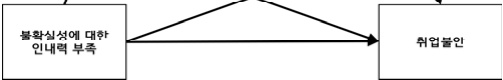
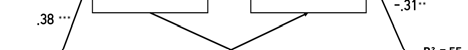
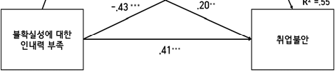

<u><mark>ORIGINAL ARTICLE</mark></u> 

# 대학생의 불확실성에 대한 인내력 부족이 취업불안에 미치는 영향: 사회비교경향성과 심리적 유연성의 순차적 매개효과 

The Effect of Intolerance of Uncertainty on Job-Seeking Anxiety in University Students: The Sequential Mediating Roles of Social Comparison Orientation and Psychological Flexibility 

최현지ㆍ김은하(단국대학교 교육대학원) 

Choi, Hyun-JiㆍKim, Eun-Ha(Graduate School of Education, Dankook University) 

## Abstract 

The purpose of this study was to examine the sequential mediating effects of social comparison orientation and psychol ogical flexibility in the relationship between intolerance of uncertainty and employment anxiety. To this end, an online self -report survey was conducted with 199 unemployed undergraduate students aged 20 to 32. The survey included measures of intolerance of uncertainty, employment anxiety, social comparison orientation, and the Korean version of the Psychologi cal Flexibility Scale. The data were analyzed using SPSS 23.0 and PROCESS Macro 4.2. The main findings are as follows. F irst, intolerance of uncertainty, social comparison orientation, and employment anxiety were found to be significantly positi vely correlated, while all three variables showed significant negative correlations with psychological flexibility. Second, the mediating effect of social comparison orientation in the relationship between intolerance of uncertainty and employment a nxiety was confirmed. Third, the sequential mediating effect of social comparison orientation and psychological flexibility in the relationship between intolerance of uncertainty and employment anxiety was also verified. Based on these results, the study discusses its limitations and suggestions for future research. 

Key words : Intolerance of Uncertainty, Social Comparison Orientation, Employment Anxiety, Psychological Flexibility 

## Ⅰ. 서 론 

대학생은 처음으로 경제적·사회적 상황에서 학업 및 직업을 선택하는 중요한 시기이다. 그러나 현재 한국 사회는 ‘N포세대’, ‘니트족’, ‘취포생’과 같은 신조어에서 알 수 있듯, 극심한 취업난이 청년세대의 주요한 사회적 문제로 대두되고 있다(김혜수, 안진아, 2023). 더불어 급변하는 사회 구 조로 인해 불확실성이 증대되면서, 많은 대학생이 미래의 취업 및 진로에 대해 극심한 불안과 스트레스를 경험하고 있다(육정원, 김봉환, 2017; 정 윤경 외, 2019; 황명주, 장용언, 2019). 

취업불안(job-seeking anxiety)은 취업을 준비하는 과정에서 개인이 경험하는 불안상태를 의미한다(조규판, 2008). 적정수준은 진로 동기를 자극하여 취업 준비를 위한 행동을 촉진할 수 있지만(김더미, 정주리, 2021; 김홍석, 김정섭, 2015), 과도할 경우 부적응적인 신체적·심리적 증상을 유발할 수 있다(김다인, 안도희, 2018; 박성권, 김해숙, 2021). 

특히 취업 준비 과정을 불확실한 상황으로 인식하고 이를 인내하지 못 하는 성향을 지닌 대학생은 다양한 정보나 경험을 성장의 기회로 해석하 기보다는 불안과 스트레스를 유발하는 위협으로 해석할 수 있다(정윤경 외, 2019). 이러한 성향은 불확실성에 대한 인내력 부족(Intolerance of 

Corresponding Author: Kim, Eun-Ha. eunha@dankook.ac.kr 

Article history, Received: July 9, 2025. Revised: August 6, 2025. Accepted: August 13, 2025. 

http://dx.doi.org/10.21097/ksw.2025.8.20.3.289 ISSN(Print) 1975-4051 / ISSN(Online) 2765-4419 Journal of Korea Society for Wellness Copyrightⓒ2025 Author(s) and the Korea Society for Wellness 

Uncertainty)으로 정의되며, 이는 모호한 상황에서 정서적·인지적·행동적 으로 부정적인 반응을 보이는 기질적인 특성을 의미한다(Buhr & Dugas, 2002). 이는 회피전략을 유발해 일시적으로 불안과 생리적 각성을 감소 시키지만(Dugas et al., 1998), 장기적으로는 정서 처리 기능을 방해하 고 적응적인 수행에 어려움을 초래한다(Dugas et al, 1998). 

불확실성이 증가하는 현대 사회에서 불확실성에 대한 인내력 부족은 취업불안과의 관계에서 즉각적으로 개입하여 향상시키기 어려운 특성이므 로, 이와 같은 특성이 취업불안에 미치는 영향을 매개하거나 조절할 수 있는 심리적 변인을 탐색하여 보다 효과적인 개입전략을 마련하고자 하는 선행연구들이 이루어져 왔다(강인혜, 유금란, 2020; 김나래, 이기학, 2012; Kalaycı & Aydın, 2025). 예를 들어, 오영아와 정남운(2011)은 불확실성에 대한 인내력이 부족이 회피전략을 유발해 부정적 심리반응을 증가시킨다고 보았고, 정윤경 외(2019)는 불확실한 상황을 수용하고 직 면하는 자기자비가 관계를 완충하는 조절변인으로 작용함을 강조하였다. 

특히 사회비교경향성(Social comparison orientation)은 불확실성에 대한 인내력 부족과 취업불안의 관계를 매개하는 중요한 변인으로 보고되 었다. 권다영과 강승희(2022)는 불확실성에 대한 인내력 부족이 사회비 교경향성을 증가시킨다는 점을 밝혔으며, 김태정과 민경화(2020)는 사회 비교경향성이 증가할수록 취업불안 수준이 높아지는 경향이 있음을 보고 하였다. 유소영과 연규진(2021)은 사회비교경향성이 불확실한 상황에서 경험하는 심리적 불편감과 정서적 반응을 설명하는 중요한 매개변인임을 확인하였다. 사회비교경향성이란, 자신을 평가하고자 타인과 비교하는 성 향으로(Gibbons & Buunk, 1999), 불확실성에 대한 인내력이 낮을수록 불쾌한 사고와 감정을 회피하고자 하며, 결정에 필요한 확신을 얻기 위해 더 많은 정보를 탐색하는 과정에서 타인과의 비교가 더욱 빈번하게 일어 나게 된다(김나래, 이기학, 2012; 김태정, 민경화, 2020; Bartoszek et al., 2022). 즉, 취업 준비 과정에서 미래에 대한 불확실성이 클수록 이 

### Journal of Korea Society for Wellness 

를 해소하기 위한 수단으로 사회비교경향이 더욱 활성화될 수 있다(반경 민, 권경인, 2024). 더불어, 한국의 대학생들은 외재적 가치를 중시하는 문화적 특성에 따라 타인과의 비교를 통해 자신의 위치나 가치를 평가하 려하며, 이로 인해 상대적으로 높은 사회비교경향성을 보이는 것으로 나 타났다(구재선, 서은국, 2015). 이렇게 증가한 사회비교경향성은 비교를 통해 얻은 외부정보를 내면화함으로써 자기 불일치를 심화시키고, 부정적 정서를 증가시키게 된다(이고은, 2023, Higgins, 1987). 

한편, 심리적 유연성(Psychological Flexibility)은 특정 순간에 떠오르 는 생각이나 감정, 신체 반응을 회피하거나 억제하지 않고 있는 그대로 수용하며, 개인의 가치와 목표를 실현하기 위해 주어진 상황에 맞춰 행동 을 조절하거나 변화시킬 수 있는 능력을 의미한다(문현미, 2006). 심리적 유연성은 우울, 불안, 정서 조절 곤란 등 다양한 심리적 고통과 관련이 있는데(이경희, 이창현, 2024; 최윤정, 이창현, 2022; 최은미, 2021; Kashdan & Rottenberg, 2010; Smith et al., 2020), 심리적 유연성이 낮을수록 이러한 고통에 더 쉽게 취약해질 수 있다. 이러한 심리적 유연 성은 내적 경험을 억압하거나 회피하는 경험회피와 관련이 있다. 낮은 심 리적 유연성은 정서적 각성 상태를 견디기 어려워 회피 반응을 유발하고 (최은미, 2021), 이러한 반복적인 회피는 결국 불안과 걱정을 증폭시키는 요인으로 작용하게 된다(오영아, 정남운, 2011; Bond et al., 2011). 

사회비교경향성과 심리적 유연성의 관계를 살펴보면, 사회비교를 통해 얻은 외부 정보를 내면화하여 부정적 정서가 유발되고, 이러한 정서적 불 편감은 다시 내적 경험을 회피하게 만들어(이소영, 장유진, 2022; White et al., 2006), 결과적으로 심리적 유연성을 저하시키게 된다(Marshall & Brockman, 2016). 이러한 낮은 심리적 유연성은 다시 회피 반응을 유발 하는 악순환으로 이어질 수 있다. 

따라서 본 연구는 심리적 유연성을 불확실성에 대한 인내력 부족이 취 업불안에 이르는 경로에서 정서적 대처 실패의 핵심 매개변인으로 설정하 고, 취업불안이 증폭되는 과정을 구체적으로 탐색하고자 하였다. 현재 국 내 연구에서는 취업불안에 이르는 경로에 대한 분석이 이루어지고 있으 나, 불안에 대한 정서적 수용 능력으로 작용하는 심리적 유연성과 같은 핵심 정서적 변인을 중심으로 한 구체적인 경로 탐색은 여전히 제한적이 다. 이에 본 연구는 취업불안을 유발하는 인지적·정서적 요인들을 통합적 으로 파악하고, 이들 간의 작용 경로를 실증적으로 확인하고자 하였다. 나아가, 취업불안으로 상담센터를 찾는 대학생들에게 단순히 불안의 결과 에 초점을 맞춘 상담 개입을 넘어, 취업불안을 유발하는 경로에 대한 세 밀한 이해를 바탕으로 각 단계에 적합한 맞춤형 상담 개입방안을 설계함 으로써 실질적인 도움을 제공하고자 하였다. 

## Ⅱ. 연구방법 

### 1. 연구 대상 

본 연구를 위해 현재 국내 대학에 재학 중인 취업준비 대학생을 대상으 로 온라인 자기보고식 설문조사를 실시하였다. 설문에 참여한 대학생은 총 204명이며, 이 중 연구에 동의하지 않았거나 불성실하게 응답한 5부 를 제외한 199명의 자료를 최종 분석에 사용하였다. 연구 참여자의 인구 학적 특성은 <표 1>과 같다. 

표 1. 연구대상의 인구통계학적 특성                       (N=199) 

||구분|빈도(명)||백분울(%)|
|---|---|---|---|---|
|성별|남성|75||37.8|
||여성|124||62.2|
||20세|14||7.0|
||21세|15||7.5|
||22세|20||10.1|
||23세|40||20.1|
||24세|30||15.1|
||25세|25||12.6|
|나이|26세|12||6.0|
||27세|12||6.0|
||28세|13||6.5|
||29세|6||3.0|
||30세|7||3.5|
||31세|1||.5|
||32세|4||2.0|
||평균 만 나이||24.43||
||1학년|4||2|
||2학년|14||7|
||3학년|35||17|
|학년|4학년|84||42|
||졸업 유예(or 수료)|41||21|
||휴학생|21||11|
||소계|199||100|

### 2. 측정 도구 

이에 따른 연구문제는 다음과 같다. 

- 연구문제 1. 대학생의 불확실성에 대한 인내력 부족, 사회비교경향성, 심 리적유연성, 취업불안은 서로 유의한 관계가 있는가? 

- 연구문제 2. 사회비교경향성은 대학생의 불확실성에 대한 인내력 부족과 취업불안의 관계를 매개하는가? 

- 연구문제 3. 심리적유연성은 대학생의 불확실성에 대한 인내력 부족과 취업불안의 관계를 매개하는가? 

- 연구문제 4. 대학생의 사회비교경향성과 심리적 유연성이 불확실성에 대 한 인내력 부족과 취업불안의 관계를 순차적으로 매개하는 가? 

그림 1. 연구 모형 

### 1) 불확실성에 대한 인내력 부족 척도 (Korean-Intolerance of Uncertainty Scale-14; K-IUS-14) 

본 연구에서는 Freeston 등(1994)이 프랑스어로 개발한 척도를 Buhr 와 Dugas(2002)가 영문판으로 번안 및 타당화하였고, 이슬(2016)이 한 국인을 대상으로 단축 및 타당화한 K-IUS-14(Korean-Intolerance of Uncertainty Scale-14)척도를 사용하였다. 본 척도는 ‘불확실성으로 인한 정신적 고통 및 일과 생활에서의 불만족감(7문항)’, ‘불확실성으로 인한 자신감 상실 및 일 진행에 대한 어려움(7문항)’으로 두 가지 하위요인으 로 구성되며 총 14문항으로 이루어져 있다. 본 척도는 Likert 5점 척도(1 점=전혀 그렇지 않다, 5점=매우 그렇다)로, 총점이 높을수록 불확실한 상 황을 견디기 어려운 정도가 높음을 의미한다. 이슬(2016)의 연구에서 보 고된 내적 신뢰도 계수(Cronbach’s α)는 .93으로 나타났으며, 본 연구에 서는 .92로 나타났다. 

### 2) 사회비교경향성(Iowa-Netherlands Comparison Orientation Measures; INCOM) 

본 연구에서는 사회비교경향성 정도를 측정하기 위해 Festinger(1954) 의 이론을 기반으로 Gibbons와 Buunk(1999)가 개발하고 최윤희(2003) 

대학생의 불확실성에 대한 인내력 부족이 취업불안에 미치는 영향 : 사회비교경향성과 심리적 유연성의 순차적 매개효과 291 

가 번안 및 타당화한 후, 백선주와 박주희(2019)가 문항을 보다 이해하 기 쉬운 문장으로 일부 수정·보완한 INCOM(Iowa-Netherlands Compari son Orientation Measures) 척도를 사용하였다. INCOM은 개인의 사회 비교경향성을 측정하기 위해 개발된 척도로, ‘능력 (ability)’차원에서 비교 하는 6문항과 ‘의견(opinion)’차원에서 비교하는 5문항의 두 가지 하위요 인으로 구성되어 있으며, 총 11문항으로 이루어져 있다. 본 척도는 Likert 5점 척도(1점=전혀 그렇지 않다, 5점=매우 그렇다)로 측정한다. 가능한 점수의 범위는 11점~55점으로, 부정문으로 기술된 문항을 역채점하여 총 점이 높을수록 사회비교경향성이 높음을 의미한다. 최윤희(2003)의 연구 에서 내적 신뢰도 계수(Cronbach’s α)는 .83이며, 백선주와 박주희(201 9)의 연구에서는 .82가 나타났다. 본 연구에서의 Cronbach’s α는 .80로 나타났다. 

### 3) 취업불안 (Job-Seeking Anxiety) 

본 연구에서는 조규판(2008)이 개발하고 타당화한 취업불안(job-seekin g anxiety) 척도를 사용하여 참여자의 취업불안 수준을 평가하였다. 본 척도는 ‘취업불안 유발상황(11문항)’, ‘취업불안 유발원인(7문항)’, ‘취업불 안 상태(10문항)’의 3개의 하위요인으로 구성되며, 총 28문항으로 이루어 져 있다. 본 척도는 Likert 5점 척도(1점=전혀 그렇지 않다, 5점=매우 그 렇다)로 측정하며, 총점이 높을수록 취업에 대한 불안이 높음을 의미한다. 조규판(2008) 타당화 연구에 의하면 내적 신뢰도 계수(Cronbach’s α)가 .96으로 나타났으며, 본 연구에서는 .97으로 나타났다. 

### 4) 한국판 심리적 유연성 척도(Korean Personalized Psychological Flexibility Index: K-PPFI) 

본 연구에서는 Kashdan 등(2020)이 개발하고, 손명희와 이희경(2024) 이 타당화한 한국판 심리적 유연성 척도(Korean Personalized Psycholo gical Flexibility Index: K-PPFI)를 사용하였다. Kashdan 등(2020)은 심 리적 유연성을 고통이나 불편함이 존재하더라도 개인이 중요하게 여기는 목표를 지속적으로 추구하는 능력으로 정의한다. 이를 반영하기 위해, 먼 저 참가자에게 ‘자신이 현재 추구하고 있는 중요한 목표’에 대해 질문한 뒤, 그 목표를 바탕으로 각 문항에 응답하도록 하였다. 본 척도는 ‘회피(5 문항)’, ‘수용(5문항)’, ‘활용(5문항)’ 3개의 하위요인으로 구성되며, 총 15 문항으로 이루어져 있다. 본 척도는 Likert 7점 척도(1점=전혀 그렇지 않 다, 7점=매우 그렇다)로 부정문으로 기술된 문항을 역채점하며, 점수가 높을수록 심리적 유연성의 정도가 높은 것을 의미한다. Kashdan 등(202 0)의 연구에서 내적 신뢰도 계수(Cronbach's α)는 .76~.87로 나타났으 며, 본 연구에서는 .84로 나타났다. 

### 3. 분석 방법 

본 연구는 불확실성에 대한 인내력 부족과 취업불안의 관계에서 사회비 교경향성과 심리적 유연성의 순차적 매개효과를 알아보기 위해 SPSS 23.0과 Process Macro 4.2를 사용하였다. 분석방법은 첫째, 연구참여자 의 인구통계학적 특성을 파악하기 위해 기술통계와 빈도분석을 실시하였 다. 둘째, 각 측정 도구의 신뢰도를 검토하기 위해 Cronbach's α 계수를 산출하였다. 셋째, 주요 변인들의 평균, 표준편차, 왜도, 첨도 등의 기술 통계치를 확인하고, 변인 간 상관성을 분석하기 위해 Pearson의 상관분 석을 수행하였다. 넷째, 불확실성에 대한 인내력 부족이 취업불안에 미치 는 영향에서 사회비교경향성의 매개효과를 검증하기 위해 SPSS의 Process Macro의 Model 4를 활용하였다. 다섯째, 불확실성에 대한 인 내력과 취업불안 간의 관계에서 사회비교경향성과 심리적 유연성의 매개 효과를 검증하고자 외생변인을 통제하고 Baron & Kenny(1986)이 제시 한 절차를 Hayes & Scharkow(2013)가 구현한 PROCESS Macro 중 Model 6을 사용하였다. 이와 더불어 변인들의 매개모형의 간접효과 검 증을 위해 부트스트래핑(Bootstrapping)을 사용하여 매개효과의 유의성 

을 검정하였다. 이를 위해 본 연구의 원자료(N=199)에서 5,000개의 표 본을 지정하고 신뢰구간 95%로 설정하여 검증하였다. 

## Ⅲ. 연구결과 

### 1. 주요 변인의 기술통계 및 상관분석 

주요 변인들의 기술통계를 위해 평균과 표준편차를 구하였으며, 표본이 정규분포를 따르는지를 확인하기 위해 왜도와 첨도 값을 함께 검토하였 다. 변인들의 왜도가 절댓값 2 미만, 첨도는 절댓값 7 미만인 경우, 정규 분포 가정을 충족한다고 판단하는데 각 변인의 정규성을 확인하기 위해 왜도와 첨도를 확인한 결과, 왜도의 범위는 -.45에서 -.13으로 절댓값 2 를 넘지 않고, 첨도의 범위 또한 -.65에서. 07로 절댓값 7의 기준에 넘 지 않는다는 점에서 정규성 가정을 충족하는 것으로 확인하였다(Curran et al., 1996). 

표 2. 주요 변인들의 기술통계 

|변인|평균|표준편차|왜도|첨도|
|---|---|---|---|---|
|불확실성에 대한 인내력 부족|2.98|.86|-.13|-.65|
|사회비교경향성|3.47|.64|-.40|-.01|
|취업불안|3.08|.93|-.45|-.41|
|심리적유연성|4.28|.88|-.18|.07|

주요 변인들의 상관분석 결과는 불확실성에 대한 인내력 부족은 사회 비교경향성(r=.38, p<.01), 취업불안(r=.65, p<.01)과 통계적으로 유의미 한 정적인 상관관계가 나타났고, 심리적 유연성(r=-.50, p<.01)과는 유의 미한 부적인 상관관계가 나타났다. 또한, 사회비교경향성은 취업불안(r=.4 7, p<.01)과 정적인 상관관계가 나타났으며, 심리적 유연성(r=-.36, p<.0 1)과 유의미한 부적 상관관계가 나타났다. 심리적 유연성은 취업불안(r=-. 59, p<.01)과도 부적인 상관으로 나타났다. 

표 3. 주요 변인 간 상관관계 

|변인|1|2|3|4|
|---|---|---|---|---|
|1) 불확실성에 대한 인내력 부족|1||||
|2) 사회비교경향성|.38**|1|||
|3) 취업불안|.65**|.47**|1||
|4) 심리적유연성|-.50**|-.36**|-.59**|1|

**p<.01 

### 2. 순차적 매개효과 분석 

불확실성에 대한 인내력 부족과 취업불안 간의 관계에서 사회비교경향 성과 심리적유연성의 순차적 매개효과를 확인하기 위해 Process Macro model 6을 활용하였다. 매개효과 분석에 앞서 예측 변인들의 다중공선성 여부를 살펴본 결과, 공차(Tolerance)는 .706~.816로 모두 .10 이상, 변 인별 분산팽창지수(VIF)는 1.225~1.417로 모두 10 이하로 나타나 다중 공선성의 문제가 없는 것으로 확인되었다. 

불확실성에 대한 인내력 부족과 사회비교경향성의 관계를 확인한 결과, 회귀모형이 유의하였으며(F=33.55, p<.001), 모형의 설명력은 15%로 나타났다. 변인 간 관계를 살펴보면 불확실성에 대한 인내력 부족은 사회 비교경향성과 유의한 정적관계를 보였으며(B=.28, p<.001), 이를 통해 

Journal of Korea Society for Wellness 

표 4. 순차적 매개효과 검증 

|단계|준거변인|예측변인|B|SE|β|t|F|R-squared|
|---|---|---|---|---|---|---|---|---|
|1|사회비교경향성|불확실성에 대한 인내력 부족|.28|.15|.38|5.80***|33.55***|.15|
|2|심리적 유연성|불확실성에 대한 인내력 부족|-.43|.07|.42|21.48***|38.30***|.28|
|||사회비교 경향성|-.27|.09|-.20|-3.03**|||
|||불확실성에 대한 인내력 부족|.45|.06|.41|7.24***|||
|3|취업 불안| 사회비교 경향성|.29|.08|.20|3.81***|79.36***|.55|
|||심리적 유연성|-.33|.06|-.31|-5.53***|||

**p<.01, ***p<.001 

불확실성에 대한 인내력이 부족할수록 사회비교경향성이 높아진다는 것을 확인하였다. 불확실성에 대한 인내력 부족과 사회비교경향성이 심리적 유 연성에 미치는 영향을 확인한 결과, 회귀모형이 유의미하였으며(F=38.30, p<.001), 모형의 설명력은 28%로 나타났다. 불확실성에 대한 인내력 부 족은 심리적 유연성과 유의한 부적 관계를 보였고(B=-.43, p<.001), 사 회비교경향성 또한 유의한 부적 관계를 보였다(B=-.27, p<.01). 즉, 불확 실성에 대한 인내력이 부족하고 사회비교경향성이 높을수록 심리적 유연 성이 낮다는 것을 확인하였다. 불확실성에 대한 인내력 부족과 사회비교 경향성, 심리적 유연성이 취업불안에 미치는 영향을 확인한 결과 회귀모 형이 적합하였으며(F=79.36, p<.001), 모형의 설명력은 55%로 나타났 다. 취업불안에 대하여 불확실성에 대한 인내력 부족은 유의한 정적관계 에 영향을 미쳤고(B=.45, p<.001), 사회비교경향성 또한 유의한 정적관 계로 영향을 보였으며(B=.29, p<.001), 심리적 유연성은 유의한 부적 관 계로 영향을 보였다(B=-.33, p<.001). 즉, 불확실성에 대한 인내력이 부 족할수록 사회비교경향성이 높아지는데, 이는 심리적 유연성을 낮추며 결 과적으로 높은 취업불안을 증가시키는 순차적 경로가 존재하는 것을 확인 하였다. 이에 대한 구체적인 분석 결과는 <표 4>에 제시하였다. 

그림 2. 연구 결과 모형 

이어서 간접효과의 유의성을 검증하기 위해 Bootstrapping을 활용하 였으며, 표본 수 5,000명, 신뢰수준 95%를 기준으로 하여 검증하였으 며, 결과는 아래 <표 5>에 제시하였다. 직접 효과인 불확실성에 대한 인내력과 취업불안 간의 관계는 신뢰구간 [.325~569] 내에 ‘0’을 포함 하지 않아 통계적으로 유의미한 것으로 확인되었다. 간접효과에 대한 분 석 결과는 다음과 같다. 첫째, 불확실성에 대한 인내력 부족 → 사회비 교경향성 → 취업불안의 간접효과의 유의성 검증 결과, 신뢰구간 [.0329~.1400] 내에 ‘0’을 포함하지 않아 사회비교경향성의 매개효과가 유의하게 확인되었다. 둘째, 불확실성에 대한 인내력 부족 → 심리적 유 연성 → 취업불안의 간접효과의 유의성 검증 결과, [.0802~.2157] 내에 ‘0’을 포함하지 않아 유의한 매개효과로 판단할 수 있다. 셋째, 불확실성 에 대한 인내력 부족 → 사회비교경향성 → 심리적 유연성 → 취업불안의 간접효과의 유의성 검증 결과, [.0031~.0522] 내에 ‘0’을 포함하지 않아 

### 유의한 매개효과를 판단할 수 있다. 

위의 결과를 종합해보면, 불확실성에 대한 인내력 부족과 취업불안의 관계를 사회비교경향성과 심리적 유연성이 순차적으로 매개하는 것으로 확인되었다. 즉, 불확실성에 대한 인내력이 부족할 경우 사회비교경향성이 높아지고, 사회비교경향성이 높아질수록 심리적 유연성이 낮아져 취업불 안이 높아지는 경로를 알 수 있다. 

표 5. Bootstrapping에 의한 간접효과 유의성 검증 

||경로||B|SE|95%  LLCI|신뢰구간 ULCI|
|---|---|---|---|---|---|---|
|총 효과|불확실성에 대한 취업불안|인내력 부족|→ .70|.06|.584|.814|
|직접 효과|불확실성에 대한 취업불안|인내력 부족|→ .45|,06|.325|.569|
||불확실성에 대한 사회비교경향성 →|인내력 부족 취업불안|→ .08|.03|.0329|.1400|
|간접 효과|불확실성에 대한 심리적 유연성 →|인내력 부족 취업불안|→ .14|.04|.0802|.2157|
||불확실성에 대한|인내력 부족|→||||
||사회비교경향성 →||.03|.01|.0031|.0522|
||심리적 유연성 →|취업불안|||||

## Ⅳ. 논 의 

본 연구에서는 대학생을 대상으로, 불확실성에 대한 인내력 부족이 취 업불안에 미치는 과정에서 사회비교경향성과 심리적 유연성의 순차적 매 개효과를 검증하고자 하였다. 주요 결과와 그에 따른 논의는 다음과 같다. 첫째, 불확실성에 대한 인내력 부족은 사회비교경향성과 취업불안과는 정적 상관을, 심리적 유연성과는 부적 상관을 보였다. 이는 불확실성을 견디기 어려운 개인일수록 타인과의 비교에 더 의존하게 되며, 그로 인해 정서적 수용 능력이 저하될 수 있다는 선행연구(김나래, 이기학, 2012; K alaycı & Aydın, 2025)과 일치한다. 또한 사회비교경향성이 심리적 유연 성을 저하시켜 불안을 높이며(권다영, 강승희, 2022), 심리적 유연성이 낮을수록 불안 수준이 높아진다는 연구결과(이경희, 이창현, 2024)와도 맥락을 같이 한다. 

둘째, 사회비교경향성은 불확실성에 대한 인내력 부족이 취업불안에 미 치는 관계를 유의하게 매개하였다. 이는 불확실성에 대한 인내력이 부족 할수록 그로 인해 유발되는 모호함과 불쾌한 사고와 감정을 회피하고자 하는 경향이 강해지며, 결정에 필요한 확신을 얻기 위해 타인과의 비교가 

대학생의 불확실성에 대한 인내력 부족이 취업불안에 미치는 영향 : 사회비교경향성과 심리적 유연성의 순차적 매개효과 293 

더욱 빈번하게 이루어지게 되고, 이는 결국 취업불안으로 이어진다는 선 행연구 결과와 일치하였다(권다영, 강승희, 2022; 김태정, 민경화, 2020; 유소영, 연규진, 2021). 

셋째, 심리적 유연성 또한 불확실성에 대한 인내력 부족이 취업불안에 미치는 관계를 유의하게 매개하였다. 이는 불확실성에 대한 인내력 부족 이 심리적 경직성을 유발하고, 이로 인해 부정적 정서를 일으킨다는 기존 연구결과(Kalaycı & Aydın, 2025; Smith et al., 2020)를 뒷받침한다. 불확실한 상황에서 유발되는 부정적인 감정이나 사고를 효과적으로 수용 하지 못할 경우, 이를 회피하려는 경향이 강화되어 심리적 유연성이 저하 된다. 이와 같은 낮은 심리적 유연성은 내면의 정서적 경험을 억제하거나 회피하게 만들며, 결과적으로 불안을 유발하는 정서적 반응 경로로 작용 한다. 

넷째, 불확실성에 대한 인내력 부족이 취업불안에 미치는 관계에서 사 회비교경향성과 심리적 유연성의 순차적 매개효과가 유의하게 나타났다. 이는 불확실한 상황을 견디기 어려울수록 모호한 상황을 회피하고자 사회 비교경향성이 높아져 더욱 내면의 부적인 감정이나 사고를 수용하지 못하 게 됨을 의미한다. 이러한 과정은 심리적 유연성 저하로 이어지고, 낮은 심리적 유연성은 결국 부정적인 감정을 수용하지 못한 채 회피해 취업불 안으로 이어지는 순차적 경로를 형성한다. 이러한 결과는 상담 현장에서 단순히 취업 불안을 완화하는 데 그치지 않고, 사회비교에 대한 자동적 사고와 인지적 반응 양식을 점검하고, 그로 인해 유발되는 정서적 회피를 수용적으로 전환하도록 돕는 전략적 개입의 필요성을 시사한다. 

본 연구에 대한 의의 및 시사점은 다음과 같다. 

본 연구는 대학생의 불확실성에 대한 인내력 부족과 취업불안 간 관계 를 사회비교경향성 및 심리적 유연성이라는 두 변인의 순차적 매개과정을 실증적으로 검증함으로써, 기존 연구와 차별화된 이론적 기여를 제시하였 다. 기존의 선행연구에서는 대학생활 적응이나 스트레스 상황에서 심리적 유연성을 단일 매개변인으로 다뤘으며(정지연, 김현식, 2024), 수용전념 치료(ACT) 이론에 기반해 독립적으로 증진해야 할 치료 목표 또는 결과 변수로 다뤘다(문현미, 2006; 이건민, 신현균, 2022). 이에 비해 본 연구 는 취업이라는 구체적 사회 맥락 과제 속에서 심리적 유연성이 불확실성 과 취업불안 간의 심리 내적 연쇄 과정에서의 중간단계로 기능하여 불안 으로 이어지는 복합적인 심리적 경로를 검증하였다는 점에서 의의가 있 다. 또한 본 연구는 인지적·정서적 요인을 통합해 취업불안의 발생 과정 을 구조적으로 이해할 수 있는 근거를 제공하였다. 이에 따라 상담현장에 서 취업불안을 호소하는 대학생을 보다 심층적으로 이해하고, 단계별 맞 춤형 상담전략을 제공할 수 있다. 예를 들어, 초기 개입 단계에서는 불확 실성을 위협으로 인식하지 않도록, 인지적 재구조화와 수용훈련이 요구된 다. 중간단계에서는 사회비교에 대한 인지습관을 자각하고, 비교의 기준을 개인의 내적 가치로 전환하도록 유도할 수 있다. 마지막으로, 후기 개입 단계에서는 심리적 유연성을 증진하도록 불안과 회피적 정서 반응을 다루 고, 가치 있는 행동을 지속할 수 있도록 수용전념치료(ACT)를 기반 프로 그램(예: 수용훈련, 전념 행동 연습 등)을 활용한 구체적 상담 개입이 실 현될 수 있음을 시사한다. 

## Ⅴ. 결 론 

본 연구는 대학생을 대상으로 불확실성에 대한 인내력 부족이 취업불안 에 미치는 영향을 확인하고, 이 과정에서 사회비교경향성과 심리적 유연 성의 순차적 매개효과를 검증하였다. 이는 대학 상담 및 진로교육 현장에 서 대학생들이 취업 준비 과정에서 겪는 불안을 효과적으로 관리할 수 있 도록 각 단계별 맞춤형 상담 개입방안을 마련하는 근거를 제공했다는 점 에서 의의가 있다. 

본 연구의 제한점 및 향후 연구에 대한 제언은 다음과 같다. 첫째, 본 

연구는 온라인 자기보고식 설문을 통해 자료를 수집하여, 응답자의 주관 적 판단이나 반응 편향이 개입될 가능성이 있다. 따라서 후속연구에서는 면접, 관찰 등 다양한 자료수집 방식을 병행할 필요가 있다. 둘째, 본 연 구는 학년, 전공, 지역 등 인구통계학적 요인을 통제하지 않아 하위 집단 간 차이를 규명하는데 제한이 있었다. 따라서 향후 연구에서는 이를 체계 적으로 분류하여 세분화된 분석을 시도할 필요가 있다. 셋째, 본 연구는 이론적 타당성과 실증적 기반을 바탕으로 설계하였으나, 추가적인 변수의 통합이나 다중경로 분석의 가능성을 고려해 이론 모형을 더욱 확장할 여 지가 있을 수 있다. 넷째, 본 연구는 단일 시점에서 수집된 자료를 기반 으로 분석되었기 때문에, 불확실성에 대한 인내력 부족이나 취업불안과 같은 심리적 변인의 시간적 변화 가능성을 충분히 반영하지 못한 한계가 있다. 따라서 후속연구는 종단적 연구 설계를 통해 시간에 따른 심리적 변화 양상을 탐색하거나, 시기별로 표집을 하여 다양한 상황을 반영할 필 요가 있다. 마지막으로 본 연구는 비교적 소규모 표본을 바탕으로 진행되 었기에 연구결과의 일반화에 한계가 있다. 따라서 후속 연구에서는 충분 한 규모의 표본을 확보하여 일반화 가능성을 높일 필요가 있다. 

## 참고문헌 

강인혜, 유금란(2020). 불확실성에 대한 인내력 부족과 취업불안의 관계 에서 지각된 진로장벽을 통한 삶의 의미의 조절된 매개효과. 진로교육연구, 33(1), 21-42. 

- 구재선, 서은국(2015). 왜 한국 대학생이 미국 대학생보다 불행한가? 상 대적 외적 가치, 사회적 지원, 사회비교의 영향. 한국심리학회 지, 29(4), 63-83. 

- 권다영, 강승희(2022). 항공사 승무원 취업준비생의 불확실성에 대한 인 내력 부족과 취업불안의 관계에서 사회비교 경향성의 매개효과. 학습자중심교과교육연구, 22(15), 513-526. 

- 김나래, 이기학(2012). 불확실성에 대한 인내력 부족과 지각된 진로장벽 의 관계: 사회비교경향성과 부정적 평가에 대한 두려움의 매개 효과 검증. 직업교육연구, 31(4), 111-134. 

- 김다인, 안도희(2018). 대학생이 지각한 전공에 대한 상향적 사후가정 사 고, 전공 만족, 취업불안 및 행복감 간의 구조적 관계. 교육심 리연구, 32(3), 355-377. 

- 김더미, 정주리(2021). 대학생의 사회부과 완벽주의와 취업불안의 관계: 자기개념, 명확성과 불확실성에 대한 인내력 부족의 매개효과. 미래교육학연구, 34(2), 133-154. 

- 김태정, 민경화(2020). 취업준비 대학생의 사회부과 완벽주의와 취업불안 의 관계에서 불확실성에 대한 인내력 부족과 사회비교 경향성 의 매개효과. 취업진로연구, 10(1), 31-53. 

- 김혜수, 안진아(2023). 취업준비생의 불확실성에 대한 인내력 부족과 취 업불안의 관계: 진로고정신념의 매개효과 및 계획된 우연기술 의 조절된 매개효과. 교육치료연구, 15(2), 181-200. 

- 김홍석, 김정섭(2015). 대학생의 내현적 자기애와 취업불안의 관계에서 학업적 자기효능감과 진로결정 자기효능감의 매개효과. 청소년 학연구, 22(2), 223-244. 

- 문현미(2006). 심리적 수용 촉진 프로그램의 개발과 효과: 수용-전념 치료 모델을 중심으로. 미간행 박사학위논문, 가톨릭대학교 대학원. 

- 박성권, 김해숙(2021). 대학생의 취업스트레스가 신체화 증상에 미치는 영향: 부적응적 자기초점주의와 정서조절곤란의 매개효과. 한국 융합학회논문지, 12(6), 267-278. 

- 반경민, 권경인(2024). 이행기 청년의 불확실성에 대한 인내력 부족과 불 안의 관계: 사회비교경향성과 실패내성의 조절된 매개효과. 청 소년학연구, 31(12), 29-56. 

Journal of Korea Society for Wellness 

- 백선주, 박주희(2019). 취업 준비 대학생의 사회비교경향성과 스트레스 대처방식이 취업 스트레스에 미치는 영향. 대한가정학회지, 57(2), 295-305. 

- 손명희, 이희경(2024). 한국판 심리적 유연성 척도의 타당화: 국내 대학 (원)생을 대상으로. 학습자중심교과교육연구, 24(3), 477-493. 

- 오영아, 정남운(2011). 불확실성에 대한 인내력 부족과 걱정의 관계: 경 험적 회피의 매개효과 검증. 한국심리학회지: 상담 및 심리치 료, 23(3), 671-691. 

- 유소영, 연규진(2021). 불확실성에 대한 인내력 부족이 초심상담자의 진 로 불안에 미치는 영향: 사회비교경향성과 초심상담자 어려움 의 매개효과. 한국심리학회지 상담 및 심리치료, 33(1), 87-111. 

- 육정원, 김봉환(2017). 대학생의 취업불안과 진로적응성의 관계에서 사회 적 지지와 진로탐색효능감의 매개효과. 상담학연구, 18(3), 111-128. 

- 이건민, 신현균(2022). 수용전념치료(ACT)가 취업스트레스, 자기효능감과 경험회피 및 우울, 불안에 미치는 효과. Stress, 30(4), 277-287. 

- 이경희, 이창현(2024). 자기 불일치가 우울에 미치는 효과: 사회적 지지 로 조절된 심리적 유연성의 매개효과. 인문사회과학연구, 6(3), 379-397. 

- 이고은(2023). 사회비교경향성이 주관적 안녕감에 미치는 영향: 자기수용 으로 조절된 자기 불일치의 매개효과. 미간행 석사학위논문, 광 운대학교 대학원. 

- 이소영, 장유진(2022). 대학생의 실제-이상 자기불일치와 인터넷 중독의 관계: 경험회피의 매개효과와 가족기능의 조절효과. 청소년상담 연구, 30(1), 183-202. 

- 이슬(2016). 한국판 불확실성에 대한 인내력 부족 척도 타당화. 미간행 석사학위논문, 가톨릭대학교 대학원. 

- 정윤경, 신주연, 이보람(2019). 불확실성에 대한 인내력 부족과 취업불안 의 관계: 자기자비와 진로고정신념의 이중매개효과를 중심으로. 취업진로연구, 9(4), 25-50. 

- 장지연, 김현식(2024). 대학생의 자기자비와 불안의 관계: 불확실성에 대 한 인내력 부족과 경험회피의 매개효과. 상담학연구, 25(6), 69-89. 

- 조규판(2008). 취업불안척도의 개발 및 타당도 연구. 한국교육학회지, 46(2), 53-75. 

- 최윤정, 이창현(2022). 불확실성에 대한 인내력 부족이 우울에 미치는 영 향: 심리적 유연성으로 조절된 정서조절곤란의 매개효과. 발달 지원연구, 11(2), 29-54. 

- 최윤희(2003). 스트레스, 통제소재 및 사회비교 경향성이 우울 정도에 미 치는 영향. 미간행 석사학위논문, 가톨릭대학교 대학원. 

- 최은미(2021). 심리적 유연성에 관한 연구동향: 2012년~2021년 국내학 술지를 중심으로. 상담교육연구, 4(1), 81-100. 

- 황명주, 장용언(2019). 대학생의 취업스트레스가 정신건강과 자살행동에 미치는 영향: 자아탄력성의 매개효과. 한국보건사회학회, 50, 63. 

- Baron, R. M., & Kenny, D. A. (1986). The moderator–mediator variable distinction in social psychological research: Conceptual, strategic, and statistical considerations. Journal of Personality and Social Psychology, 51(6), 1173-1182. 

- Bartoszek, G., Ranney, R. M., Curanovic, I., Costello, S. J., & Behar, E. (2022). Intolerance of uncertainty and 

information-seeking behavior: Experimental manipulation of threat relevance. Behaviour Research and Therapy, 154, 104125. 

- Bond, F. W., Hayes, S. C., Baer, R. A., Carpenter, K. M., Guenole, N., Orcutt, H. K., Waltz, T., & Zettle, R. D. (2011). Preliminary psychometric properties of the Acceptance and Action Questionnaire–II: A revised measure of psychological inflexibility and experiential avoidance. Behavior Therapy, 42(4), 676–688. 

- Buhr, K. M., & Dugas, M. J. (2002). The intolerance of uncertainty scale: Psychometric properties of the English version. Behaviour Research and Therapy, 40(8), 931-945. 

- Curran, P. J., West, S. G., & Finch, J. F. (1996). The robustness of test statistics to nonnormality and specification error in confirmatory factor analysis. Psychological Methods, 1(1), 16. 

- Dugas, M. J., Gagnon, F., Ladouceur, R., & Freeston, M. H. (1998). Generalized anxiety disorder: A preliminary test of a conceptual model. Behaviour Research and Therapy, 36(2), 215-226. 

- Festinger, L. (1954). A theory of social comparison processes. Human Relations, 7(2), 117-140. 

- Freeston, M. H., Rhéaume, J., Letarte, H., Dugas, M. J., & Ladouceur, R. (1994). Why do people worry?. Personality and Individual Differences, 17(6), 791-802. 

- Gibbons, F. X., & Buunk, B. P. (1999). Individual differences in social comparison: development of a scale of social comparison orientation. Journal of Personality and Social Psychology, 76(1), 129-142. 

- Hayes, A. F., & Scharkow, M. (2013). The relative trustworthiness of inferential tests of the indirect effect in statistical mediation analysis: does method really matter?. Psychological Science, 24(10), 1918-1927. 

- Higgins, E. T. (1987). Self-discrepancy: a theory relating self and affect. Psychological Review, 94(3), 319-340. 

- Kalaycı, M. Y., & Aydın, Y. (2025). Intolerance of Uncertainty and Psychological Flexibility Predict Worry in Young Adults. Bartın University Journal of Faculty of Education, 14(1), 238-250. 

- Kashdan, T. B., & Rottenberg, J. (2010). Psychological flexibility as a fundamental aspect of health. Clinical psychology review, 30(7), 865-878. 

- Kashdan, T. B., Disabato, D. J., Goodman, F. R., Doorley, J. D., & McKnight, P. E. (2020). Understanding psychological flexibility: A multimethod exploration of pursuing valued goals despite the presence of distress. Psychological Assessment, 32(9), 829-850. 

- Marshall, E. J., & Brockman, R. N. (2016). The relationships between psychological flexibility, self-compassion, and emotional well-being. Journal of Cognitive Psychotherapy, 30(1), 60-72. 

- Smith, B. M., Twohy, A. J., & Smith, G. S. (2020). Psychological inflexibility and intolerance of uncertainty moderate the relationship between social isolation and mental health outcomes during COVID-19. Journal of Contextual Behavioral Science, 18, 162-174. 

- White, J., Langer, E., Yariv, L., & Welch IV, J. (2006). Frequent social comparisons and destructive emotions and behaviors: The dark side of social comparisons. Journal of Adult Development, 13, 36-44. 

대학생의 불확실성에 대한 인내력 부족이 취업불안에 미치는 영향 : 사회비교경향성과 심리적 유연성의 순차적 매개효과 295 

## 요약 

본 연구의 목적은 불확실성에 대한 인내력 부족이 취업불안에 미치는 과정에서 사회비교경향성과 심리적 유연성의 순차적 매개효과 를 확인하는 것이다. 이를 위해 국내 대학교에 재학 중인 만 20~32세의 미취업 대학생 199명을 대상으로 불확실성에 대한 인내력 부 족 척도, 취업불안 척도, 사회비교경향성 척도, 한국판 심리적 유연성 척도로 구성된 온라인 자기보고식 설문조사를 실시하였다. SPSS 23.0 프로그램과 Process Macro 4.2을 사용하여 분석한 연구의 결과는 다음과 같다. 첫째, 불확실성에 대한 인내력과 사회비교경향성, 취업불안은 유의미한 정적인 상관관계가 있고, 세 변인과 심리적 유연성은 유의미한 부적 상관관계가 있었다. 둘째, 불확실성에 대한 인 내력과 취업불안의 관계에서 사회비교경향성의 매개효과를 확인하였다. 셋째, 불확실성에 대한 인내력 부족과 취업불안의 관계에서 사회 비교경향성과 심리적유연성의 순차적 매개효과를 확인하였다. 이러한 연구결과를 토대로 제한점 및 후속연구를 위한 제언을 제시하였다. 

저자 정보 

주저자 교신저자 

최현지 단국대학교 교육대학원 석사과정 김은하 단국대학교 교육대학원 교수 

